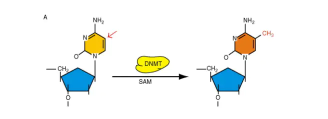
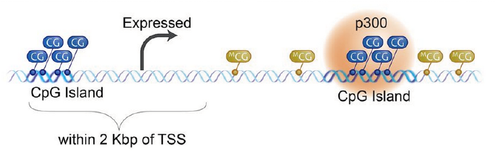
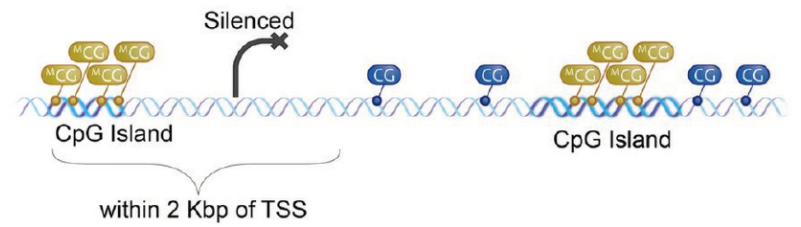
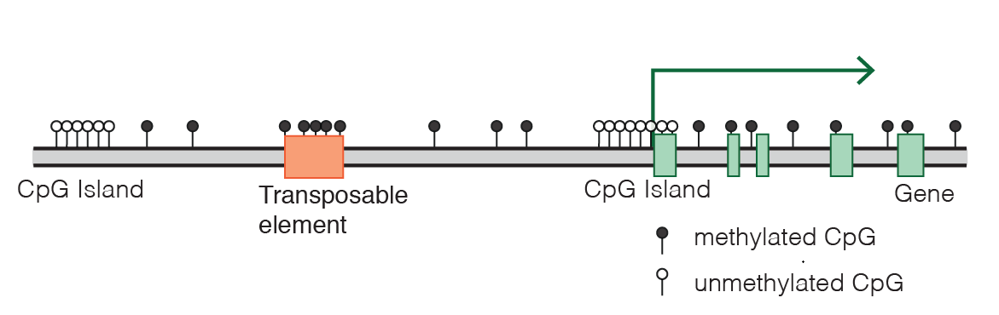
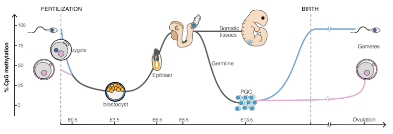
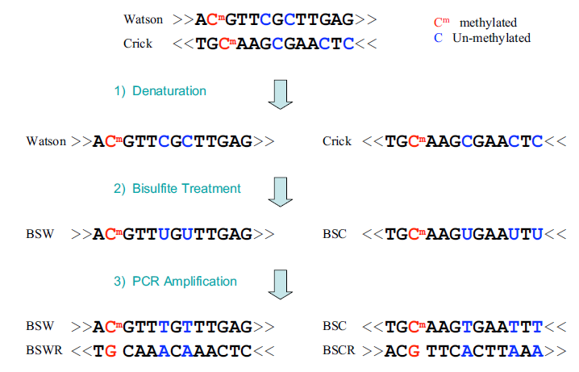
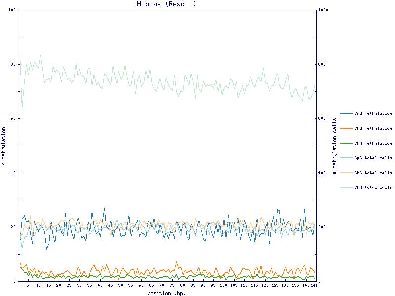
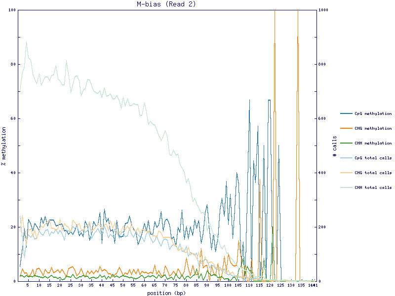
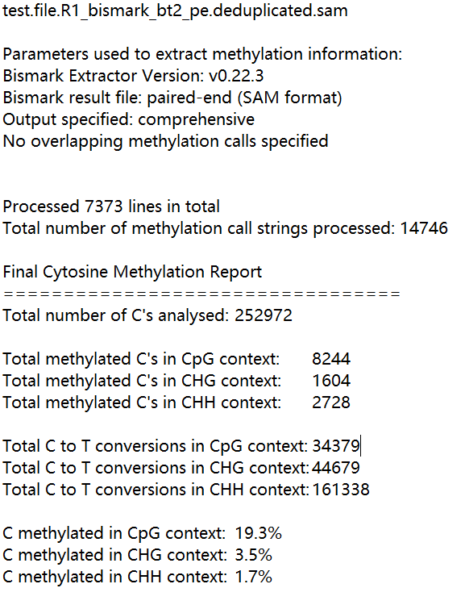

# 全基因组重亚硫酸盐测序（Whole Genome Bisulfite Sequencing）甲基化分析

> https://github.com/FelixKrueger/Bismark  
> https://github.com/xflicsu/swDMR  
> https://www.jianshu.com/p/0aa453ba9476  
> https://blog.csdn.net/u011262253/article/details/108509052

表观遗传学研究已经证实了特定基因区域的DNA甲基化修饰对于染色体构象、基因表达调控机制、转录因子结合和抑制转座子元件等有着重要影响，而全基因组DNA甲基化研究将是表观基因组学最为关注的内容之一。

目前，DNA甲基化检测的技术已经比较成熟，例如高通量的WGBS、RRBS、MeDIP-seq、MBD-seq，低通量的BSP、MSP等，其中以WGBS（Whole genome bisulfite sequencing）最为经典。Bisulfite处理能够将基因组中**未发生甲基化的C碱基转换成U**，进行PCR扩增后变成T，与原本具有甲基化修饰的C碱基区分开来，再结合高通量测序技术，可绘制单碱基分辨率的全基因组DNA甲基化图谱。

## DNA甲基化简介

### 一、什么是DNA甲基化

DNA甲基化是一个生物过程，它会在在DNA分子中引入甲基化基团，但是甲基化并不会改变序列本身，而会改变DNA片段的活性。

在哺乳动物中，DNA甲基化对于正常发育必不可少，而且与很多生物学现象有密切联系，包括基因组印迹，X染色体失活，转座因子招募，衰老和致癌作用。

胞嘧啶甲基化是在真核生物和原核生物普遍存在的，而且甲基化的速率在物种之间有很大的差异。

最常见的是在**胞嘧啶的5号碳位置**，在酶和底物的作用下，引入一个甲基基团，变成了**5甲基胞嘧啶（5mC）**，从而改变了它的活性。



腺嘌呤甲基化也在细菌，植物和哺乳动物DNA中均观察到了，但并不是研究热点。

下面，我们重点看胞嘧啶甲基化。

### 二、CpG islands

在植物和其他生物中，可以在三种不同的序列中发现DNA甲基化：

- CpG
- CHG
- CHH

其中H对应于A，T或C。

CpG是胞嘧啶（C，Cytosine），磷酸（p，phosphoric acid），鸟嘌呤（G，Guanine ）的缩写，也可以去掉磷酸直接叫CG。在哺乳动物中，在基因组中富含GC和CpG的序列区段，叫CpG岛（CpG islands）。

#### 1. CpG岛与转录

在人基因组中，90%以上的CpG位点是被甲基化的，但是CpG岛甲基化程度通常很低，这种情况下，不影响蛋白结合到DNA的启动子区域来启动转录，进而使基因表达。



但是，如果这个DNA的CpG岛被甲基化后，蛋白不能结合DNA，进而使转录沉默，基因不表达。



通常我们也会在文章中看到下面这种图，每个“棒棒糖”代表一个甲基化位点，位点集中的区域就可能是CpG岛，如果在转录因子结合的地方恰好被甲基化（黑色棒棒糖），那么这个基因就废了，不会继续表达了。



#### 2. 如何定义CpG岛

通常定义为以下区域：

- 长度大于200bp
- G + C含量大于50％，
- 观察到的CpG与预期CpG的比率大于0.6，有时也使用其他定义。

#### 3. CpG岛的分布

除重复序列外，人类基因组中约有25,000个CpG岛，其中75％的岛长小于850bp。

大约50％的CpG岛位于基因启动子区域，而另外25％的岛位于基因内，通常充当替代启动子。

在人中，大约60-70％的基因在其启动子区域中具有CpG岛。大多数CpG岛在结构上未甲基化，并富集一些染色质修饰，例如H3K4甲基化。在体细胞组织中，只有10％的CpG岛被甲基化，其中大部分位于基因间和基因内区域。

### 三、甲基化的功能

- 基因调控：启动子区域的甲基化会使基因表达沉默
- 发育调控：细胞分裂时可遗传，建立细胞与组织分化差异
- DNA复制起始及错误修正定位
- 改变DNA区域构象变化，影响了蛋白质与DNA的相互作用，抑制了转录因子与启动区DNA的结合效率
- 高度甲基化：
    - X染色体失活：持续失活导致女性的一条 X 染色体，
    - 染色体印迹：指基因表达活性只局限于来自双亲之一的基因版本
- 抑制转座子：在CpG密集区域，DNA甲基化是一种强力的转录阻遏物。尽管DNA甲基化不具有微调基因调控所需的灵活性，但其稳定性非常适合确保转座因子的永久沉默。 这种甲基化在几乎所有组织中都会使部分基因永久保持沉默。
- 甲基化可以被环境影响

### 四、启动子区甲基化与基因转录

在几乎所有被分析的生物中，**启动子区域的甲基化与基因表达呈负相关**。转录活性基因的CpG密集启动子从未被甲基化，但是，转录沉默基因并不一定带有甲基化的启动子。

在小鼠和人类中，大约60％至70％的基因在其启动子区域中都有一个CpG岛，并且在分化和未分化的细胞类型中，大多数这些CpG岛都保持未甲基化状态，而与基因的转录活性无关。

值得注意的是，尽管CpG岛的DNA甲基化与转录抑制作用明确相关，但对CG缺乏的启动子中DNA甲基化的功能仍不清楚。

DNA甲基化可能以两种方式影响基因的转录：首先，DNA本身的甲基化可能在物理上阻碍转录因子与基因的结合；第二，甲基化的DNA可能被称为甲基CpG结合域（methyl-CpG-binding domain，MBD）的蛋白结合。MBD蛋白将其他蛋白募集到位点，例如组蛋白脱乙酰基酶和其他可以修饰组蛋白的染色质重塑因子，从而形成致密的，无活性的异染色质。

### 五、基因内甲基化与基因转录

在几乎所有存在DNA甲基化的物种中，DNA甲基化在高度转录的基因内特别丰富，也就是说**在基因内的DNA甲基化与基因表达正相关**。

基因内甲基化的功能尚不清楚。大量证据表明：

- 它可以调节剪接并抑制基因内转录单位（密码子，启动子或转座因子）的活性。
- 基因内甲基化似乎与H3K36甲基化紧密相关。在酵母和哺乳动物中，H3K36甲基化在高度转录的基因体内高度富集。
- 在哺乳动物中，DNMT3a和DNMT3b PWWP结构域与H3K36me3结合，并且这两种酶被募集到活跃转录的基因体内。

### 六、在胚胎发育过程中的甲基化

在胚胎发育过程中，DNA甲基化先被大量擦除，然后在哺乳动物的各代之间重建。

- 在配子发生和早期胚胎发育过程中，几乎擦除了来自亲本的所有甲基化，每次都发生去甲基和再甲基化。
- 早期胚胎发育的去甲基化发生在植入前：最初在合子中，然后在桑椹胚和囊胚。
- 在胚胎植入阶段发生了甲基化波，保护了CpG岛免受甲基化。这导致整体抑制，并使管家基因在所有细胞中表达。
- 在植入后阶段，甲基化模式是特定于阶段和组织的，其变化将定义每种单独的细胞类型，可长期稳定持续。



尽管DNA甲基化本身对于转录沉默而言并不是必需的，但是，它代表了一种“锁定”状态，可以使转录失活。

尤其在基因组印迹和X染色体失活的情况下，DNA甲基化对于维持单等位基因沉默显得至关重要。在这些情况下，表达的等位基因和沉默的等位基因的甲基化状态不同，DNA甲基化的丧失导致Xist在体细胞中的印迹和再表达的丧失。

由于存在基因组印迹现象，因此母本和父本基因组具有差异性标记，并且每次通过生殖系时都必须正确地重新编程。因此，在配子发生过程中，原始生殖细胞必须根据传代母体的性别擦除并重新建立其原始的双亲DNA甲基化模式。受精后，将父本和母本基因组再次去甲基化并重新甲基化（与印迹基因相关的差异甲基化区域除外）。重编程可能是新形成胚胎的全能性和擦除获得的表观遗传变化所必需的。

### 七、检测DNA甲基化

亚硫酸氢盐测序（Bisulfite sequencing，BS-seq ，methseq），先使用亚硫酸氢盐处理DNA，然后上机测序来确定甲基化模式。 如果听到 WGBS（Whole-genome bisulfite sequencing） ，其实也是BS-seq。

#### 1. 原理

用亚硫酸氢盐处理DNA可将胞嘧啶残基（C）转化为尿嘧啶（U），但5-甲基胞嘧啶残基（5mC）对其有抗性，并不会发生转变。

因此，用亚硫酸氢盐处理过的DNA**仅保留甲基化的胞嘧啶**。



上图中，

- 蓝色的核苷酸是被亚硫酸氢盐转化为尿嘧啶（U）的未甲基化的胞嘧啶（C）
- 红色的核苷酸是对转化具有抗性的5-甲基胞嘧啶（5mC）

总的来说，样本用 Bisulfite 处理，将基因组中未发生甲基化的 C 碱基转换成 U，进行PCR扩增后变成T，与原本具有甲基化修饰的 C 碱基区分开来，再结合高通量测序技术，与参考序列比对。

- 未甲基化的 C -> T
- 甲基化的 C -> C

#### 2. 特点

- 未甲基化的 C 会转变为 T，这种转变会让基因组内的C少，ATG多，但是在生物中是不存在这种情况的
- 在比对时，还使用的是一般的参考基因组，所有这些转变的 reads 不能匹配到参考基因组相应的位点
- BS-seq 在 Bisulfite 处理和 PCR 后会产生四条不同的链，转录组是两条正负链


## Bismark

### Bismark Genome Preparation（建立索引）

```bash
bismark_genome_preparation \
    --bowtie2 \
    --path_to_aligner ~/Software/bowtie2-2.3.3/ \
    --verbose \
    ~/bismark_example/01index/

# 重要参数说明
bismark_genome_preparation
--bowtie2/--hisat2：调用bowtie2/hisat2建立基因组索引
--path_to_aligner：比对软件所在文件夹的全路径
--verbose：输出详情
--parallel：设置线程，索引建立是并行运行，因此实际线程要×2
--large-index：大基因组索引建立
--yes：如果有安全类问题则自动选择yes，比如覆盖某个已存在的文件
<path_to_genome_folder>：基因组所在文件夹路径，即~/bismark_example/01index/
```

### Bismark（进行比对）

```bash
bismark -N 0 -L 20 \
    --un --ambiguous --sam \
    --bowtie2 \
    --path_to_bowtie2 ~/Software/bowtie2-2.3.3/ \
    -o ~/bismark_example/02compare \
    --fastq \
    --prefix test.file \
    --genome ~/bismark_example/01index/ \
    -1 ~/bismark_example/R1.fq.gz \
    -2 ~/bismark_example/R2.fq.gz

# 重要参数说明
bismark
-N：设置seed中允许的最大错配数，可取0或1，默认为0。值越高，对齐速度越慢，灵敏度越高。
-L：设置seed长度，最大值为32，默认为20。值越高，对齐速度越快，灵敏度越低。
--quiet：不输出比对流程信息
--un：过滤多处匹配的reads
--ambiguous：多处匹配reads信息独立记录
--sam/--bam：输出SAM格式，与--parallel不兼容/输出BAM格式，可调整--parallel
--bowtie2/--hisat2 ：调用bowtie2/hisat2，默认bowtie2
--path_to_bowtie2/--path_to_hisat2 ：bowtie2/hisat2所在文件夹的全路径
-o/--output_dir ：输出文件的全路径
--samtools_path：samtools所在文件夹的全路径
--prefix：指定输出文件的前缀
--q/--fastq：输入文件为FastQ
-f/--fasta：输入文件为FastA
--phred33-quals/--phred64-quals：指定FastQ文件的质量分数格式，默认为phred33
--genome：包含未修改的参考基因组和bismark_genome_preparation创建的子文件夹(CT_conversion/和GA_conversion/）的文件夹的路径，即~/bismark_example/01index/
-1/-2：双端测序文件

# 输出文件
(a) test.file.R1_bismark_bt2_pe.sam 所有对齐和甲基化的信息
(b) test.file.R1_bismark_bt2_PE_report.txt 对齐和甲基化的主要信息概括
```

### Duplicate Bismark（过滤重复）

```bash
deduplicate_bismark \
    -sam -p \
    ~/bismark_example/02compare/test.file.R1_bismark_bt2_pe.bam \
    --output_dir ~/bismark_example/03duplicate/

# 重要参数说明
deduplicate_bismark
--sam/--bam：删除 Bismark 对齐产生的SAM/BAM 文件中的重复数据，建议用于WGBS，但不建议应用于RRS (reduced representation shotgun)，如 RRBS、amplicon or target enrichment libraries。
-p/--paired ：前一步双端数据产生的结果文件
-s/--single：前一步单端数据产生的结果文件
--samtools_path：samtools所在文件夹的全路径
--output_dir：输出文件夹路径
--multiple：指定输入文件都作为一个样本处理，连接在一起进行重复数据删除。
对SAM文件使用Unix“cat”，对BAM文件使用“samtools cat”。所有输入文件的格式必须相同。默认情况下，标头取自要连接的第一个文件。

# 输出文件
(a) test.file.R1_bismark_bt2_pe.deduplicated.bam
(b) test.file.R1_bismark_bt2_pe.deduplication_report.txt
```

### Bismark Methylation Extractor（甲基化信息提取）

```bash
bismark_methylation_extractor \
    -p --gzip --no_overlap \
    --comprehensive \
    --bedGraph \
    --count \
    --CX_context \
    --cytosine_report \
    --buffer_size 20G \
    --genome_folder ~/bismark_example/01index/ \
    -o testfile_report
    ~/bismark_example/03duplicate/test.file.R1_bismark_bt2_pe.deduplicated.bam

# 重要参数说明
bismark_methylation_extractor
--comprehensive ：合并所有四个可能的特定链，将甲基化信息转换为context-dependent的输出文件
--no_overlap：避免因双端读取read_1和read_2理论上的重叠，导致甲基化重复计算。可能会删去相当大部分的数据，对于双端数据的处理，默认情况下此选项处于启用状态，可以使用--include_overlap禁用。
-p/--paired-end：前一步双端数据产生的结果文件
--bedGraph：指将产生一个BedGraph文件存储CpG的甲基化信息（不与--CX联用，仅产生CpG信息）
--CX/--CX_context：与--bedGraph联用，产生一个包含三种类型甲基化信息的BedGraph文件;与--cytosine_report联用，产生一个包含三种类型甲基化信息的全基因组甲基化报告
--cytosine_report：指将产生一个存储CpG的甲基化信息的报告（不与--CX联用时，仅产生CpG信息），默认情况坐标系基于 1
--buffer_size：甲基化信息进行排序时指定内存，默认为2G
--zero_based：使用基于 0 的基因组坐标而不是基于 1 的坐标，默认值：OFF
--split_by_chromosome：分染色体输出
--genome_folder：包含未修改的参考基因组和bismark_genome_preparation创建的子文件夹(CT_conversion/和GA_conversion/）的文件夹的路径，即~/bismark_example/01index/
<filenames> :BAM 格式的 Bismark 结果文件
```

#### 输出文件

(1)`CHG/CHH/CpG_context_test.file.R1_bismark_bt2_pe.deduplicated.txt`

```
col1 : 比对上的序列ID
col2 : 基因组正负链：+ -
col3 : 染色体编号
col4 : 染色体位置
col5 : 甲基化C的状态（XxHhZzUu）

X 代表CHG中甲基化的C
x  代笔CHG中非甲基化的C
H 代表CHH中甲基化的C
h  代表CHH中非甲基化的C
Z  代表CpG中甲基化的C
z  代表CpG中非甲基化的C
U 代表其他情况的甲基化C(CN或者CHN)
u  代表其他情况的非甲基化C (CN或者CHN)

CpG：甲基化C下游是个G碱基
CHH：甲基化C下游的2个碱基都是H（A、C、T）
CHG：甲基化的C下游的2个碱基是H和G
```

(2)`test.file.R1_bismark_bt2_pe.deduplicated.bedGraph.gz`

```
col1 : 染色体编号
col2 : 胞嘧啶（c）位置信息
col3 : 胞嘧啶（c）位置信息
col4 : 甲基化率
```

(3)`test.file.R1_bismark_bt2_pe.deduplicated.bismark.cov.gz`

```
col1 : 染色体编号
col2 : 起始位置
col3 : 终止位置
col4 : 甲基化率 （col5/col5+col6）
col5 : 甲基化数目
col6 : 非甲基化数目 
```

(4)`test.file.R1_bismark_bt2_pe.deduplicated.CX_report.txt`

```
col1 : 染色体编号
col2 : 位置
col3 : 正负链信息
col4 : 甲基化碱基数目
col5 : 非甲基化碱基数目
col6 : 类型
col7 : 具体背景 
```

(5)`test.file.R1_bismark_bt2_pe.deduplicated.M-bias.txt/...R1.png/...R2.png`

```
#reads中每个可能位置的甲基化比例
CpG context (R1)
col1 : read position
col2 : 甲基化count（count methylated）
col3 : 非甲基化count（count unmethylated）
col4 : 甲基化率（beta）
col5 : coverage
```

M-bias plot 通过Perl模块`GD:：Graph`产生，没有模块的只产生M-bias.txt文件，可用`--ignore`参数忽略





(6)`test.file.R1_bismark_bt2_pe.deduplicated_splitting_report.txt` 甲基化总体报告



### 示例代码

```bash
## Using bismark to analysis bisulfite-sequencing data
# Usage: sbatch bismark_pipeline_paired_end.sh <FastQ Basename> <Genome Folder> <5' Clip bp>
# Author: Yujie Liu
# Date: 1/7/2022

# get file name
fq1=${1}_1.fastq.gz
fq2=${1}_2.fastq.gz
fq1_trimmed=${1}_val_1.fq.gz
fq2_trimmed=${1}_val_2.fq.gz

# trim adapters
trim_galore \
    --clip_R1 $3 \
    --clip_R2 $3 \
    --basename $1 \
    --paired $fq1 $fq2

# run bismark (Note: be cautious to use "--non_directional")
bismark \
    --local \
    -X 800 \
    --un --ambiguous \
    --genome $2 \
    -1 ${fq1_trimmed} \
    -2 ${fq2_trimmed}

# remove duplicates
deduplicate_bismark \
    --paired ${1}_val_1_bismark_bt2_pe.bam

# call methylation
bismark_methylation_extractor \
    --gzip \
    --bedGraph \
    --no_overlap \
    --comprehensive \
    --counts \
    --CX_context \
    --cytosine_report \
    --genome_folder $2 \
    -o ${1}_report \
    ${1}_val_1_bismark_bt2_pe.deduplicated.bam
```

## swDMR

### 示例代码

```bash
perl ~/Software/swDMR-1.0.7/swDMR \
    --processes 8 \
    --samples WT_CX_report.txt,MUT_CX_report.txt \
    --name WT,MUT \
    --outdir CHH_DMR_result \
    --statistics Fisher \
    --cytosineType CHH \
    --window 200 \
    --stepSize 50 \
    --length 100 \
    --pvalue 0.01 \
    --coverage 4 \
    --points 5 \
    --diff 0.1 \
    --fold 2 \
    --fdr 0.05 \
    --chromosome 1 \
    --position 2 \
    --ctype 6 \
    --methy 4 \
    --unmethy 5
```