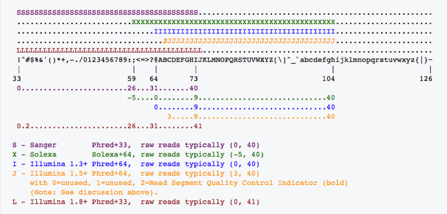

# 生物信息学常见文件格式

- [生物信息学常见文件格式](#生物信息学常见文件格式)
  - [BED文件](#bed文件)
  - [GTF/GFF文件](#gtfgff文件)
  - [FASTQ文件](#fastq文件)
    - [附：Phred体系](#附phred体系)
    - [如何判断是Phred33还是Phred64](#如何判断是phred33还是phred64)
  - [VCF文件](#vcf文件)
  - [SAM文件](#sam文件)
    - [头部信息介绍](#头部信息介绍)
    - [比对信息介绍](#比对信息介绍)
      - [第二列`FLAG`取值](#第二列flag取值)
      - [第五列`CIGAR`字符串](#第五列cigar字符串)
      - [比对信息第12列及之后：可选字段](#比对信息第12列及之后可选字段)


## BED文件

BED文件(Browser Extensible Data)格式是UCSC Genome Browser的一个格式，提供了一种灵活的方式来定义的数据行，以用来描述注释信息。BED行有3个必须的列和9个额外可选的列，每行的数据格式要求一致。

**必须有以下3列**
* chrom：即染色体号
* chromStart：即feature在染色体上起始位置，在染色体上最左端坐标是0
* chromEnd：即feature在染色体上的终止位置。例如一个染色体前100个碱基定义为chromStart=0, chromEnd=100, 跨度为0-99

**可选的9列**
* name：feature的名字，在基因组浏览器左边显示
* score：在基因组浏览器中显示的灰度设定，值介于0-1000
* strand：定义链的方向，`+`或者`-`
* thickStart：起始位置(例如基因起始编码位置）
* thickEnd：终止位置（例如基因终止编码位置）
* itemRGB：是一个RGB值的形式, R, G, B (eg. 255, 0,0), 如果itemRgb设置为`On`, 这个RBG值将决定数据的显示的颜色
* blockCount：BED行中的block数目，也就是外显子数目
* blockSize：用逗号分割的外显子的大小, 这个item的数目对应于BlockCount的数目
* blockStarts：用逗号分割的列表, 所有外显子的起始位置，数目也与blockCount数目对应


## GTF/GFF文件

GFF全称为General Feature Format；GTF全称为Gene Transfer Format。

GTF文件以及GFF文件都由9列数据组成，这两种文件的前8列都是相同的（一些小的差别），第9列信息展现方式有所不同:

* `seqid` - name of the chromosome or scaffold; chromosome names can be given with or without the 'chr' prefix. Important note: the seq ID must be one used within Ensembl, i.e. a standard chromosome name or an Ensembl identifier such as a scaffold ID, without any additional content such as species or assembly. See the example GFF output below. (一般为chr或者scanfold编号) 
* `source` - name of the program that generated this feature, or the data source (database or project name) (注释的来源，如果未知用.代替) 
* `type` - type of feature. Must be a term or accession from the SOFA sequence ontology (注释信息的类型，比如Gene、cDNA、mRNA、CDS等) 
* `start` - Start position of the feature, with sequence numbering starting at 1.
* `end` - End position of the feature, with sequence numbering starting at 1.
* `score` - A floating point value. (序列相似性比对时的E-values值或者基因预测是的P-values值，“.”表示为空) 
* `strand` - defined as + (forward) or - (reverse).(正反义链) 
* `phase` - One of '0', '1' or '2'. '0' indicates that the first base of the feature is the first base of a codon, '1' that the second base is the first base of a codon, and so on. (CDS类型中指出该值，值为CDS的起始位置，除以3得到的余数) 
* `attributes` - A semicolon-separated list of tag-value pairs, providing additional information about each feature. Some of these tags are predefined, e.g. ID, Name, Alias, Parent. 
  * **GFF**：以多个键值对组成的注释信息描述，键与值之间用`=`，不同的键值用`;`
  * **GTF**：以`gene_id`或`transcript_id`开头，但标签与值之间以空格分开，值常加引号，每个特征之后都要有分号间隔（包括最后一个特征）


## FASTQ文件

二代测序平台获得的原始数据为fastq（或为压缩文件fq.gz）格式，包含双末端测序所得的正向和反向两个文件（通常用“1”和“2”来区分），其内容如下：

* 每一个read包含**四行**内容
* 第一行以`@`开头，后面是reads的属性信息，也即read名称，中间用“:”隔开。
* 第二行为read序列信息。一般条件下read1里面最前面为特异性Barcode和反向引物的序列，read2里面最前面为正向引物的序列。
* 第三行以`+`开头，一般与`@`后面的内容相同，常省略，但`+`一定不能省。
* 第四行代表read每个碱基的测序质量。每个碱基对应的字符在ASCII码中对应的十进制数字减去33即为该碱基质量（也即Phred33体系）。如某碱基的质量为D，对应的十进制数字为68，则碱基质量为68-33=35。碱基质量Q=-10*logP，P为碱基被测错的概率。也即Q为30代表被测错的概率为0.001，碱基质量越高，则被测错的概率越低。

### 附：Phred体系

如果直接把Q值直接对应ASCII码，应该挺方便的，但是Q值有时会有负值，再者，看ASCII码的0-31位都是控制字符，没法打印和保存，能打印的从要从32位的空格开始，所以就可以给实际的Q值加上一个固定值，这样就可以打印出来而保存在fastq文件中了。

所以下面就是固定值加多少的问题。Phred33，就是加了33，也就是10变成43，查表是`+`。而当时的Solexa加的是64，这就是Phred64。数据处理时，有些软件会根据碱基质量得分的不同做不同处理，所以需要指定正确的编码方式。一般来说，软件会自动进行判断和处理。



由上图可以看出，Phred+33的字符使用33-73，而+64使用59-104之间的ASCII码。所以，只要ASCII小于59的仅仅在Phred+33中使用，而+64的都大于等于59。对于Illumina 1.8+版本，其使用33-74字符，即大于74的只在Phred+64中使用。

### 如何判断是Phred33还是Phred64

默认读取1000条序列，在这1000条序列中：
* 如果有2个以上的质量字符ASCII值小于等于58（即有两个碱基的得分小于等于25），同时没有任何质量字符的ASCII值大于等于75，即判断是Phred+33。
* 如果有2个以上的质量字符ASCII值大于等于75（即有两个碱基的得分大于等于10），同时没有任何质量字符的ASCII值小于等于58，即判断是Phred+64。
* 如果所有质量字符的ASCII值介于59到74之间，即判断可能是Phred+33，但建议使用更多的序列做进一步测试。出现这种结果可能有两种情况：(1) Phred+33编码，所有碱基质量得分介于26到42之间；(2)Phred+64编码，所有碱基质量得分介于-5到10。是前者的可能性大。
* 如果出现上述3种以外的情况，建议打印出质量字符的ASCII值人工判断，脚本如下：
```bash
cat test.fq | head -n 1000 | awk '{if(NR%4==0) printf("%s",$0);}' \
| od -A n -t u1 -v \
| awk 'BEGIN{min=100;max=0;} \
{for(i=1;i<=NF;i++) {if($i>max) max=$i; if($i<min) min=$i;}}END \
{if(max<=126 && min<59) print "Phred33"; \
else if(max>73 && min>=64) print "Phred64"; \
else if(min>=59 && min<64 && max>73) print "Solexa64"; \
else print "Unknown score encoding"; \
```


## VCF文件

VCF是用于描述SNP，INDEL和SV结果的文本文件。VCF文件分为两部分内容：以"#"开头的注释部分；没有"#"开头的主体部分。注释部分有很多对VCF的介绍信息，仔细查看注释部分就可以完全明白VCF各行各列的意义。主体部分中每一行代表一个Variant的信息。

* **CHROM 和 POS**：代表参考序列名和variant的位置；如果是INDEL的话，位置是INDEL的第一个碱基位置。
* **ID**：variant的ID。比如在dbSNP中有该SNP的id，则会在此行给出；若没有，则用"."表示其为一个novel variant。
* **REF 和 ALT**：参考序列的碱基 和 Variant的碱基。
* **QUAL**：Phred格式(Phred_scaled)的质量值，表示在该位点存在variant的可能性；该值越高，则variant的可能性越大；计算方法：`Phred = -10 * log (1-p)` ，p为variant存在的概率; 通过计算公式可以看出值为10的表示错误概率为0.1，该位点为variant的概率为90%。
* **FILTER**：使用上一个QUAL值来进行过滤的话，是不够的。GATK能使用其它的方法来进行过滤，过滤结果中通过则该值为"PASS"或"."。
* **INFO**：这一行是variant的详细信息，以"TAG=Value"，并使用";"分隔的形式。其中很多的注释信息在VCF文件的头部注释中给出：
  * **AC，AF 和 AN**：AC(Allele Count) 表示该Allele的数目；AF(Allele Frequency) 表示Allele的频率； AN(Allele Number) 表示Allele的总数目。对于1个diploid sample而言：则基因型 0/1 表示sample为杂合子，Allele数为1(双倍体的sample在该位点只有1个等位基因发生了突变)，Allele的频率为0.5(双倍体的sample在该位点只有50%的等位基因发生了突变)，总的Allele为1； 基因型 1/1 则表示sample为纯合的，Allele数为2，Allele的频率为1，总的Allele为2。
  * **DP**：reads覆盖度。是一些reads被过滤掉后的覆盖度。
  * **Dels**：Fraction of Reads Containing Spanning Deletions。进行SNP和INDEL calling的结果中，有该TAG并且值为0表示该位点为SNP，没有则为INDEL。
  * **FS**：使用Fisher's精确检验来检测strand bias而得到的Fhred格式的p值。该值越小越好。一般进行filter的时候，可以设置 FS < 10～20。
  * **HaplotypeScore**：Consistency of the site with at most two segregating haplotypes
  * **InbreedingCoeff**：Inbreeding coefficient as estimated from the genotype likelihoods per-sample when compared against the Hard-Weinberg expectation
  * **MLEAC**：Maximum likelihood expectation (MLE) for the allele counts (not necessarily the same as the AC), for each ALT allele, in the same order as listed
  * **MLEAF**：Maximum likelihood expectation (MLE) for the allele frequency (not necessarily the same as the AF), for each ALT alle in the same order as listed
  * **MQ**：RMS Mapping Quality
  * **MQ0**：Total Mapping Quality Zero Reads
  * **MQRankSum**：Z-score From Wilcoxon rank sum test of Alt vs. Ref read mapping qualities
  * **QD**：Variant Confidence/Quality by Depth
  * **RPA**：Number of times tandem repeat unit is repeated, for each allele (including reference)
  * **RU**：Tandem repeat unit (bases)
  * **ReadPosRankSum**：Z-score from Wilcoxon rank sum test of Alt vs. Ref read position bias
  * **STR**：Variant is a short tandem repeat
* **FORMAT 和 B001**：这两行合起来提供了"B001"这个sample的基因型的信息。"B001"代表这该名称的样品，是由BAM文件中的@RG下的SM标签决定的。
  * **GT**：样品的基因型（genotype）。两个数字中间用’/'分开，这两个数字表示双倍体的sample的基因型。0 表示样品中有ref的allele； 1 表示样品中variant的allele； 2表示有第二个variant的allele。因此： 0/0 表示sample中该位点为纯合的，和ref一致； 0/1 表示sample中该位点为杂合的，有ref和variant两个基因型； 1/1 表示sample中该位点为纯合的，和variant一致。
  * **AD 和 DP**：AD(Allele Depth)为sample中每一种allele的reads覆盖度,在diploid（二倍体）中则是用逗号分割的两个值，前者对应ref基因型，后者对应variant基因型； DP（Depth）为sample中该位点的覆盖度。
  * **GQ**：基因型的质量值(Genotype Quality)。Phred格式(Phred_scaled)的质量值，表示在该位点该基因型存在的可能性；该值越高，则Genotype的可能性越大；计算方法：`Phred = -10 * log (1-p)`，p为基因型存在的概率。
  * **PL**：指定的三种基因型的质量值(provieds the likelihoods of the given genotypes)。这三种指定的基因型为(0/0,0/1,1/1)，这三种基因型的概率总和为1。和之前不一致，该值越大，表明为该种基因型的可能性越小。 `Phred = -10 * log (p)`，p为基因型存在的概率。


## SAM文件

SAM文件由两部分组成：头部信息和比对信息，都是以tab键分隔。

### 头部信息介绍

每个标题行以字符`@`开头，后面是两个字母的记录类型代码。在标题中，每一行都是由制表符分隔的。除了`@CO`行，每个数据字段都遵循格式`TAG:VALUE`，其中`TAG`是两个字母组成的字符串，定义了内容和值的格式。每个标题行应该匹配:`/^ @(HD|SQ|RG|PG)(\\t\[A-Za-z\]\[A-Za-z0-9\]:\[-~\]+)+$ /`或`/^@CO\\t.\*/`。小写字母是保留给用户自定义内容使用的，不会在任何版本定义中出现。以下给出了定义的记录类型和标记。

- `@HD` 首行，输出文件的第一行  
  * `VN` 格式版本
  * `SO` 比对排序类型，有unknown (default), unsorted, queryname和coordinate，对于coordinate，排序的主键是`RNAME`，其顺序由标题中的`@SQ`行顺序定义，次要排序键是`POS`字段。如果`RNAME`和`POS`相同，顺序是任意随机的。
  
- `@SQ` 参考序列字典，`@SQ`行的顺序定义了比对文件排序顺序。
  * `SN` 参考序列名字(染色体)。每一个`@SQ`行必须含有一个去重的`SN`标签。这个字段的值是用于`RNAME`和`PNEXT`比对的记录
  * `LN` 参考序列长度
  * `AS` 基因组装配标识符
  * `M5` MD5算法校验序列码
  * `SP` 物种
  * `UR` 参考序列的URI。这个值从一个标准的协议开始，例如，`http:`或`ftp:`，如果不是这些协议作为开始，那么就应该是文件系统路径
  
- `@RG` Read Group，1个样本的测序结果为1个Read Group。允许有多个无序的`@RG`行
  * `ID` read group标识符。每一个`@RG`行必须含有一个唯一的ID
  * `CN` 测序中心提供的read名称
  * `DS` 描述
  * `DT` 测序的日期 (ISO8601 date or date/time)
  * `LB` 文库名
  * `PL` 用于产生reads的平台/技术。可用值: CAPILLARY, LS454, ILLUMINA, SOLID, HELICOS, IONTORRENT and PACBIO
  * `PU` 平台单元（flowcell-barcode.lane for Illumina or slide for SOLiD）。唯一标识符。  
  * `SM` 样本名
  
- `@PG` 比对所使用的软件程序及版本  
  * `ID` 程序记录标识符。每个`@PG`必须有一个唯一的`ID`
  * `PN` 程序名字
  * `CL` 比对操作的命令行内容
  * `VN` 程序版本
 
- `@CO` 单行的text描述，是一个任意的说明信息。允许多个`@CO`行无序排列

### 比对信息介绍  

比对信息部分(alignment section)，每一行表示一个片段（segment）的比对信息，包括11个必须的字段（mandatory fields）和一个可选的字段，字段之间用tab分割。必须的字段有11个，顺序固定，不可用时，根据字段定义，可以为`0`或者`*`，这是11个字段包括：

1. `QNAME` 比对片段的（template）的编号；read name，read的名字通常包括测序平台等信息
2. `FLAG` 位标识，template mapping情况的数字表示，每一个数字代表一种比对情况，这里的值是符合情况的数字相加总和
3. `RNAME` 参考序列的编号，如果头部注释中对SQ-SN进行了定义，这里必须和其保持一致，另外对于没有mapping上的序列，这里是`*`
4. `POS` 比对上的位置，注意是从`1`开始计数，没有比对上，此处为`0`
5. `MAPQ` mapping的质量，比对的质量分数，越高说明该read比对到参考基因组上的位置越唯一
6. `CIGAR` 简要比对信息表达式（Compact Idiosyncratic Gapped Alignment Report），其以参考序列为基础，使用数字加字母表示比对结果，match/mismatch、insertion、deletion 对应字母`M`、`I`、`D`。比如`3S6M1P1I4M`，前三个碱基被剪切去除了，然后6个比对上了，然后打开了一个缺口，有一个碱基插入，最后是4个比对上了，是按照顺序的
7. `RNEXT` 配对片段（即mate）比对上的参考序列的编号，没有另外的片段，这里是`*`，同一个片段，用`=`
8. `PNEXT` 配对片段（即mate）比对到参考序列上的第一个碱基位置，若无mate,则为0
9. `TLEN`  Template（文库插入序列）的长度，最左边的为正，最右边的为负，中间的不用定义正负，不分区段（single-segment)的比对上，或者不可用时，此处为0(ISIZE，Inferred fragment size.详见Illumina中paired end sequencing 和 mate pair sequencing，是负数，推测应该是两条read之间的间隔(待查证)，若无mate则为0)
10. `SEQ` 序列片段的序列信息，如果不存储此类信息，此处为`*`，注意CIGAR中`M/I/S/=/X`对应数字的和要等于序列长度。**比对到正链上，此处即为read的序列；比对到互补链上，则是read序列的反向互补（即此处序列与参考基因组正链方向一致）**
11. `QUAL` 序列的质量信息, read质量的ASCII编码。格式同FASTQ一样。
12. 第十二列及之后：Optional fields，以tab建分割。

#### 第二列`FLAG`取值

| FLAG(十进制) | Bitwise(二进制) | 十六进制 | 内容描述 |
|:---:|:---:|:---:|:---:|
| 1 | 0000 0000 0001 | 0x1 | 代表PE测序，如果是0，代表SE测序 |
| 2 | 0000 0000 0010 | 0x2 | 代表正常比对，如果是PE测序，还代表PE的两条read之间的比对距离没有明显的偏离插入片段长度 |
| 4 | 0000 0000 0100 | 0x4 | 代表这个序列没有mapping到参考序列上 |
| 8 | 0000 0000 1000 | 0x8 | 代表这个序列的另一端序列没有比对到参考序列上，比如这条序列是R1,它对应的R2端序列没有比对到参考序列上 |
| 16 | 0000 0001 0000 | 0x10 | 代表这个序列比对到参考序列的负链上 |
| 32 | 0000 0010 0000 | 0x20 | 代表这个序列对应的另一端序列比对到参考序列的负链上 |
| 64 | 0000 0100 0000 | 0x40 | 代表这个序列是R1端序列，read1 |
| 128 | 0000 1000 0000 | 0x80 | 代表这个序列是R2端序列，read2 |
| 256 | 0001 0000 0000 | 0x100 | 代表这个序列不是主要的比对，一条序列可能比对到参考序列的多个位置，只有一个是首要的比对位置，其他都是次要的 |
| 512 | 0010 0000 0000 | 0x200 | 该read没有通过质量控制 |
| 1024 | 0100 0000 0000 | 0x400 | 代表这个序列是PCR重复序列 |
| 2048 | 1000 0000 0000 | 0x800 | 这条read可能存在嵌合，这个比对的部分只是来自其中的一部分序列(Supplementary alignment) |

1. 关于Supplementary的定义，可以看文档对chimeric alignment（嵌合比对）的描述
chimeric alignment:“嵌合比对” 的形成是由于一条测序read比对到基因组上时分别比对到两个不同的区域，而这两个区域基本没有overlap。因此它在sam文件中需要占用多行记录显示。只有第一个记录被称作"representative",其他的都是"supplementary"【Chimeric reads are also called split reads】
2. 当`FLAG`包含`16`时，bam文件中记录的序列是原始序列的反向互补序列，而且质量值也是反向的.

#### 第五列`CIGAR`字符串

CIGAR | BAM | 描述 | 消耗待比对序列 | 消耗参考序列
:---:|:---:|:---:|:---:|:---:
M | 0 | 位置能比对上 | yes | yes
I | 1 | 相对参考序列有插入 | yes | no
D | 2 | 相对参考序列有缺失 | no | yes
N | 3 | 从参考序列上跳过一段 | no | yes
S | 4 | 软切割（被切割的序列保留在SEQ中） | yes | no
H | 5 | 硬切割（被切割的序列不出现在SEQ中） | no | no
P | 6 | 补丁（打了补丁的参考序列中的沉默缺失） | no | no
= | 7 | read碱基与参考序列相同 | yes | yes
X | 8 | read碱基与参考序列不同 | yes | yes

1. "消耗查询序列"与"消耗参考序列"分别指`CIGAR`是否引起比对沿着查询序列和参考序列的方向向前前进一个或几个碱基
2. `H`只能出现在`CIGAR`的开始或最后
3. `S`的两边必为`H`，否则必须位于`CIGAR`的两端
4. 对于mRNA到基因组的比对，`N`表示内含子。对于其他类型的比对，`N`的解释未被定义
5. `MIS=X`的长度和应该等于SEQ长度

#### 比对信息第12列及之后：可选字段

所有的可选字段服从`TAG:TYPE:VALUE`格式，其中`TAG`是两个字符组成的字符串，符合正则表达式`/\[A-Za-z\]\[A-Za-z0-9\]/`。每个`TAG`在一个比对行中只能出现一次。小写字母组成的`TAG`保留给终端用户自定义。在可选字段中，`TYPE`是大小写敏感的单个字母，用来定义`VALUE`的格式
    
| TYPE | 相应VALUE的正则表达式 | 描述 |
|:---:|:---:|:---:|
| A | \[!-~\] | 可打印字符 |
| i | \[-+\]?\[0-9\]+ | 有符号的整数（SAM格式对这里整数的范围没有要求，但BAM要求范围是\[-2^31, 2^32 \]，所以SAM也得在这个范围内） |
| f | \[-+\]?\[0-9\]\*.?\[0-9\]+(\[eE\]\[-+\]?\[0-9\]+)? | 单精度浮点数 |
| Z | \[ !-~\]\* | 可打印字符串，包括空格 |
| H | (\[0-9A-F\]\[0-9A-F\])\* | 十六进制格式的二进制数列表（例如，二进制列表\[0x1a, 0xe3, 0x1\]对应十六进制串 ‘1AE301’） |
| B | \[cCsSiIf\](,\[-+\]?\[0-9\]\*.?\[0-9\]+(\[eE\]\[-+\]?\[0-9\]+)?)\* | 整数或数字数组 |
    
1. 对于一个整数或数字列表（类型B），第一位字母指明后面逗号分隔的列表的数字类型，可以是`cCsSiIf`中的一个，分别对应int8 t (有符号的8位整数), uint8 t (无符号的8位整数), int16 t, uint16 t, int32 t, uint32 t and float（Explicit typing eases format parsing and helps to reduce the file size when SAM is converted to BAM）。输入输出过程中，如果其他类型也能与列表兼容，列表元素的类型可能会改变。
2. 可选字段-预定义的标签：在[SAM可选字段说明](http://samtools.github.io/hts-specs/SAMtags.pdf)中有描述，其中描述了已有的标准TAG字段和自定义字段的细节。以X、Y、Z开头的TAG和包含小写字母的TAG保留为终端用户自定义使用，例如：
   1. `AS:i` 匹配的得分
   2. `XS:i` 第二好的匹配的得分
   3. `YS:i` mate 序列匹配的得分
   4. `XN:i` 在参考序列上模糊碱基的个数
   5. `XM:i` 错配的个数
   6. `XO:i` gap open的个数，针对于比对中的插入和缺失
   7. `XG:i` gap 延伸的个数，针对于比对中的插入和缺失
   8. `NM:i` 编辑距离。但是不包含头尾被剪切的序列。一般来说等于序列中error base的个数
   9. `YF:i` 该reads被过滤掉的原因。可能为LN(错配数太多，待查证)、NS(read中包含N或者．)、SC(match bonus低于设定的阈值)、QC(failing quality control，待证)
   10. `YT:Z` 值为UU表示不是pair中一部分(单末端？)、CP(是pair且可以完美匹配)、DP(是pair但不能很好的匹配)、UP(是pair但是无法比对到参考序列上)
   11. `MD:Z` 比对上的错配碱基的字符串表示
   12. `bwa`定义
       1.  `XT:A` 比对Type: Unique/Repeat/N/Mate-sw 如 XT:A:U 表示唯一比对
       2.  `XM:i` 比对中mismatch的数目

