# 链特异性测序
> https://kaopubear.top/blog/2017-11-11-ssrna/  
> https://www.jianshu.com/p/670cd485d673  
> 可对 bam 文件用[RSeQC](http://rseqc.sourceforge.net/#infer-experiment-py)中的 `infer_experiment.py` 命令直接判断是否链特异性建库

## RNA-seq 基本流程

下图是一个大概的 RNA-seq 基本流程

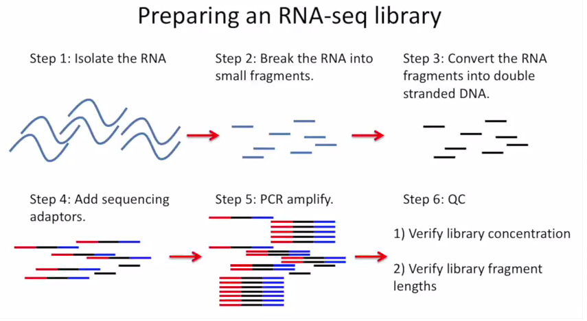

把 RNA 破碎成小片段，然后将 RNA 转变成一条 cDNA，这一步需要用到反转录酶 reverse transcriptase (RT) 才能用 RNA 作为模板合成 DNA。

不论是转录还是反转录都需要引物。通常如果我们要 mRNA，那就可以用 oligo-dT 作为 RT 的引物，但是用它有两个问题，第一个是只能反转录那些有 A 尾巴的 RNA，第二个问题是 RT 不是一个高度持续性的聚合酶，可能让转录提前发生终止，造成的结果就是 3'端要比 5'端 reads 富集，这样就会使得后续定量分析带来 bias。

另一种常用的引物称为**随机引物**，随机引物的好处是没有 A 尾巴的诸如 ncRNA 也被留下了，而且不会存在明显的 3'端偏差。但是很多研究也发现，所谓的随机引物根本就不随机，**这也是测序结果中，通常前 6 个碱基的 GC 含量分布特别不均匀的原因**。这几个碱基 GC 含量均匀很可能不是接头或者 barcode 那些东西，其实是 Illumina 测序 RT 这一步的 random hexamer priming 造成的 bias，很多人在处理数据的时候会把这几个碱基去掉，其实很多时候 RNA-seq 数据去不去掉基本什么影响，不过开头如果有低质量的碱基倒是应该去掉。

随后是第二条链合成，这一步用是 DNA 聚合酶，以刚才和成的第一条链作为模板。

接下来就是在序列两端加上接头，加接头一方面是为了让机器可以识别这些序列，把这些序列固定；二是为了让多个样品可以同时上机，平摊每个样品的测序价格。双端测序为了让 read 从两边开始延伸，也需要在两端有所需的引物。

| Adapter element | Requirement | Location | Function |
| --- | --- | --- | --- |
| **Amplification element** | Required | 5′ and 3′ terminus | Clonal amplification of the construct |
| **Primary sequencing priming site** | Required | Adjacent to the insert | Initiating the primary sequencing reaction |
| **Barcode/Index** | Optional | 5′-end of the insert/Between the sequencing priming site and its respective amplification element | Provides a unique label to sequences from different samples. Allows pooling of multiple experiments in a single sequencing reaction. |
| **Paired-end sequencing priming site** | Optional | Adjacent to the insert on the side opposite of the primary sequencing priming site | Sequencing into the insert on the end opposite of the primary read |
| **Index sequencing priming site** | Optional | Complementary to the 5′-end of the sequencing priming site | Sequencing of the index |

所谓双端测序，因为很多时候 read 的长度要短于 insert，为了增加覆盖度于是就想出了从 insert 两端同时测序的办法。使得测序深度增加的同时也能够用来判断 isoform 方向。

对于 illumina 数据，有一条 5-3 的 universal adaptor；还有一条是 3-5 的 indexed adatpor，这条引物含有特意的 barcode。需要说明的是，在双端测序中，如果 insert 不是足够长，那么 R1 可能就会测到 R2 的引物，同时 R2 可能会测到 R1 引物的反向互补序列。

大概的意思就是下面两张图。

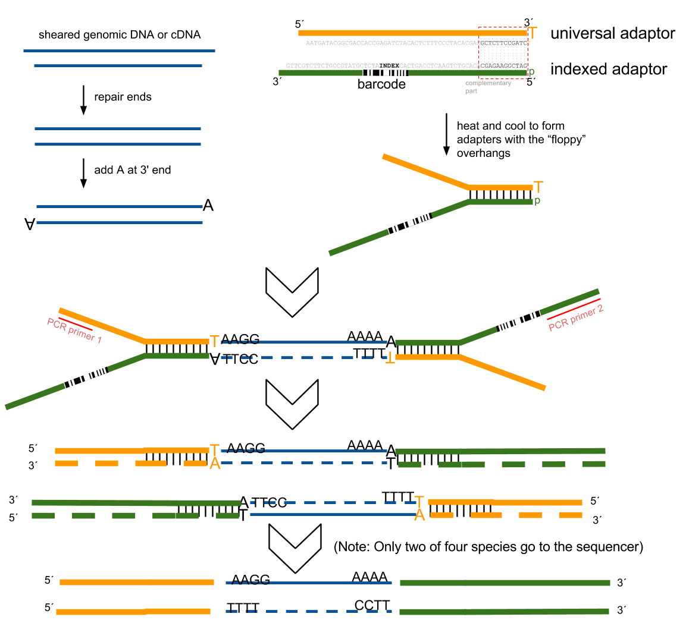

加了接头以后进行 PCR 的扩增。扩增后就开始测序，测序的过程如下图所示。

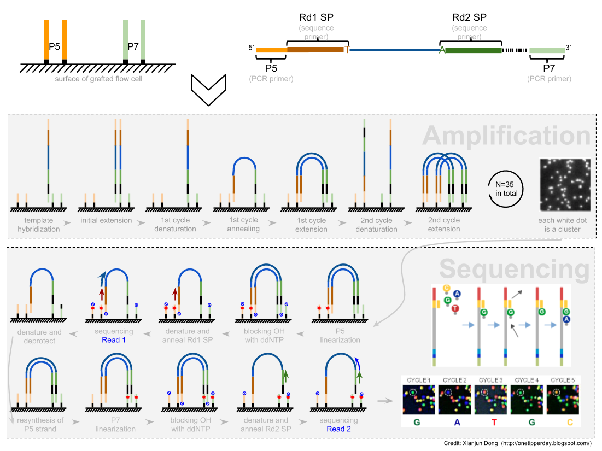

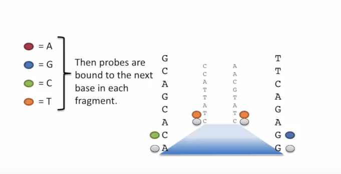

测序的基本思想是机器识别四种碱基发出的不同颜色的荧光，可以理解为一个 flow cell 立着非常多序列，机器一层一层扫过去，通过识别荧光而判断这一层每个序列的碱基是什么。

因为一个 cell 密密麻麻的全是荧光信号，机器并不是总能把每一个判断的非常准确，如果某一个荧光信号没有那么清晰，这个碱基的测序质量就比较低，如下图。

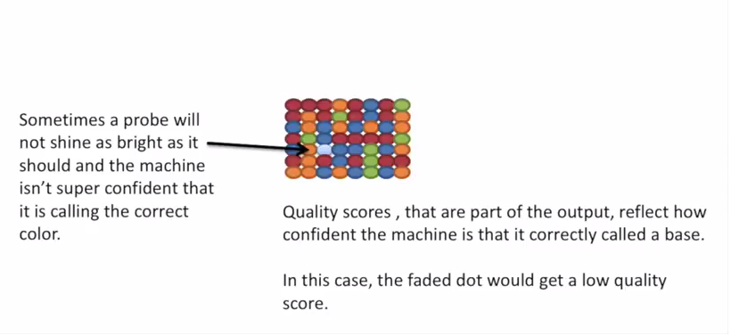

有的时候，如果一大片点都是同一种荧光，机器也可能犯晕，不知道到底哪一个荧光属于哪一个序列。这种情况尤其是在序列的前几个碱基容易发生。

> The sequencing machine uses the first few bases to establish where the cDNA fragments are on the flow cell. If all of the bases in one part of the flow cell are all the same, like 'C', and all show up green in the picture, then the colors will bleed together and it will not be clear where exactly all of the reads are. In contrast, if you have a lot of different colors in a region, it's easier to determine where each one is, even with a little color bleed.

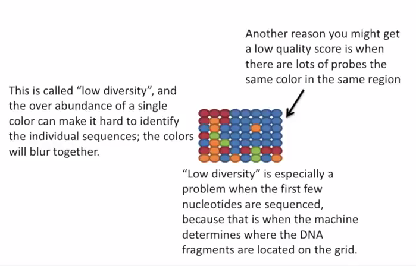

## 链特异性测序

和普通的 RNAseq 不同，链特异性测序可以保留最初产生 RNA 的方向，普通建库方式为什么不行呢？因为传统建库方式通过两个接头的 ligation 把 RNA 已经变成了双链 DNA，最后的文库中一部被测序的链对应正义链（sense strand），一部分被测序的链测是反义链。

链特异性建库方式有不止一种，详见下表和下图：

| **Library Type** | **Examples** | **Description** |
| --- | --- | --- |
| fr-unstranded | Standard Illumina | Reads from the left-most end of the fragment (in transcript coordinates) map to the transcript strand, and the right-most end maps to the opposite strand. |
| fr-firststrand | dUTP, NSR, NNSR | Same as above except we enforce the rule that the right-most end of the fragment (in transcript coordinates) is the first sequenced (or only sequenced for single-end reads). Equivalently, it is assumed that only the strand generated during first strand synthesis is sequenced. |
| fr-secondstrand | Ligation, Standard SOLiD | Same as above except we enforce the rule that the left-most end of the fragment (in transcript coordinates) is the first sequenced (or only sequenced for single-end reads). Equivalently, it is assumed that only the strand generated during second strand synthesis is sequenced. |

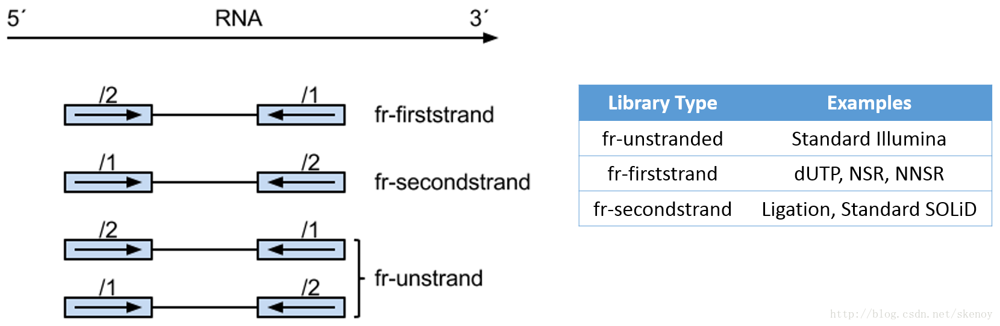  
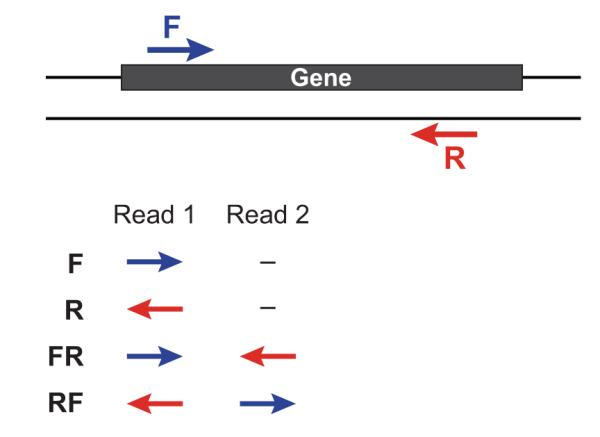  
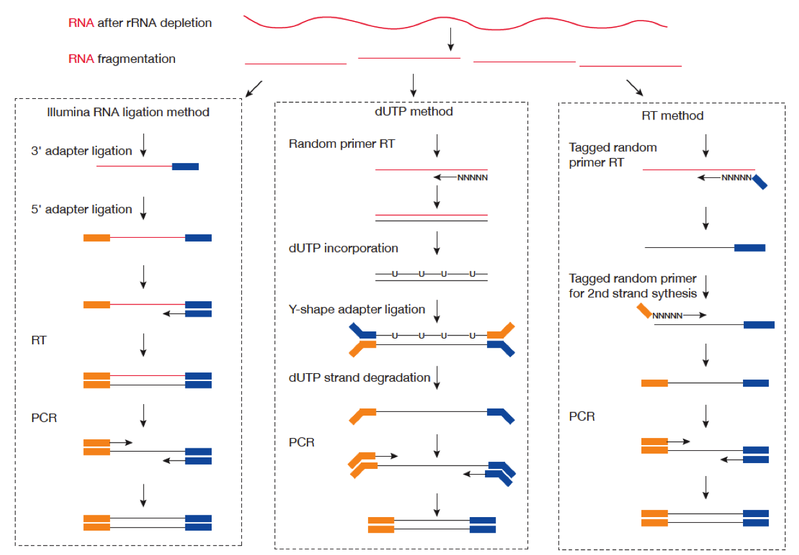

**下图比较了 dUTP 和 Ligaction 建库方法：**  
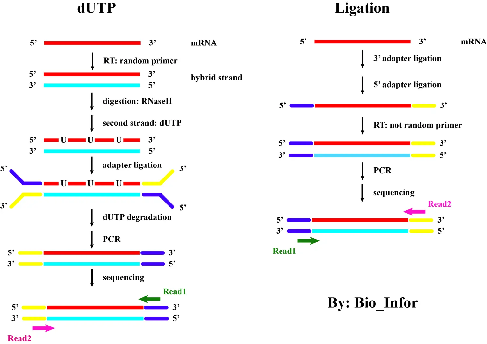

**详细来讲：**  
- 在这里，红色始终表示sense strand的信息，天蓝色始终表示antisense strand的信息，蓝色和黄色表示接头，深绿色和玫瑰红色表示reads。  
- 需要注意的是：在将adapter连接到待测序的核酸链上时，能够与裸露的3'端连接的一定是黄色的adapter；而能够与裸露的5'端连接的一定是蓝色的adapter！而我们在测序时，首先会添加能够与蓝色adapter结合的测序引物进行测序，生成read1，随后才是生成read2。仔细看就知道，从连上接头两边就已经开始出现差异了，所以这两种测序建库方法，得到的reads与链之间的关系一定是相反的。

## 链特异性测序数据分析

详见[Strandness in RNASeq](https://littlebitofdata.com/en/2017/08/strandness_in_rnaseq/)

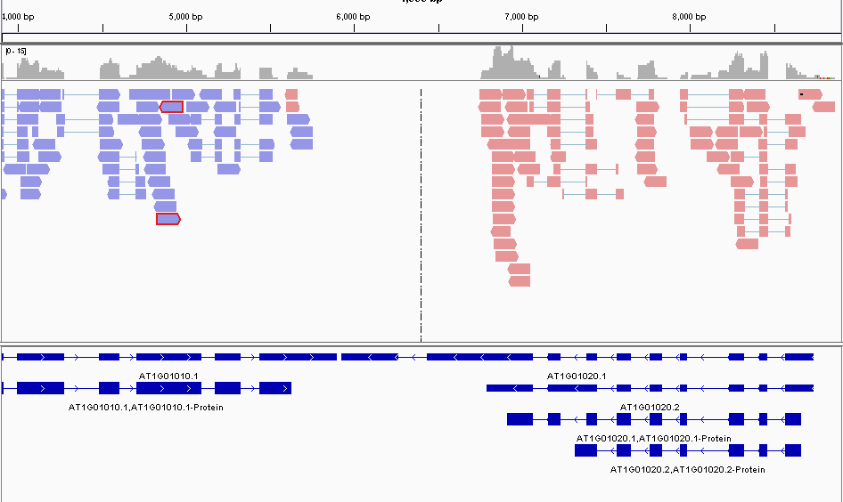  

|  | Condition A | Condition B | Condition C |
| --- | --- | --- | --- |
| METHODS or KITS | Ligation / Standard SOLiD | dUTP / Illumina TruSeq Stranded | Standard Illumina |
| Read 1 | sense strand | antisense strand | no strand |
| TopHat | `--library-type fr-secondstrand` | `--library-type fr-firststrand` | `--library-type fr-unstranded` |
| HTSeq | `stranded=yes` | `stranded=reverse` | `stranded=no` |
| FeatureCounts | `-s 1` | `-s 2` | `-s 0` |
| RSEM | `--forward-prob 1` | `--forward-prob 0` | `--forward-prob 0.5` |
| Kallisto | `--fr-stranded` | `--rf-stranded` |  |
| Salmon | `-l ISF` | `-l ISR` | `-l IU` |
| collectRnaSeq Metrics | `FIRST_READ_TRANSCRIPTION_STRAND` | `SECOND_READ_TRANSCRIPTION_STRAND` |  |
| Trinity | `--SS_lib_type FR` | `--SS_lib_type RF` |  |

链特异性建库方式（以目前最常用的 dUTP 为例）首先利用随机引物合成 RNA 的一条 cDNA 链，在合成第二条链的时候用 dUTP 代替 dTTP，加 adaptor 后用 UDGase 处理，将有 U 的第二条 cDNA 降解掉。这样最后的 insert DNA fragment 都是来自于第一条 cDNA，也就是 dUTP 叫 fr-firststrand 的原因。

**对于 dUTP 数据，各软件参数应该设置为：**
- **tophat**: `--library-type fr-firststrand`
- **cufflinks**: `--library-type fr-firststrand`
- **hisat2**: `--rna-strandness RF`
- **STAR**: `--outSAMstrandField intronMotif`
- **htseq-count**: `-s reverse`
- **featureCounts**: `-s 2`
- **stringTie**: `--rf`

总结：
- dUTP 链特异性测序中，RNA 方向（gff 文件中基因的方向）与 read1 相反，与 read2 相同。如果 read1 比对到基因组正链上，则对应的 gene 在基因组负链；如果 read2 比对到基因组正链则对应的 gene 在基因组正链。
- dTUP 测序方式叫做 fr-firstrand（留下的是 cDNA 第一条链），也是 RF。
- 如果 dUTP 链特异性测序，看基因表达量应该 counts for the 2nd read strand aligned with RNA (htseq-count option `-s reverse`, STAR `ReadsPerGene.out.tab` column 3 )
- 如果想看反义链是否有转录本（比如 NAT）应该用 the 1st read strand aligned with RNA ( htseq-count option `-s yes`，STAR `ReadsPerGene.out.tab` column 4)

## “链”的含义

- **正负链（正链: forward strand, plus strand; 负链: reverse strand, minus strand）**  
    正负链这个定义实际上很“人为”，在参考基因组中，DNA的一条链被指定为正链，另一条链就被指定为负链，这个指定是大家都保持一致的，即通用，我们所使用的参考基因组都是正链的序列。
- **模板链、非模板链**  
    在转录过程当中，与RNA结合，充当转录模板的那条DNA链，我们称之为模板链，自然另外那条链就称为非模板链。简单来说，模板链是与RNA互补的那条DNA链，非模板链是与RNA序列相同的那条链（这样说不严谨，但是方便大家理解）。
- **正义链（sense strand）、反义链（antisense strand）**  
    接着前面的，正义链就是和RNA序列相同的那条DNA链，反义链就是和RNA互补的那条DNA链。
- **编码链（coding strand）、非编码链（noncoding strand）**  
    接着前面的，编码链就是和RNA序列相同的那条DNA链，非编码链就是和RNA互补的那条DNA链。

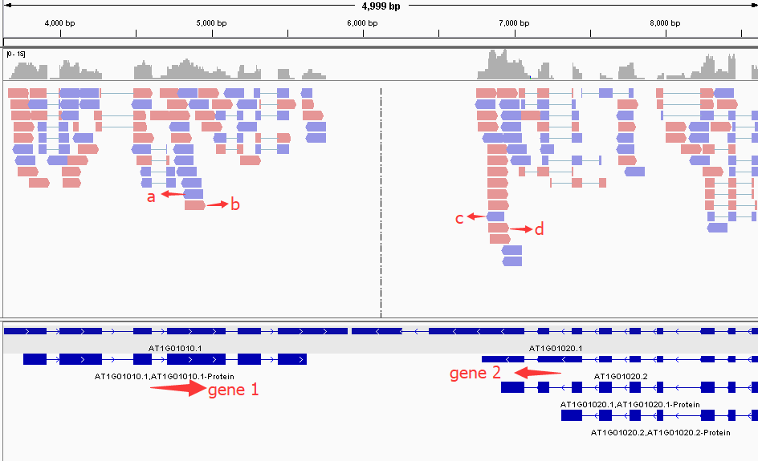

