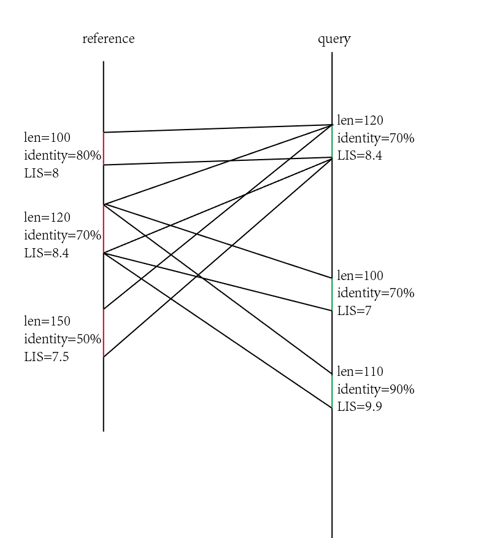
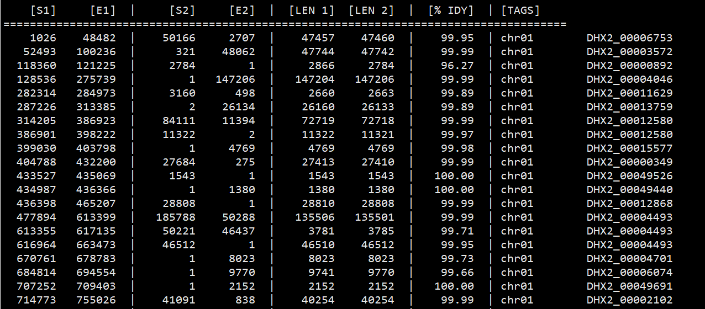
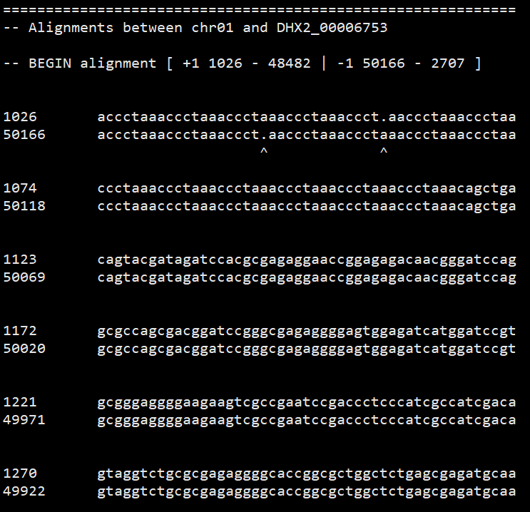

# MUMmer大片段比对与基因组共线性

> [MUMmer3 Manual](http://mummer.sourceforge.net/manual/)  
> https://www.jianshu.com/p/2e184e5c15b7  
> https://github.com/MariaNattestad/Assemblytics

测序技术刚开始发展的时候，大家得到的序列都是单个基因的长度，所以一般都是逐个基因的比较，用的都是BLAST或FASTA通过逐个基因联配的方式搜索数据库。但是1999年后，越来越多的物种全基因组出现，比如说在1999年出现了 _Helicobacter pylori_ 的第二类菌株的基因组序列，就需要研究同一物种不同品系进化过程的基因组变化，比如说基因倒置现象。传统的BLAST/FASTA就用不了，就需要用到新的工具，这就是MUMmer出现的历史背景。

那么MUMmer能用来研究什么呢？比如说细菌的不同菌株基因组中倒置现象，人和老鼠的基因组在进化上的重排现象。还有比较同一物种的不同组装结果等。MUMmer的算法基础(suffix tree)使得它的速度比BLASTZ(k-mers)快得多，但是灵敏度低，也就是检测不到比较弱的匹配，但是作者说这都是可以通过修改参数进行改善.

## 安装

MUMmer是开源软件，因此可以通过下载源码编译的方式进行安装，同时biconda上已经有编译好的二进制版本方便用conda进行安装。

## MUMmer使用方法

MUMmer的核心基于 _Maximal Exact Matching_ 算法开发的`mummer`。其他工具(`nucmer`,`promer`,`run-mummer1`.`run-mummer3`)都是基于`mummer`的开发的流程。这些流程的分析策略分为三部：

1. 用`mummer`在两个输入中找**给定长度**的极大唯一匹配( _Maximal Exact Matching_ )
2. 然后将这些匹配区域**聚类**成较大不完全联配区域, 作为锚定点(anchor)
3. 最后它从每个匹配外部扩展联配, 形成有gap的联配。

### Maximal Exact Matching

MUMmer核心是基于后缀树(suffix tree)数据结构的最大匹配路径。 根据这个算法开发出来的`repeat-match`和`exact-tandems`可以从单个序列中检测重复，`mummer`则是用于联配两条或两条以上的序列。由于MUMmer的其他工具基本都是基于mummer开发的，于是理解mummer就变得非常重要。

> 概念1：suffix tree: 表示一个字符串的所有子字符串的数据结构，比如说abc的所有子字符串就是a,ab,ac,bc,abc.  
> 概念2：Maximal Unique Match: 指的是匹配仅在两个比较序列中各出现一次

**mummer**: 基于后缀树(suffix tree)数据结构，能够在两条序列中有效定位极大唯一匹配(_maximal unique matches_)，因此它比较适用于产生一组准确匹配(exact matches)以点图形式展示，或者用来锚定从而产生逐对联配(pair-wise alignments)

大部分情况下都不会直接用到`mummer`，所以只要知道MUMmer历经几次升级，使得`mummer`可以能够只找在reference和query都唯一的匹配(第一版功能)，也可以找需要在reference唯一的匹配(第二版新增)，甚至不在乎是否唯一的匹配(第三版新增),参数分别为`-mum`,`-mumreference`,`maxmatch`。

**repeat-match**和**exact-tandems**比较少用，毕竟参数也不多，似乎有其他更好的工具能用来寻找序列中的重复区。

### Clustering

`MUMmer`的聚类算法能够比较智能地把几个独立地匹配按照顺序聚成一块。分为两种模式`gaps`和`mgaps`(下图上下两个子图)。这两者差别在于是否允许重排,分别用于`run-mummer1`,`run-mummer3`.


> 基于`gap`和`mgaps`的输出，第四版还提供了`annotate`和`combineMUMs`两个工具增加联配信息。

### 联配构建工具

基于上述两个工具，作者编写了4个工作流程，方便实际使用。

- `nucmer`: 由Perl写的流程，用于联配很相近(closely related)核酸序列。它比较适合**定位和展示高度保守的DNA序列**。注意，为了提高nucmer的精确性，最好把输入序列先做**遮盖(mask)**避免不感兴趣的序列的联配，或者**修改单一性限制**降低重复导致的联配数。
- `promer`：也是Perl写的流程，它以翻译后的**氨基酸序列**进行联配，工作原理同`nucmer`.
- `run-mummer1`,`run-mummer3`： 两者是基于cshell写的流程，用于两个序列的常规联配，和promer,nucmer类似，只不过能够自动识别序列类型。它们擅长联配**相似度高**的DNA序列，找到它们的不同，也就是适合找SNP或者纠错。前者用于1v1无重排，后者1v多有重排

重点介绍一下`nucmer`的使用。reference和query文件都需要时fasta格式，每个都可以有多条序列。

```bash
nucmer [options] <reference> <query file>
```

参数可分为五个部分：匹配，聚类，外延、其他和新增

- 匹配:
```bash
--mum, --mumreference(默认), --maxmatch
--minmatch/-l: 单个匹配最小长度
--forwoard/-f, --reverse/-r: 只匹配正链或只匹配负链。
```

- 聚类：
```bash
--mincluster/-c: 用于聚类的匹配最低长度，默认65
--maxgap/-g: 两个相邻匹配间的最大gap长度，默认90
--diagdiff/-D: 一个聚类中两个邻接匹配，最大对角差分，默认5
--diagfactor/-d: 也是和对角差分相关参数，只不过和gap长度有关，默认0.12
```

- 外延:
```bash
--breaklen/-b: 在对联配两端拓展式，在终止后继续延伸的程度，默认200
--[no]extend：是否外延，默认是
--[no]optimize：是否优化，默认是。即在联配分数较低时不会立刻终止，而是回顾整条联配，看能否苟延残喘一会。
```

- 其他:
```bash
--depend: 显示依赖信息后退出
--coords: 调用show-coords输出坐标信息
--prefix/-p: 输出文件的前缀
--[no]delta: 是否输出delta文件，默认是
```

- **新增**：
```bash
# 在第四版新增的参数
--threads/-t: 多核心
--delta=PATH: 指定位置，而不是当前
--sam-short=PATH：保存为SAM短格式
--sam-long=PATH： 保存为SAM长格式
--save=PREFIX：保存suffix array
--load=PREIFX：加载suffix array
```

运行后得到一个delta格式的文件，它的作用是记录每个联配的坐标，每个联配中的插入和缺失的距离。下面逐行进行解释

```bash
/home/username/reference.fasta /home/username/query.fasta # 两个比较文件的位置
PROMER # 程序运行类型： NUCMER或PROMER
>tagA1 tagB1 3000000 2000000 # 一组联配(可以有多个小匹配)，ref的fastaID，qry的fastaID，ref序列长度，qry序列长度
1667803 1667078 1641506 1640769 14 7 2 # 第一小组 ref起始，ref结束，qry起始，qry结束，错误数(不相同碱基+indel碱基数)，相似错误(非正匹配得分) 终止密码子(NUCMER为0)。 如果结束大于起始，表示在负链。
-145 # qry的145有插入
-3   # qry的145+3=148有插入
-1   # qry的145+3+1=149有插入
40   # qry的145+3+1+40=149有缺失
0 # 表示当前匹配结束
1667804 1667079 1641507 1640770 10 5 3 # 第二小组
-146
-1
-1
-34
0
...
```

## MUMmer用法举例

### 两个完整度高的基因组

比较常见的用法是把一条连续的序列和另一条连续的序列比。比如说两个细菌的菌株,直接用`mummer`

```bash
wget http://mummer.sourceforge.net/examples/data/H_pylori26695_Eslice.fasta
wget http://mummer.sourceforge.net/examples/data/H_pyloriJ99_Eslice.fasta
mummer -mum -b -c H_pylori26695_Eslice.fasta H_pyloriJ99_Eslice.fasta > 26695_J99.mums
# -mum: 计算在两个序列中唯一的最大匹配数
# -b: 计算正向和反向匹配数
# -c: 报告反向互补序列相对于原始请求序列的位置
```

或者是**高度相似**序列，不含重排

```bash
run-mummer1 ref.fasta qry.fasta ref_qry
# 仅报告负链匹配序列
run-mummer1 ref.fasta qry.fasta ref_qry -r
```

或者是**高度相似**序列，存在重排现象

```bash
run-mummer3 ref.fasta qry.fasta ref_qry
```

以上的`run-mummer*`比较关注序列的不同之处，那么对于**相似度没有那么高**的两个序列，就需要用到`nucmer`。`nucmer`关注序列的相似之处，所以它允许重排，倒置和重复现象。`nucmer`允许多对多的比较方式，当然比较常用的是多对一的比较。

```bash
nucmer --maxgap=500 --mincluster=100 --prefix=ref_qry ref.fasta qry.fasta
## --maxgap: 两个match间最大gap为500
##--minclster: 至少要有100个match才能算做一簇
```

> 注意一点： 第四版中`run-mummer1, run-mummer3`已经被废弃了，就是尽管保留了，但是没有对它做任何升级的意思。

如果是**有点差异**的两个序列，可以用翻译的氨基酸序列进行比较

```bash
promer --prefix=ref_qry ref.fasta qry.fasta
```

### 两个基因草图

上面都是两条序列间的比较，但是研究植物的人更容易遇到的是两个物种的基因组都只有scaffold级别，甚至是contig级别。那么就可以使用`nucmer`或`promer`构建序列间的可能联配。

```bash
# 首先过滤低于1kb的序列
bioawk -c fastx '{if (length($seq) > 1000) print ">"$name "\n"$seq}' ~/reference/genome/rice_contigs/HP1 > HP103_1kb.fa
bioawk -c fastx '{if (length($seq) > 1000) print ">"$name "\n"$seq}' ~/reference/genome/rice_contigs/HP119.fa > HP119_1kb.fa
# 处理，时间会比较久，因为分别有20109，17877条contig
nucmer --prefix HP103_HP119 HP103_1kb.fa HP119_1kb.fa &
```

### 一个基因草图对一个完整基因组

这里可以比较一下水稻日本晴基因组和其他地方品种

```bash
nucmer --prefix IRGSP1_DHX2 ~/reference/genome/IRGSP1.0/IRGSP-1.0_genome.fasta ~/reference/genome/rice_contigs/DHX2.fa
```

> 在第四版中新增了一个`dnadiff`，进一步封装`nucmer`和其他数据整理工具，基本上没啥参数，而输出很齐全，非常的人性化。在不知如何开始的时候，可以无脑用这个。

```bash
# 已有delta文件
dnadiff -d IRGSP1_DHX2.delta
# 未有delta文件
dnadiff -p IRGSP1_DHX2 ~/reference/genome/IRGSP1.0/IRGSP-1.0_genome.fasta ~/reference/genome/rice_contigs/DHX2.fa
```

## 数据整理

之前得到的数据还需要用`delta-filter`,`show-coords`和`show-tilling`进行进一步整理才能用于后续的分析。后续操作基于上面的基因草图和完成基因组比较结果。

最初的比对结果保留了最多的信息，需要用`delta-filter`进行一波过滤，除去不太合适的部分。过滤选项有

- `-i`: 最小的相似度 \[0,100\], 默认0
- `-l`: 最小的匹配长度 默认0.
- `-u`: 最小的联配唯一度 \[0,100\], 默认0
- `-o`: 最大重叠度，针对`-r`和`-q`设置。 \[0,100\], 默认100
- `-g`: 1对1全局匹配，不允许重排
- `-1`: 1对1联配，允许重排，是`-r`和`-q`的交集
- `-m`: 多对对联配，允许重排，是`-r`和`-q`的合集。
- `-q`: 仅保留每个query在reference上的最佳位置,允许多条query在reference上重叠
- `-r`: 仅保留每个reference在query上的最佳位置,允许多条reference在query上重叠

以上顺序是`-i -l -u -q -r -g -m -1`.光看参数估计不太明白，来一波图解。referece的一个片段可以联配到query的多个片段上，同样的query的一个片段也可以联配到reference的多个片段上，那么如何取舍呢？



通过`-i`,`-l`可以先过滤一些比较短，并且相似度比较低的匹配情况。进一步，计算长度和相似度的乘积(加权最长增加子集)，对于`-q`而言就是保留左2，对于`-r`则是保留右3. 这就是传说中的三角关系，这种关系可以用`-m`保留或者用`-q`消灭。

比如说我想看contig和reference两者唯一匹配，并且长度在1000，相似度大于90.

```bash
delta-filter -i 89 -l 1000 -1 IRGSP1_DHX2.delta > IRGSP1_DHX2_i89_l1000_1.delta.filter
```

如何才能验证上面参数运行的结果是符合要求的呢？毕竟数据分析第一原则“不要轻易相信分析结果，需要多次验证才能使用”。

可以先用`show-coord`以人类可读的格式显示匹配的坐标。

```bash
show-coords -r IRGSP1_DHX2_i89_l1000_1.delta.filter > IRGSP1_DHX2_i89_l1000_1.coord
# -r：以refID排序，相对的，还有-q，以queryID排序
less IRGSP1_DHX2_i89_l1000_1.coord
```

不难发现这个位置锚定的非常不错，至少暂时看起来没有重叠之处



用`show-aligns`看某一个匹配的序列比对情况。

```bash
show-aligns IRGSP1_DHX2_i89_l1000_1.delta.filter chr01 DHX2_00006753 | less
```



针对reference有很长的组装序列的情况，还可以用`show-tilling`将contig回贴到reference上，如果装了`gnuplot`还能用`mummerplot`可视化点图.`show-tiling`会尝试根据contig和reference匹配信息构建出tiling path，主要用于**Mapping a draft sequence to a finished sequence**:

```bash
nucmer --prefix=ref_qry ref.fasta qry.fasta
show-coords -rcl ref_qry.delta > ref_qry.coords

# If mapping the draft sequences to each of their repeat locations is not required:
delta-filter -q ref_qry.delta > ref_qry.filter
# OR, repeat for every combination of sequences (slooower):
show-aligns ref_qry.delta refname qryname > ref_qry.aligns

show-tiling ref_qry.delta > ref_qry.tiling
```

## SNP与SV检测

### SNP detection

Joining a couple of the MUMmer components together can form a quite reliable SNP detection pipeline. MUMmer can perform all steps of this pipeline from aligning the sequences, to selecting the one-to-one mapping, and finally calling the SNP positions. The user can then process these SNP positions to assign quality scores based on the underlying traces and surrounding context. Such methods have been successfully applied to various SNP studies for organisms including Bacillus anthracis and Yersinia pestis. Of important note, a SNP pipeline built with nucmer allows for the identification of SNPs between two genomes with many rearrangements. The Yersinia pestis strains, for example, demonstrate significant genome "shuffling", and make SNP detection difficult with global alignment programs such as run-mummer1. However, a pipeline built with nucmer (like shown below) is capable of finding all of the SNPs between two genomes, regardless of their structural similarity.

To find a reliable set of SNPs between to highly similar multi-FastA sequence sets ref.fasta and qry.fasta, type:

```bash
nucmer --prefix=ref_qry ref.fasta qry.fasta
show-snps -Clr ref_qry.delta > ref_qry.snps
```

The `-C` option in `show-snps` assures that only SNPs found in uniquely aligned sequence will be reported, thus excluding SNPs contained in repeats. An alternative method which first attempts to determine the "correct" repeat copy is:

```bash
nucmer --prefix=ref_qry ref.fasta qry.fasta
delta-filter -r -q ref_qry.delta > ref_qry.filter
show-snps -Clr ref_qry.filter > ref_qry.snps
```

Now, conflicting repeat copies will first be eliminated with delta-filter and the SNPs will be re-called in hopes of finding some that were previously masked by another repeat copy.

### SV detection: using Assemblytics

```bash
chmod +x scripts/Assemblytics*

scripts/Assemblytics <delta_file> <output_prefix> <unique_anchor_length> <min_variant_size> <max_variant_size>

# e.g.
~/01.software/Assemblytics/scripts/Assemblytics Nip_gran.delta Nip_gran_SV 10000 100 10000
```
