# 分子演化与群体遗传笔记

- [分子演化与群体遗传笔记](#分子演化与群体遗传笔记)
  - [群体遗传演化名词解释](#群体遗传演化名词解释)
  - [Population Genetics Glossary](#population-genetics-glossary)
    - [Glossary and Bibliography of terms in population and molecular genetics, systematics etc.](#glossary-and-bibliography-of-terms-in-population-and-molecular-genetics-systematics-etc)
    - [Useful reference texts](#useful-reference-texts)
    - [Literature cited](#literature-cited)
  - [群体遗传学与重测序分析](#群体遗传学与重测序分析)
    - [0. 几种变异类型](#0-几种变异类型)
    - [1. 重测序和从头组装](#1-重测序和从头组装)
    - [2. 重测序分析流程\[5\]](#2-重测序分析流程5)
    - [3. 群体进化选择](#3-群体进化选择)
      - [3.1 正选择\[6\]](#31-正选择6)
      - [3.2 负选择](#32-负选择)
      - [3.3 平衡选择\[9\]](#33-平衡选择9)
    - [4. 群体遗传学中的统计指标](#4-群体遗传学中的统计指标)
      - [4.1 群体多态性参数](#41-群体多态性参数)
      - [4.2 分离位点数目](#42-分离位点数目)
      - [4.3 核苷酸多样性](#43-核苷酸多样性)
      - [4.3.1 利用杂合度(heterozygosity)计算核苷酸多样性](#431-利用杂合度heterozygosity计算核苷酸多样性)
      - [4.4 群体内选择检验: Tajima's D](#44-群体内选择检验-tajimas-d)
      - [4.5 群体间分歧度检验: Fst](#45-群体间分歧度检验-fst)
      - [4.6 群体分歧度检验: ROD](#46-群体分歧度检验-rod)
    - [5. 群体结构分析](#5-群体结构分析)
      - [5.1 进化树](#51-进化树)
      - [5.2 PCA图](#52-pca图)
      - [5.3 群体分层图](#53-群体分层图)
    - [6. 连锁不平衡分析](#6-连锁不平衡分析)
      - [6.1 LD衰减分析](#61-ld衰减分析)
    - [7. GWAS](#7-gwas)
      - [7.1 GWAS流程](#71-gwas流程)
      - [7.2 GWAS数学模型](#72-gwas数学模型)
      - [7.3 GWAS结果](#73-gwas结果)
    - [8 其他统计指标和算法](#8-其他统计指标和算法)
      - [8.1 MSMC](#81-msmc)
      - [8.2 LAMP](#82-lamp)
      - [8.3 Treemix](#83-treemix)
  - [Determination of Haplotypes from Genotype information](#determination-of-haplotypes-from-genotype-information)
  - [群体选择信号分析](#群体选择信号分析)
    - [群体进化与选择信号](#群体进化与选择信号)
    - [遗传背景分析](#遗传背景分析)
      - [一、主成分分析(Principal Component Analysis)](#一主成分分析principal-component-analysis)
      - [二、进化树](#二进化树)
      - [三、群体结构 (structure) 分析](#三群体结构-structure-分析)
      - [四、LD衰减分析](#四ld衰减分析)
    - [选择信号检测方法](#选择信号检测方法)
      - [一、基于等位基因频率谱](#一基于等位基因频率谱)
      - [二、基于连锁不平衡](#二基于连锁不平衡)
      - [三、基于群体分化](#三基于群体分化)
      - [四、基于基因组杂合度](#四基于基因组杂合度)
      - [选择信号的应用策略](#选择信号的应用策略)
      - [iHS检测群体内的选择信号(基于单体型haplotype的选择信号的检测)](#ihs检测群体内的选择信号基于单体型haplotype的选择信号的检测)
        - [1.数据文件准备](#1数据文件准备)
        - [2.vcf文件的phasing，beagle转换格式](#2vcf文件的phasingbeagle转换格式)
        - [3.准备分染色体的vcf文件，单倍型以及基于单倍型的分析都需要逐条染色体运行，所以需要把vcf文件以及map按照染色体ID进行拆分。](#3准备分染色体的vcf文件单倍型以及基于单倍型的分析都需要逐条染色体运行所以需要把vcf文件以及map按照染色体id进行拆分)
        - [4.准备分染色体的map文件](#4准备分染色体的map文件)
        - [5.map计算遗传距离](#5map计算遗传距离)
        - [6.计算iHS](#6计算ihs)
        - [7.画曼哈顿图](#7画曼哈顿图)
    - [8.SnpEff注释](#8snpeff注释)
  - [群体进化选择消除分析](#群体进化选择消除分析)
    - [中性进化假说](#中性进化假说)
    - [物种进化过程中遇到的选择](#物种进化过程中遇到的选择)
    - [群体多态性估计参数](#群体多态性估计参数)
      - [θπ和θw](#θπ和θw)
      - [中性检验（Tajima's D）](#中性检验tajimas-d)
    - [选择信号检测方法](#选择信号检测方法-1)
      - [1.基于基因组杂合度的方法](#1基于基因组杂合度的方法)
      - [2.基于群体分化的方法](#2基于群体分化的方法)
      - [3.基于等位基因频率谱的方法](#3基于等位基因频率谱的方法)
      - [4.基于连锁不平衡增加的方法](#4基于连锁不平衡增加的方法)
    - [选择信号的应用策略](#选择信号的应用策略-1)
      - [1.群体分化结合基因组杂合度（Fst & θπ）](#1群体分化结合基因组杂合度fst--θπ)
      - [2.等位基因频率结合基因组杂合度（Tajima’s D & θπ）](#2等位基因频率结合基因组杂合度tajimas-d--θπ)
  - [基因流分析](#基因流分析)
    - [基本概念](#基本概念)
    - [基因流](#基因流)
    - [群体遗传结构和基因流关系](#群体遗传结构和基因流关系)
    - [基因流研究方法](#基因流研究方法)
      - [**ABBA-BABA（D统计）**](#abba-babad统计)
      - [D-统计原理](#d-统计原理)
      - [D-统计实操（SNP data）](#d-统计实操snp-data)
      - [Treemix介绍](#treemix介绍)
      - [Treemix基本原理](#treemix基本原理)
      - [Treemix的使用](#treemix的使用)
        - [下载需要用到格式转换脚本](#下载需要用到格式转换脚本)
        - [输入文件](#输入文件)
        - [运算](#运算)
        - [数据可视化](#数据可视化)


## 群体遗传演化名词解释

**1\. 等位基因频率**

等位基因频率是群体遗传学的术语，用来显示一个种群中基因的多样性，或者说是基因库的丰富程度。在一个群体中，等位基因频率即某类等位基因占该基因位点上全部等位基因数的比率。如：在某种群中一个等位基因的基因频率为20%，那么在种群的所有成员中，1/5的染色体带有那个等位基因，而其他4/5的染色体带有该等位基因的其他对应变种--可以是一种也可以是很多种。

计算方法：
- 通过基因型个数计算基因频率：某种基因的基因频率=此种基因的个数/（此种基因的个数+其等位基因的个数）
- 通过基因型频率计算基因频率：某种基因的基因频率＝某种基因的纯合体频率+1/2杂合体频率
- 根据遗传平衡定律计算基因频率：一个群体在符合一定条件的情况下，群体中各个体的比例可从一代到另一代维持不变。

**2\. 基因型频率**

群体中某一基因型个体占群体总个数的比例。可以反映某一基因型个体在群体中的相对数量。在群体遗传学中基因型频率指在一个种群中某种基因型的所占的百分比。

**3\. 群体** 

是指生活在一定空间范围内，能够相互交配并生育具有正常生殖能力后代的同种个体群。群体与个体相对，是个体的共同体，不同个体按某种特征结合在一起，进行共同活动、相互交往，就形成了群体。

**4\. 遗传平衡定律(又称哈迪.温伯格定律)**

一个不发生突变、迁移和选择的无限大的相互交配的群体中，群体的基因频率和基因型频率将逐代保持不变。

在理想状态下，各等位基因的频率和等位基因的基因型频率在遗传中是稳定不变的，即保持着基因平衡。该定律运用在生物学、生态学、遗传学。例：当等位基因只有一对（Aa）时，设基因A的频率为p，基因a的频率为q，则A+a=p+q=1，AA+Aa+aa=p2+2pq+q2=1。哈迪-温伯格平衡定律（Hardy-Weinberg equilibrium） 对于一个大且随机交配的种群，基因频率和基因型频率在没有迁移、突变和选择的条件下会保持不变。

**5\. 适合度**

指一个个体能够生存并将其基因传给下一代的能力，可用相同环境中不同个体的相对生育率来衡量。

**6\. 突变压力**

一定条件下，一个群体的突变率可明显增高，形成突变压力，使某个基因频率增高。

**7\. 选择压力**

又称为进化压力，指外界施与一个生物进化过程的压力，从而改变该过程的前进方向，所谓达尔文的自然选择，或者物竞天择、适者生存，即是指自然界施与生物体选择压力从而使得适应自然环境者得以存活和繁衍。

分类：
- **负向选择**（纯化选择）：若某个群体内DNA突变对于生物是有害的，对这个突变的选择就是负向的(Negative selection)或纯化选择(Purifying selection)。理论上，纯化选择将消灭群体中的有害突变。但是轻微有害突变的命运则没有那么明确。
- **正向选择**：若某个群体内某DNA突变对于生物是有益的，对这个突变的选择就是正向的(Positive selection)。根据有益优势水平的不同，这个有益突变在正面选择下在种群中广泛存在需要不同的时间，短的可以是几代，长的可以上成千上万代。
- **平衡选择**：是一种关于自然选择保持种群内遗传多样性的学说，是在一些等位基因上杂合的基因型的系列，这些等位基因的纯合体仅在正常的杂交群体的少数个体中存在，并且在适合度上低于杂合体，然后将会出现有利于在许多座位上发展复等位基因系列的选择压力。

**8\. 选择系数**

指在选择作用下降低的适合度。

**9\. 群体分层**

群体分层是指群体内存在亚群的现象，亚群内部个体间的相互关系大于整个群体内部个体间的平均亲缘关系。

**10\. 核苷酸多样性(π)**

衡量特定群体多样性高低的参数，是指在同一群体中随机挑选的两条DNA序列在各个核苷酸位点上核苷酸差异的均值。π值越大，说明其对应的亚群多样性越高。

**11\. 群体间固定指数(Fst)**

衡量群体中等位基因频率是否偏离遗传平衡论比例的指标，用来研究不同群体间的分化程度。其取值为0到1，0代表两个群体未分化，其成员间是完全随机交配的；1代表两个群体完全分化，形成物种隔离，且无共同的多样性存在。

**12\. θw**

Watterson's 多态性估值，从理论上说，在中性条件下，应当有θw=4Neμ的平衡状态，Ne表示有效群体大小，μ表示每一代的序列突变率。

**13\. 连锁不平衡**

相邻位点之间的非随机关联，当一个位点上的某一等位基因与另一位点上的等位基因共同出现的概率大于随机组合的假设，则这两个位点之间存在连锁不平衡。

**14\. 瓶颈效应**

由于环境骤变(如火灾、地震、洪水等)或人类活动(如人工选择、驯化)，使得某一生物种群的规模迅速减少，仅有一少部分个体能够顺利通过瓶颈事件，在之后的恢复期内产生大量后代。

**15\. 适合度**

是指某种基因型的个体在一定环境条件下，能生存并传递其基因于下一代的能力。

是指生物体或生物群体对环境适应的量化特征，是分析估计生物所具有的各种特征的适应性，以及在进化过程中继续往后代传递的能力的指标。达尔文的《物种起源》中指出：适合度是衡量一个个体存活和繁殖成功机会的尺度。适合度越大，个体成活的机会和繁殖成功的机会也越大，反之则相反（因此义项与广义适合度相对应，故亦可称之为狭义适合度）。达尔文的适者生存的个体选择观点就是建立在适合度基础上的，但用个体选择的观点无法解释动物的利他行为。因为利他行为所增进的是其他个体的适合度，而不是自己的适合度。

计算方式：适合度可以用数据计算出来：W=ml。其中，W代表适合度，m表示基因型个体生育力，l表示基因型个体存活率。

**16\. 随机遗传漂变**

当一个族群中的生物个体的数量较少时，下一代的个体容易因为有的个体没有产生后代，或是有的等位基因没有传给后代，而和上一代有不同的等位基因频率。一个等位基因可能(在经过一个以上的世代后)因此在这个族群中消失，或固定成为唯一的等位基因。这种现象就叫“遗传漂变”。

**17\. 奠基者效应**

有少数个体的基因频率决定了他们后代中的基因频率的效应，是一种极端的遗传漂变作用。

**18\. 迁移压力(又叫基因流)**

由于某种原因，具有某一基因频率的群体的一部分移入基因频率与其不同的另一群体，并杂交定居，就会引起迁入群体的基因频率发生改变。

**19\.  有效群体大小**

指与实际群体有相同基因频率方差或相同杂合度衰减率的理想群体含量，通常小于绝对的群体大小。

**20\. 中性学说**

认为分子水平上的大多数突变是中性或近中性的，自然选择对它们不起作用，这些突变靠一代又一代的随机漂变而被保存或趋于消失，从而形成分子水平上的进化性变化或种内变异。

**21\. Tajima’s D值检验**

在原有的平衡状态中θT=θW=4Neμ，所以D值为0。但是，如果群体中存在许多低频率的等位基因(稀有等位基因)，使θT<θW，则D<0。相反，当群体中是中等频率的等位基因占主导时，θT>θW，D>0。Tajima把过多低频率等位基因的存在归咎为定向选择时，选择性清除会削弱原有等位基因的在群体中的频率，而使新等位基因以低频率补充进来成为稀有等位基因。相反，如果是中等频率的等位基因占主导，则可能是平衡选择的结果，或者是种群大小在经历瓶颈时使稀有等位基因丢失。因此，当Tajima’s D显著大于0时，可用于推断瓶颈效应和平衡选择；当Tajima’s D显著小于0时，可用于推断群体规模放大和定向选择。由于平衡选择与定向选择都属于正选择的范畴，因此，只要D值显著背离0，就可能是自然选择的结果；而当D值不显著背离0时，则中性零假说则不能被排除。

**22\. 定向选择**

是指生存环境的方向性选择（自然选择）或品种的人工定向选择。

**23\. 选择性清除**

自然选择会促使有利变异更容易在群体中被保留下来，其两侧序列往往由于连锁效应同时被保留；而非有利变异则被选择清除（selective sweep）。简单的说就是基因组某区域由于受到了选择而消除多态性，即遗传多样性降低的现象。

**24\. 微进化**

群体在世代过程中等位基因频率的变化，成为微进化，即发生在物种内的遗传变化。

**25\. 大进化**

从现有物种中产生新物种的过程，是微进化的扩展、累积的结果。

**26\. 趋同进化**

在突变和选择的作用下，不同物种间具有趋同进化的趋势，这种现象称协同进化。

**27\. 遗传负荷**

如果一个群体的突变不断积累，并且这些突变是有害的，就会出现适合度下降。这种现象称为遗传负荷。


## Population Genetics Glossary
> [Population Genetics Glossary, PopEcol, UWyo](https://www.uwyo.edu/dbmcd/popecol/maylects/popgengloss.html)  
> [Population Ecology, University of Wyoming](http://www.uwyo.edu/dbmcd/popecol/index.html)

### Glossary and Bibliography of terms in population and molecular genetics, systematics etc.

- **Allele**: a variant segment of the genetic material. Diploid organisms will have two potential alleles for any particular stretch (gene, _sensu_ _latu_) of DNA (e.g., a 'normal' and a 'mutant' allele for _Drosophila_ trait such as eye color). If the alleles are the same (or indistinguishable) on both chromosomes, the individual is a homozygote, if the alleles differ, a heterozygote. Bateson and Saunders (1902) originally coined the term for traits alternative to one another in Mendelian inheritance (Gk. _Allelon_, one another; _morphe_, form). Now used for alternative forms at a genetic [locus](https://www.uwyo.edu/dbmcd/popecol/maylects/popgengloss.html#Locus). [Codominant](https://www.uwyo.edu/dbmcd/popecol/maylects/popgengloss.html#Codominant) alleles are particularly useful as [genetic markers](https://www.uwyo.edu/dbmcd/popecol/maylects/popgengloss.html#GeneticMarker).
- Allopatric: having non-overlapping geographic ranges. Cf. [sympatric](https://www.uwyo.edu/dbmcd/popecol/maylects/popgengloss.html#Sympatric),
- **Allozymes**: [Codominant](https://www.uwyo.edu/dbmcd/popecol/maylects/popgengloss.html#Codominant) protein variants ([alleles](https://www.uwyo.edu/dbmcd/popecol/maylects/popgengloss.html#Allele)) that can be [visualized](https://www.uwyo.edu/dbmcd/popecol/maylects/popgengloss.html#Visualization) by appropriate staining and starch-gel [electrophoresis](https://www.uwyo.edu/dbmcd/popecol/maylects/popgengloss.html#Electrophoresis). These were the first major molecular [genetic markers](https://www.uwyo.edu/dbmcd/popecol/maylects/popgengloss.html#GeneticMarker), developed in the late 1960’s.
- Assignment (test):  A method of assigning individuals to the populations from which they were most likely to have originated (regardless of where they dispersed to or were sampled).  A web-based assignment calculator is at: http://www.biology.ualberta.ca/jbrzusto/Doh.html.  \[See also Davies, N., F.X. Villablanca, and G.K. Roderick. 1999. Determining the source of individuals: multilocus genotyping in nonequilibrium population genetics. Trends Ecol. Evol. 14: 17-21; Waser, P.M., and C. Strobeck. 1998. Genetic signatures of interpopulation dispersal. Trends Ecol. Evol. 13: 43-44\].   J.M. Cornuet's GeneClass does Bayesian and other assignment tests: http://www.ensam.inra.fr/urlb/
- Assortative mating: Nonrandom mating systems in which like pairs with like. Cf. [Disassortative mating](https://www.uwyo.edu/dbmcd/popecol/maylects/popgengloss.html#Disassortative), [Random mating](https://www.uwyo.edu/dbmcd/popecol/maylects/popgengloss.html#RandomMating).
- Assumptions: A critical portion of any model of the genetic structure of populations or taxa. Most models make simplifying assumptions concerning drift, mutation or linearity that will be violated to some degree by almost every actual data set. The key point is whether the violations are sufficient to invalidate the conclusions of the model. A _robust_ analysis is one whose conclusions are insensitive to violations of the assumptions.
- Autosome: chromosome other than a sex chromosome.
- ‘Beanbag’ genetics: An initially derogatory term for the classical basis of population genetics founded by Sewall Wright, J.B.S. Haldane, and R.A. Fisher. Manipulation of counts of gene and [genotype](https://www.uwyo.edu/dbmcd/popecol/maylects/popgengloss.html#Genotype) frequencies based on the forces of mutation, drift, [migration](https://www.uwyo.edu/dbmcd/popecol/maylects/popgengloss.html#Migration), selection and non-[random mating](https://www.uwyo.edu/dbmcd/popecol/maylects/popgengloss.html#RandomMating) provide the basis for a theoretical understanding of evolution.
- **Bottleneck**: Reduction in population size that can have major influence on genetic variation because of the relationship between genetic drift and population size.
- bp: Abbreviation of 'base pairs' (nucleotides).
- Clade: [Monophyletic](https://www.uwyo.edu/dbmcd/popecol/maylects/popgengloss.html#Monophyletic) group of taxa.
- Cladistics: School of phylogenetic analysis emphasizing the branching patterns of [monophyletic](https://www.uwyo.edu/dbmcd/popecol/maylects/popgengloss.html#Monophyletic) taxa relying on synapomorphies (vs. symplesiomorphies) to unite sister taxa. \[See Avise, pp. 34-39, 121-122\].
- Cladogram: A diagram, in the form of a stylized tree, showing inferred historical branching patterns among taxa.
- **Codominant**: expression of heterozygote phenotypes that differ from either homozygote phenotype. [Microsatellites](https://www.uwyo.edu/dbmcd/popecol/maylects/popgengloss.html#Microsatellite) are codominant [genetic markers](https://www.uwyo.edu/dbmcd/popecol/maylects/popgengloss.html#GeneticMarker), because one can distinguish a heterozygote (two bands) from each of the homozygotes (single band).
- Coefficient of relatedness (_r_): A measure of the degree of relatedness between individuals, ranging from -1.0 (no genes in common, at least over the [genetic markers](https://www.uwyo.edu/dbmcd/popecol/maylects/popgengloss.html#GeneticMarker) assayed) to +1.0 (identical twins or clones). In an outbred diploid population, siblings should have _r_ = 0.5, individuals chosen at random should have _r_ = 0.0. This measure is the foundation of Hamilton's (1964) theory of kin selection, which sparked a revolution in the study of animal behavior, behavioral ecology and the analysis of fitness. \[See Avise p. 191; Queller and Goodnight, 1989\].
- Congruence: Agreement among or within phylogenetic data sets.
- **Diploid**:  Having a double complement of chromosomes (generally a paternal and a maternal set).  Many genetic analyses are conducted on taxa whose cells are usually diploid.  Exceptions to diploidy include haploid gametes, haplo-diploid males in hymenoptera, polyploid species (particularly in plants, but a recent mammalian example exists!), and haploid stages in some complex life cycles.
- Disassortative mating: Nonrandom mating system in which unlike individuals pair.  Cf. [Assortative mating](https://www.uwyo.edu/dbmcd/popecol/maylects/popgengloss.html#Assortative), [Random mating.](https://www.uwyo.edu/dbmcd/popecol/maylects/popgengloss.html#RandomMating)
- **Effective population size**: see _[Ne.](https://www.uwyo.edu/dbmcd/popecol/maylects/popgengloss.html#Ne)_
- **Electrophoresis**: polarized acetate, agarose or acrylamide gel through which one runs proteins or DNA. The material then separates by weight or polarity and allows one to distinguish variants (e.g., [alleles](https://www.uwyo.edu/dbmcd/popecol/maylects/popgengloss.html#Allele), enzyme variants). \[-_phoresis_; from the Greek for ‘to carry’\]. \[See Avise, Fig. 3.2, p. 48, and Fig. 3.3, p. 50\]. [Allozymes](https://www.uwyo.edu/dbmcd/popecol/maylects/popgengloss.html#Allozymes) refer to enzyme variants used as [genetic markers](https://www.uwyo.edu/dbmcd/popecol/maylects/popgengloss.html#GeneticMarker).
- Endemism:  occurring in only one restricted locality.  Island species are often endemic (not found on adjacent mainland).  High levels of endemism (e.g., plants and invertebrates in Florida sand-pine scrub habitats) suggest a history of geographical isolation.  South American mountain ranges, for example, have very high rates of endemism for plants and animals.
- **Evolutionary forces**:  Five major forces can cause evolutionary change: **Natural selection**, **Genetic drift (or population size)**, **Mutation**, **Non-random mating**, **Migration (in the genetic sense of permanent movement of genes from one location to another)**
- Exon: Section of the DNA that codes for amino acids. See [intron](https://www.uwyo.edu/dbmcd/popecol/maylects/popgengloss.html#Intron).
- Fitness: Easiest to encapsulate in its population genetics sense as the relative rate of increase of a [genotype](https://www.uwyo.edu/dbmcd/popecol/maylects/popgengloss.html#Genotype) under viability selection alone. Metz et al. (1992) discuss the concept in a TREE article, Grafen (1982) discusses inclusive fitness, Danchin et al. (1995) and McGraw and Caswell (1996) discuss measuring fitness from real-world data. For many cases, the matrix population parameter l can be taken as a measure of fitness (Caswell, 1989, p. pp. 163-171). \[If l > 1 then the genotype increases, if l < 1 then it decreases\].
- Flanking region: for [microsatellites](https://www.uwyo.edu/dbmcd/popecol/maylects/popgengloss.html#Microsatellite), the flanking regions are the stretches of DNA outside the simple sequence tandem repeat. These sequences are used as [primer](https://www.uwyo.edu/dbmcd/popecol/maylects/popgengloss.html#Primer) pairs. The flanking regions are usually invariant across a population or species, but mutations in the flanking region can be a cause of null alleles as well as a potentially serious source of [homoplasy](https://www.uwyo.edu/dbmcd/popecol/maylects/popgengloss.html#Homoplasy) (see Pemberton et al. 1995).
- Forensic: Of or relating to courts or legal matters. Molecular markers are increasingly common in the context of forensics, both in wildlife and human cases involving identity or relatedness.
- **_F_-statistics**: a measure of genetic structure developed by Sewall Wright (1969, 1978). Related to statistical analysis of variance  (_ANOVA_). _F<sub>ST</sub>_ is the proportion of the total genetic variance contained in a subpopulation (the _S_ subscript) relative to the total genetic variance (the _T_ subscript). Values can range from 0 to 1. High _F<sub>ST</sub>_ implies a considerable degree of differentiation among populations. _F<sub>IS</sub>_ (inbreeding coefficient) is the proportion of the variance in the subpopulation contained in an individual. High _F<sub>IS</sub>_ implies a considerable degree of inbreeding. _Related measures:_ q (theta) of Weir and Cockerham (1984) and _G<sub>ST</sub>_ of Nei (1973, 1978). \[See Weir, 1996; Avise, Box 6.3, p. 206\].
- **Gene diversity** (expected heterozygosity): A measure of genetic variation in a population. It is calculated from the squared gene (= allele) frequencies. See Weir (1996) p. 124 for the formula.
- **Gene flow**:  movement of genes from one population to another, causing them to become more similar.  Genetic migration is the primary agent of gene flow.
- **Gene frequencies**: The term used in population genetics for [allele](https://www.uwyo.edu/dbmcd/popecol/maylects/popgengloss.html#Allele) frequencies.
- Genetic distance: various statistics for measuring the 'genetic distance' between subgroups or populations. Major distance measures include Nei's distance (1972, 1978), Reynold's distance (Reynolds et al. 1983) and new distance measures that incorporate the [stepwise mutation](https://www.uwyo.edu/dbmcd/popecol/maylects/popgengloss.html#Stepwise) process in [microsatellites](https://www.uwyo.edu/dbmcd/popecol/maylects/popgengloss.html#Microsatellite) (_R<sub>ST</sub>_ of Slatkin 1995a, b; _D_ of Shriver et al., _delta mu_ of Goldstein et al. 1995).
- **Genetic drift**: a force that reduces heterozygosity by the random loss of alleles.  Drift is inversely related to population size.  Infinitely large populations (an assumption of the Hardy-Weinberg equilibirum) will not experience drift, whereas small populations will experience major effects of drift.  Drift is one of the major forces of evolutionary change (along with natural selection, mutation, genetic migration, and non-random mating).  The equilibrium/balance between drift and mutation is a major focus of much of population genetics.
- **Genetic markers**: any trait used as a marker of genetic variation with in and among individuals and taxa. Traits used include phenotypic traits (eye color), protein products ([allozymes](https://www.uwyo.edu/dbmcd/popecol/maylects/popgengloss.html#Allozymes), albumin), and segments of the DNA. One might use a particular genetic marker as a diagnostic trait (is this meat a legal elk or Rancher Smith's prize bull?; does this person have a heritable genetic disorder?), as a tool for management (how different are trout in Wyoming from trout in Colorado?), as an aid to systematic analyses, or in a huge variety of ways in basic evolutionary biology. Different genetic markers (e.g., [microsatellites](https://www.uwyo.edu/dbmcd/popecol/maylects/popgengloss.html#Microsatellite), [mtDNA](https://www.uwyo.edu/dbmcd/popecol/maylects/popgengloss.html#MtDNA), allozymes, RAPD's) have different scopes (fine-grained vs. coarse-grained analyses), and different advantages and disadvantages (e.g., specificity, cost, ease of analytical interpretation of the resulting data).
- Genome size: The genome is the collective term for all the complement of hereditary material found in an organism (e.g., all the DNA in the set of chromosomes in eukaryotes). Genome size ranges from approximately 10<sup>4</sup> base pairs ([bp](https://www.uwyo.edu/dbmcd/popecol/maylects/popgengloss.html#bp)) in some viruses to approximately 10<sup>10</sup> in many angiosperm plants, to > 10<sup>10</sup> in some salamanders and fishes. Mammals have approximately 2-3 x 10<sup>9</sup> bp. Although polyploidy can increase genome size, most increase seems to be due to relatively small duplication events (because genome sizes within taxa tend to be approximately normally distributed around an intermediate modal size. \[See Ayala, 1982, pp. 219-22\].
- **Genotype**: The set of DNA variants found at one or more [loci](https://www.uwyo.edu/dbmcd/popecol/maylects/popgengloss.html#Locus) in an individual. The information from which genotypes are developed could include [allozyme](https://www.uwyo.edu/dbmcd/popecol/maylects/popgengloss.html#Allozymes) [alleles](https://www.uwyo.edu/dbmcd/popecol/maylects/popgengloss.html#Allele), microsatellite alleles, or sequence information (we then usually refer to haplotypes).  Cf. [phenotype](https://www.uwyo.edu/dbmcd/popecol/maylects/popgengloss.html#Phenotype).
- Haldane’s rule: "When in the F1 offspring of two different animal races one sex is absent, rare, or sterile, that sex is the heterozygous \[[heterogametic](https://www.uwyo.edu/dbmcd/popecol/maylects/popgengloss.html#Heterogametic)\] sex." \[See Avise, p. 289\].
- Haploid: having a single complement of chromosomes. See [diploid](https://www.uwyo.edu/dbmcd/popecol/maylects/popgengloss.html#Diploid).
- **Hardy-Weinberg** principle: (Hardy-Weinberg Equilibrium is abbreviated HWE)   Given certain simplifying assumptions such as no genetic drift (= infinite population size), [random mating](https://www.uwyo.edu/dbmcd/popecol/maylects/popgengloss.html#RandomMating), non-overlapping generations, no selection and no (genetic) [migration](https://www.uwyo.edu/dbmcd/popecol/maylects/popgengloss.html#Migration), the [genotype](https://www.uwyo.edu/dbmcd/popecol/maylects/popgengloss.html#Genotype) frequencies in an infinite population can be predicted from the gene frequencies, _p_ and _q_ by the formula: _p<sup>2</sup>+2pq+q<sup>2</sup>_ . A population will achieve Hardy-Weinberg equilibrium (HWE) in a single generation (unless one of the assumptions listed above is violated). We test for HWE by comparing observed and expected genotype frequencies.  An amazing proportion of the subject matter of population genetics is centered on how/why populations deviate from HWE.
- Heritability: _h_<sup>2</sup> = narrow-sense heritability in quantitative genetics = _V_<sub>A</sub>/_V_<sub>P</sub>, where _V_<sub>A</sub> is the additive genetic variance and _V_<sub>P</sub> is the phenotypic variance.  Heritability (in the narrow sense) enters into the response to selection _R_, where _R_ =_h_<sup>2</sup>_S_, and _S_ is the intensity of selection.  See Gillespie (1998) p. 129, Hartl (2000) pp. 166-167.
- Heterogametic sex: the sex whose sex chromosomes are different from each other. In mammals, most other vertebrates and most insects, males are the heterogametic sex (XY), whereas in birds, lepidopterans, and some fish it is females (WZ). Chromosomal sex determination is not universal (alternatives are phenotypic and [allelic](https://www.uwyo.edu/dbmcd/popecol/maylects/popgengloss.html#Allele) sex determination).
- **Heterozygosity (expected)**: An individaul or population-level parameter. The proportion of [loci](https://www.uwyo.edu/dbmcd/popecol/maylects/popgengloss.html#Locus) expected to be heterozygous in an individual (ranging from 0 to 1.0). _H_<sub>O</sub> (observed heterozygosity) is the observed proportion of heterozygotes, averaged over loci. _H_<sub>E</sub> (expected heterozygosity) is also known as [gene diversity](https://www.uwyo.edu/dbmcd/popecol/maylects/popgengloss.html#GeneDiversity) (= _D_; preferred, less ambiguous term) and is calculated as 1.0 minus the sum of the squared [gene frequencies](https://www.uwyo.edu/dbmcd/popecol/maylects/popgengloss.html#GeneFreq). \[See Weir, 1996, p. 124 for the multi-locus, multi-allele formula\].
- Homology: having the same origin (used for genes or characters deriving from a common ancestor).
- Homoplasy: similarity of traits or genes for reasons other than coancestry (e.g., convergent evolution, parallelism, evolutionary reversals, horizontal gene transfer, gene duplications). Homoplasy violates a basic assumption of the analysis of [genetic markers](https://www.uwyo.edu/dbmcd/popecol/maylects/popgengloss.html#GeneticMarker) \-- variants of similar phenotype (e.g., base pair size) are assumed to derive from a common ancestor. \[See Sanderson, M., and Hufford. 1996. Homoplasy: The Recurrence of Similarity in Evolution. Academic Press, NY ISBN 618030-X\].
- HWE: see [Hardy-Weinberg](https://www.uwyo.edu/dbmcd/popecol/maylects/popgengloss.html#HardyWeinberg).
- Hypervariability: High degree of variation among individuals within local populations at a given [genetic marker](https://www.uwyo.edu/dbmcd/popecol/maylects/popgengloss.html#GeneticMarker). Examples of hypervariable markers include [minisatellites](https://www.uwyo.edu/dbmcd/popecol/maylects/popgengloss.html#Minisatellite) and [microsatellites](https://www.uwyo.edu/dbmcd/popecol/maylects/popgengloss.html#Microsatellite).
- Independent assortment: During gamete formation segregating pairs of unit factors (e.g., genes controlling color or shape traits) assort independently of each other.  As a result, one can use multiplicative probabilities to compute multi-trait or multigene phenotypes or genotypes. Linkage disequilibrium can prevent the expected probabilities from being realized.
- Individualization: buzzword (largely restricted to forensics applications) to embrace the idea that molecular markers can facilitate distinguishing individuals.
- Intron: DNA sequences within the protein-coding sequences of a gene; introns are transcribed into mRNA but are cut out of the message before it is translated into protein. Introns may contain sequences involved in regulating expression of a gene. See [exon](https://www.uwyo.edu/dbmcd/popecol/maylects/popgengloss.html#Exon).
- Isolate breaking: Excess heterozygosity (over Hardy-Weinberg expectation) observed when divergent populations or subpopulations establish secondary contact.  The opposite of the [Wahlund effect](https://www.uwyo.edu/dbmcd/popecol/maylects/popgengloss.html#Wahlund).
- Isozymes: Enzyme variants with the same functional role, but differing in 1°, 2°, 3° or 4° structure. In some cases, isozymes may be multimers produced by multiple genes. They may, therefore, not qualify as [codominant](https://www.uwyo.edu/dbmcd/popecol/maylects/popgengloss.html#Codominant) [allozymes](https://www.uwyo.edu/dbmcd/popecol/maylects/popgengloss.html#Allozymes) for use as [genetic markers](https://www.uwyo.edu/dbmcd/popecol/maylects/popgengloss.html#GeneticMarker).
- Karyotype:  the complement of chromosomes (e.g., 2 _n_ = 46 in humans) that constitute the genetic material of a eukaryote.
- Ladder: A series of known-size fragments run in a gel to allow sizing of fragments of target DNA run in other lanes. One commonly used ladder is [phage](https://www.uwyo.edu/dbmcd/popecol/maylects/popgengloss.html#Phage) [lambda](https://www.uwyo.edu/dbmcd/popecol/maylects/popgengloss.html#Lambda) cut with a restriction enzyme \[yields fragments of 216, 211, 200, 164 and 150 [bp](https://www.uwyo.edu/dbmcd/popecol/maylects/popgengloss.html#bp)\].
- Lambda: Lambda (l) phage DNA is a useful tool in molecular biology. Because its entire sequence is known (= 50Kb double-stranded), it is often used to create a [ladder](https://www.uwyo.edu/dbmcd/popecol/maylects/popgengloss.html#Ladder) of known-size fragments for sizing bands on gels. It is also a useful cloning vector.
- **Locus**: from the Latin for 'place'. A stretch of DNA at a particular place on a particular chromosome — often used for a 'gene' in the broad sense, meaning a stretch of DNA being analyzed for variability (e.g., a [microsatellite](https://www.uwyo.edu/dbmcd/popecol/maylects/popgengloss.html#Microsatellite) locus).
- Marker: see [Genetic marker](https://www.uwyo.edu/dbmcd/popecol/maylects/popgengloss.html#GeneticMarker).
- **Microsatellites**: Short tandem repeats (e.g., AC _n_ , where _n_ > 8) of nucleotide sequences -- the tandem units can be dinucleotides, trinucleotides or tetranucleotides. The apparent mutation process is by [slippage replication](https://www.uwyo.edu/dbmcd/popecol/maylects/popgengloss.html#Slippage) errors, where the repeats allow matching via excision or addition of repeats. Because this sort of slippage replication is more likely than point mutations, microsatellite [loci](https://www.uwyo.edu/dbmcd/popecol/maylects/popgengloss.html#Locus) tend to be [hypervariable](https://www.uwyo.edu/dbmcd/popecol/maylects/popgengloss.html#Hypervariable). The usual procedure is to use an oligo (e.g., AC10) as a [probe](https://www.uwyo.edu/dbmcd/popecol/maylects/popgengloss.html#Probe), screen a genomic library and then sequence positive clones to develop [primer](https://www.uwyo.edu/dbmcd/popecol/maylects/popgengloss.html#Primer) pairs that can be used to amplify the target DNA with the [PCR](https://www.uwyo.edu/dbmcd/popecol/maylects/popgengloss.html#PCR).  Alternative name is SSTR (simple sequence tandem repeat). \[See also McDonald and Potts (1997), or 1-page intro. at http://www.uwyo.edu/zoology/McDONALD.HTM\].
- **Migration**: In population genetics, migration means the (permanent) movement of genes into or out of a population. Thus, a 'migrating' warbler does not cause any migration (in the genetic sense) by moving from breeding grounds in Wyoming to wintering grounds in Mexico and then returning to breed in the same Wyoming locale.  We refer to the process of genes moving among populations as [gene flow](https://www.uwyo.edu/dbmcd/popecol/maylects/popgengloss.html#Geneflow).
- Minimum viable population size:  See Nunney, L., and K.A. Campbell. 1993. Assessing minimum viable population size: demography meets population genetics. Trends Ecol. Evol. 8: 234-239.
- Minisatellites: \[see VNTR\]. Segments of repeated DNA often used as [genetic markers](https://www.uwyo.edu/dbmcd/popecol/maylects/popgengloss.html#GeneticMarker) for individual identification ([forensic](https://www.uwyo.edu/dbmcd/popecol/maylects/popgengloss.html#Forensic) DNA 'fingerprinting') or analyses of relatedness. Can be either single- or multi-[locus](https://www.uwyo.edu/dbmcd/popecol/maylects/popgengloss.html#Locus). Minisatellite technology relies on [probe](https://www.uwyo.edu/dbmcd/popecol/maylects/popgengloss.html#Probe)\-based hybridization. Advantages include lack of need for specific [primers](https://www.uwyo.edu/dbmcd/popecol/maylects/popgengloss.html#Primer) and [hypervariability](https://www.uwyo.edu/dbmcd/popecol/maylects/popgengloss.html#Hypervariable). Disadvantages include inability to use [PCR](https://www.uwyo.edu/dbmcd/popecol/maylects/popgengloss.html#PCR) amplification, the need for Southern blotting, and, for multi-locus minisatellites, the lack of locus-specificity (making population genetic analyses difficult). \[See Avise, Fig. 3.16, p. 80\].
- Molecular clock hypothesis: Hypothesis that molecular change is linear with time, and constant over different taxa and in different places. If that is so, then the sequence difference between homologs in different taxa can be used to estimate time since divergence. \[See Avise text, pp. 100-109\].
- Monophyletic group ([clade](https://www.uwyo.edu/dbmcd/popecol/maylects/popgengloss.html#Clade)): Evolutionary assemblage of taxa that includes a common ancestor and all of its descendants. \[See Avise, p. 36\].
- MtDNA: mitochondrial DNA. Sequencing of mtDNA is a widely used technique in systematics. The mostly maternal, clonal transmission of mt-DNA provides both opportunities and problems for phylogenetic analysis. \[See Avise, p. 63\].
- **_Ne_**: **Effective population size**. Many factors include fluctuating population size, sex ratio (_N_<sub>e</sub> = (4 _N_<sub>m</sub>-_N_<sub>f</sub>)/(_N_<sub>m</sub>+_N_<sub>f</sub>), age of reproduction (overlapping generations), the spatial dispersion of the population ( _N_<sub>e</sub> = 4πσ<sup>2</sup>δ) and family size can affect _N_<sub>e</sub>. Usually, _N_<sub>e</sub> will be less than _N_ (the census population size) in natural populations. If, however, the distribution of family sizes is more uniform than Poisson, then _N_<sub>e</sub> can be > _N_. _N_<sub>e</sub> is a fundamental component of many population genetics formulations.   Often, however, it is found in the term 4 _N_<sub>m</sub> or 4 _N_<sub>m</sub> (mutation or migration respectively) and hence cannot be estimated by itself.  See Crow and Kimura (1970) for an overview; Ewens (1982), Harris and Allendorf (1989), Caballero and Hill (1992), and Nunney and Elam (1994) also discuss the concept.  Hartl's (2000) primer of population genetics has a useful summary on pp. 96-98.
- Non-[synonymous](https://www.uwyo.edu/dbmcd/popecol/maylects/popgengloss.html#Synonymous) substitution: A nucleotide substitution (mutation) that results in a different amino acid. More likely for first and second position codons.
- **Nucleotides**: the building blocks of DNA (and RNA).  DNA nucleotides consist of a nitrogenous base, a deoxyribose sugar and a phosphate group.
- OTU: Operational taxonomic unit. Examples include populations, species, genera, and families. For phylogenetic analyses, the OTUs will be terminal taxa (i.e., occur at the branch tips of the tree).
- Outgroup: Taxon phylogenetically outside the [clade](https://www.uwyo.edu/dbmcd/popecol/maylects/popgengloss.html#Clade) of interest (the ingroup). When one uses an outgroup in phylogenetic inference, the ingroup is implicitly assumed to be [monophyletic](https://www.uwyo.edu/dbmcd/popecol/maylects/popgengloss.html#Monophyletic).  Best reference point for determining polarity (direction of character change/whether a character is or isn't ancestral). \[See Avise, p. 36; p. 416 of Molecular Systematics, 2nd edn.\].
- Panmixia: Absence of any differentiation among subpopulations (because of high levels of [gene flow](https://www.uwyo.edu/dbmcd/popecol/maylects/popgengloss.html#Geneflow), creating effectively one single large population with no internal structure).  The adjective is **panmictic**.
- **PCR**: polymerase chain reaction. Technique for amplifying nucleic acids in a [thermal cycler](https://www.uwyo.edu/dbmcd/popecol/maylects/popgengloss.html#ThermalCycler). Involves use of forward and reverse [primer](https://www.uwyo.edu/dbmcd/popecol/maylects/popgengloss.html#Primer) pairs that start off the reaction. End yield is many orders of magnitude more DNA of the target sequence than one started with. The resulting amplified DNA can then be [visualized](https://www.uwyo.edu/dbmcd/popecol/maylects/popgengloss.html#Visualization) with stains or radioactive labeling, or sized with fluorescent markers in a sequencer. \[See Avise, p. 84, Fig. 3.18, p. 85\].
- **Phenotype**: the outward expression of a genotype.  This "visible" variation might be expressed as coat color in a mouse, as the odor of a secondary compound (mint or sagebrush), or as the length of a DNA fragment on an electrphoretic gel.  Cf. [genotype](https://www.uwyo.edu/dbmcd/popecol/maylects/popgengloss.html#Genotype).
- **Phylogeography**: Study of the patterns of genetic differentiation across landscapes, often involving intraspecific variation and the comparison of patterns across a range of different taxa in the same region (phylogenetic biogeography). Pioneered by John Avise.
- Polymerase chain reaction: See [PCR](https://www.uwyo.edu/dbmcd/popecol/maylects/popgengloss.html#PCR).
- Polyploid: having more than two sets of homologous chromosomes.  A common route to speciation in plants.  Recently, researchers discovered a polyploid South American rodent.
- **Primer**: Short, preexisting single-stranded polynucleotide chain to which new deoxyribonucleotides can be added by DNA polymerase (to 'prime' [PCR](https://www.uwyo.edu/dbmcd/popecol/maylects/popgengloss.html#PCR) amplification). The primer anneals to a nucleic acid template (DNA of the organism of interest) and promotes copying of the template, starting from the primer site. To amplify [microsatellites](https://www.uwyo.edu/dbmcd/popecol/maylects/popgengloss.html#Microsatellite) one uses a forward and reverse primer pair: \[_agctcagtccctagtcagtact_\]acacacacacacacacacacac\[_ggtacttcggagctatccgaattccct_\] In this example the italicized [bp](https://www.uwyo.edu/dbmcd/popecol/maylects/popgengloss.html#bp) are the forward and reverse primers (should not differ among individuals), whereas the unitalicized 'ac' repeat is the microsatellite. By running back and forth across the repeat one can amplify a few copies of the microsatellite region by orders of magnitude, yielding sufficient DNA to allow [visualization](https://www.uwyo.edu/dbmcd/popecol/maylects/popgengloss.html#Visualization) of the amplified product on an acrylamide gel by staining with ethidium bromide. Some primer sequences may be conserved across wide taxonomic gaps (e.g., across families), while others may differ even among congeners.
- Probe : Single-stranded DNA or RNA molecules of specific base sequence, labeled either radioactively, immunologically, or by other means, that are used to detect the complementary base sequence by hybridization. Some [genetic markers](https://www.uwyo.edu/dbmcd/popecol/maylects/popgengloss.html#GeneticMarker) (e.g., [minisatellites](https://www.uwyo.edu/dbmcd/popecol/maylects/popgengloss.html#Minisatellite)) depend on probe-based techniques.
- _r: See_ [Coefficient of relatedness](https://www.uwyo.edu/dbmcd/popecol/maylects/popgengloss.html#Coefficient) .
- **Random mating**: A fundamental simplifying assumption for many population genetics models. Non-random mating may be [assortative](https://www.uwyo.edu/dbmcd/popecol/maylects/popgengloss.html#Assortative) (birds of a feather), [disassortative](https://www.uwyo.edu/dbmcd/popecol/maylects/popgengloss.html#Disassortative) (opposites attract) or skewed (hotshots). For example, for [Hardy-Weinberg](https://www.uwyo.edu/dbmcd/popecol/maylects/popgengloss.html#HardyWeinberg) equilibrium, random mating is required.
- Recombination: Exchange of gene segments by crossing over at chiasmata (exchange of material between non-sister chromatids). The exchanged sections are usually homologous. The likelihood of recombination increases with increasing physical distance.
- Relatedness:  See [coefficient of relatedness](https://www.uwyo.edu/dbmcd/popecol/maylects/popgengloss.html#Coefficient).
- Sequencing: Molecular techniques for deducing the nucleotide composition of the DNA. The two major alternatives are Maxam-Gilbert sequencing, and Sanger/dideoxy sequencing. \[See Avise, 1996, Fig. 3.17, p. 83; Russell, 1992, pp. 458-462; Miyamoto and Cracraft, 1991\].
- Silent substitution: mutation in a coding/expressed region of the DNA that produces no change in the amino acid coded for (because of the redundancy of the genetic code).  Also known as [synonymous substitution](https://www.uwyo.edu/dbmcd/popecol/maylects/popgengloss.html#Synonymous).
- Simple sequence tandem repeat: See [microsatellite](https://www.uwyo.edu/dbmcd/popecol/maylects/popgengloss.html#Microsatellite).
- Slippage replication:  A mutation process whereby a simple sequence tandem ([microsatellite](https://www.uwyo.edu/dbmcd/popecol/maylects/popgengloss.html#Microsatellite)) repeat grows by addition or subtraction of the "beads" of simple units that make up the "necklace".  A dinucleotide AC repeat would grow by addition or subtraction of AC units.
- Stepwise mutation: [Microsatellite](https://www.uwyo.edu/dbmcd/popecol/maylects/popgengloss.html#Microsatellite) variation appears to result from [slippage](https://www.uwyo.edu/dbmcd/popecol/maylects/popgengloss.html#Slippage) in replication, which is most likely to add or delete a single repeat unit (steps of one). As a result, [alleles](https://www.uwyo.edu/dbmcd/popecol/maylects/popgengloss.html#Allele) more similar in size will presumably be more closely related. This additional 'phylogenetic' information can be used in assessing genetic differentiation or [genetic distance](https://www.uwyo.edu/dbmcd/popecol/maylects/popgengloss.html#GeneticDistance).
- Sympatric: occurring in the same geographic area. Cf. [allopatric](https://www.uwyo.edu/dbmcd/popecol/maylects/popgengloss.html#Allopatric).
- Synonymous substitution: A nucleotide substitution that does not result in a different amino acid (e.g., any codon beginning CC will code for proline, regardless of the codon in the third position). Also known as a "silent" substitution.  Synonymous substitutions result from the degeneracy (redundancy) of the genetic code at the third codon position. A non-synonymous substitution changes the amino acid coding. \[See Avise, Fig. 4.2, p. 102\].
- Taxon (plural taxa): Group of organisms linked by common ancenstry.  Taxa can range in scale from populations to kingdoms.
- Thermal cycler: the 'engine' or [PCR](https://www.uwyo.edu/dbmcd/popecol/maylects/popgengloss.html#PCR) machine, in which the PCR is performed.
- Transition: a point mutation in the DNA in which replacement is by a similar nucleotide. I.e., a purine (A and G) by a purine or a pyrimidine (C or T) by a pyrimidine. Transitions happen more often than [transversions](https://www.uwyo.edu/dbmcd/popecol/maylects/popgengloss.html#Transversion).  The dissimilar rates of mutation can be incorporated in phylogenetic inference by various weighting schemes.  \[See pp. 432-438 of Mol. Syst., 2nd edn.\].
- Transversion: a point mutation in the DNA in which replacement is by a dissimilar nucleotide. I.e., a purine (A or G) is replaced by a pyrimidine (C or T) or vice versa. Cf. [transition](https://www.uwyo.edu/dbmcd/popecol/maylects/popgengloss.html#Transition).
- Visualization: technique for assessing variation among DNA segments ([genetic markers](https://www.uwyo.edu/dbmcd/popecol/maylects/popgengloss.html#GeneticMarker)). Methods include radiolabeling (exposure of gels to x-ray film) and various stains (ethidium bromide, silver stains etc.).
- **Wahlund effect**: Reduction in homozygosity (increase in [heterozygosity](https://www.uwyo.edu/dbmcd/popecol/maylects/popgengloss.html#Heterozygosity)) when distinct taxa are analyzed jointly, or when they hybridize.  Whenever subpopulations vary in gene frequency, the population as a whole will show a Wahlund effect.  The opposite effect, known as [isolate breaking](https://www.uwyo.edu/dbmcd/popecol/maylects/popgengloss.html#IsolBreak), occurs when divergent populations intermix.  In that case, the interbreeds will show an increase in heterozygosity over the Hardy-Weinberg expectation.

### Useful reference texts

- **Avise, J.C. 1994. Molecular Markers, Natural History and Evolution. Chapman and Hall, New York.**
- Brooks, D.R., and D.A. McLennan. 1991. Phylogeny, Ecology, and Behavior. Chicago Univ. Press, Chicago.
- Ferraris, J.D., and S.R. Palumbi (eds.). 1996. Molecular Zoology: Advances, Strategies, and Protocols. Wiley-Liss, NY. 580 pp.
- **Gillespie, J. H. 1998. Population Genetics: A Concise Guide. The Johns Hopkins University Press, Baltimore, Md. On Reserve**
- **Hartl, D.L. 2000. A Primer of Population Genetics (3rd ed.). Sinauer Associates, Sunderland, MA.**
- Hartl, D.L., and A.G. Clark. 1989. Principles of Population Genetics. Sinauer Associates, Sunderland, MA.
- Hillis, D.M., C. Moritz, and B.K. Mable (eds.). 1996. Molecular Systematics (2nd ed.). Sinauer Associates, Sunderland, MA.
- Hoelzel, A.R., and G.A. Dover. 1991. Molecular Genetic Ecology. IRL Press, Oxford U. Press, Oxford
- Kendrew, J.C. 1994. The Encyclopedia of Molecular Biology . Blackwell Science, Oxford
- Li, W. 1997. Molecular Evolution. Sinauer Associates, Sunderland, MA.
- Maddison, W.P., and D.R. Maddison. 1992. MacClade: Analysis of Phylogeny and Character Evolution. Sinauer Associates, Sunderland, MA. V. 3.
- Martins, E.P., and T.F. Hansen. 1997. Phylogenies and the comparative method: a general approach to incorporating phylogenetic information into the analysis of interspecific data. Am. Nat. 149: 646-667.
- Rieger, R, A. Michaelis, and M.M. Green. 1991. Glossary of Genetics : Classical and Molecular, 5th edn. Springer-Verlag, Berlin
- Russell, P.J. Genetics, 3rd Edition. Harper, Collins, New York. UW Science library call
- Weir, B.S. 1996. Genetic Data Analysis II: Methods for discrete population genetic data (2nd ed.). Sinauer Assoc., Sunderland, MA.

### Literature cited

- Ayala, F.J. 1982. Population and Evolutionary Genetics: A Primer. Benjamin/Cummings, Menlo Park, CA.
- Caballero, A., and W.G. Hill. 1992. A note on the inbreeding effective population size. Evol. 46: 1969-1972.
- Caswell, H. 1989. Matrix Population Models. Sinauer Associates, Sunderland, Mass.
- Danchin, E., G. Gonzalez Davila, and J.D. Lebreton. 1995. Estimating bird fitness correctly by using demographic-models. J Avian Biol. 26: 67-75.
- Ewens, W.J. 1982. On the concept of effective population size. Theor. Pop. Biol. 21: 373-378.
- Freifelder, D.M. 1987. Molecular Biology, 2nd edn. Boston: Jones and Bartlett  
- Goldstein, D.B., A.R. Linares, L.L. CavalliSforza, and M.W. Feldman. 1995. An evaluation of genetic distances for use with microsatellite loci. Genetics 139: 463-471.
- Grafen, A. 1982. How not to measure inclusive fitness. Nature 298: 425-426
- Harris, R.B., and F.W. Allendorf. 1989. Genetically effective population size of large mammals: an assessment of estimators. Conserv. Biol. 3: 181-191.
- Hartl, D.L. 2000. A Primer of Population Genetics (3rd ed.). Sinauer Associates, Sunderland, MA.
- McDonald, D.B., and W.K. Potts. 1997. Microsatellite DNA as a genetic marker at several scales. pp. 29-49 In Avian Molecular Evolution and Systematics (D. Mindell, ed.). Academic Press, New York.
- McGraw, J.B., and H. Caswell. 1996. Estimation of individual fitness from life-history data. Am. Nat. 147: 47-64.
- Metz, J.A.J., R.M. Nisbet, and S.A.H. Geritz. 1992. How should we define 'fitness' for general ecological scenarios? TREE 7: 198-202
- Miyamoto, M.M., and J. Cracraft. 1991. Phylogenetic Analysis of DNA Sequences. Oxford University Press, Oxford.
- Nei, M. 1972. Genetic distance between populations. Am. Nat. 106: 283-292.
- Nei, M. 1973. Analysis of gene diversity in subdivided populations. P.N.A.S., USA 70: 3321-3323.
- Nei, M. 1977. F-statistics and the analysis of gene diversity in subdivided populations. Ann. Hum. Genet. 41: 225-233.
- Nei, M. 1978. Estimation of average heterozygosity and genetic distance from a small number of individuals. Genetics 76: 379-390.
- Nunney, L., and D.R. Elam. 1994. Estimating the effective population size of conserved populations. Conserv. Biol. 8: 175-184.
- Pemberton, J.M., Slate, J., Bancroft, D.R., and Barrett, J.A. (1995). Nonamplifying alleles at microsatellite loci: a caution for parentage and population studies. Mol. Ecol. 4, 49-52.
- Queller, D.C., and K.F. Goodnight. 1989. Estimating relatedness using genetic markers. Evol. 43: 258-275.
- Reynolds, J., B.S. Weir, and C.C. Cockerham. 1983. Estimation of the coancestry coefficient: Basis for a short-term genetic distance. Genetics 105: 767-779.
- Shriver, M.D., L. Jin, E. Boerwinkle, R. Deka, R.E. Ferrell, and R. Chakraborty. 1995. A novel measure of genetic distance for highly polymorphic tandem repeat loci. Mol. Biol. Evol. 12: 914-920.
- Slatkin, M. 1995a. A measure of population subdivision based on microsatellite allele frequencies. Genetics 139: 457-462  
- Genetic structure; stepwise mutation model. CORRECTION NEXT
- Slatkin, M. 1995b. A measure of population subdivision based on microsatellite allele frequencies (vol. 139, pg. 457, 1995). Genetics 139: 1463
- Swofford, D.L. 1996. PAUP: Phylogenetic Analysis Using Parsimony (and Other Methods), version 4.0. Sinauer Associates, Sunderland MA.
- Swofford, D.L., G.J. Olsen, P.J. Waddell, and D.M. Hillis. 1996. Phylogenetic inference. Chapter 11, pp. 407-514 _In_: Molecular Systematics, 2nd ed. (D.M.. Hillis, C. Moritz, and B.K. Mable, eds.). Sinauer Associates, Sunderland, MA.
- Weir, B.S. 1996. Genetic Data Analysis II: Methods for discrete population genetic data (2nd ed.). Sinauer Assoc., Sunderland, MA.
- Weir, B.S., and C.C. Cockerham. 1984. Estimating F\-statistics for the analysis of population structure. Evol. 38(6): 1358-1370.
- Wright, S. 1969. Evolution and the Genetics of Populations, Vol. 2. University of Chicago Press, Chicago.
- Wright, S. 1978. Evolution and the Genetics of Populations, Vol. 4. University of Chicago Press, Chicago.


## 群体遗传学与重测序分析
> https://www.jianshu.com/p/807e54278539

分子层面对生物的研究，在个体水平上主要是看单个基因的变化以及全转录本的变化（RNA-seq）；在对个体的研究的基础上，开始了群体水平的研究。如果说常规的遗传学主要的研究对象是个体或者个体家系的话，那么群体遗传学则是主要研究由不同个体组成的群体的遗传规律。

在测序技术大力发展之前，对群体主要是依靠表型进行研究，如加拉巴哥群岛的13中鸟雀有着不同的喙，达尔文认为这是自然选择造成的后果\[1\]。达尔文的进化论对应的观点可以简单概括为“物竞天择，适者生存”，这也是最为大众所接受的一种进化学说。直到1968年，日本遗传学家提出了中性进化理论\[2\]，也叫中性演化理论。中性理论的提出很大程度上是基于分子生物化学的发展。可以这样理解中性理论：一群人抽奖，在没有内幕的情况下，每个人抽到一等奖的概率是相等的，这个可能性和参与抽奖的人的身高、年龄、爱好等因素都没有关系。中性理论常作为群体遗传研究中的假设理论（CK）来计算其他各种统计指标。

群体遗传学，研究的单位是群体，比如粳稻、籼稻、野生稻，就能够构成不同的群体；我们国内的各省份的水稻也可以作为一个个群体。群体遗传学大概可以分为群体内的研究和群体间的研究。比如研究云南元阳的水稻的遗传多样性；如果研究是的云南元阳的水稻和东北的水稻，那就可以算成是群体间的研究。群体间和群体内的研究是相互的。

测序价格的急剧下降\[3\]使得大规模的群体测序得以实现。

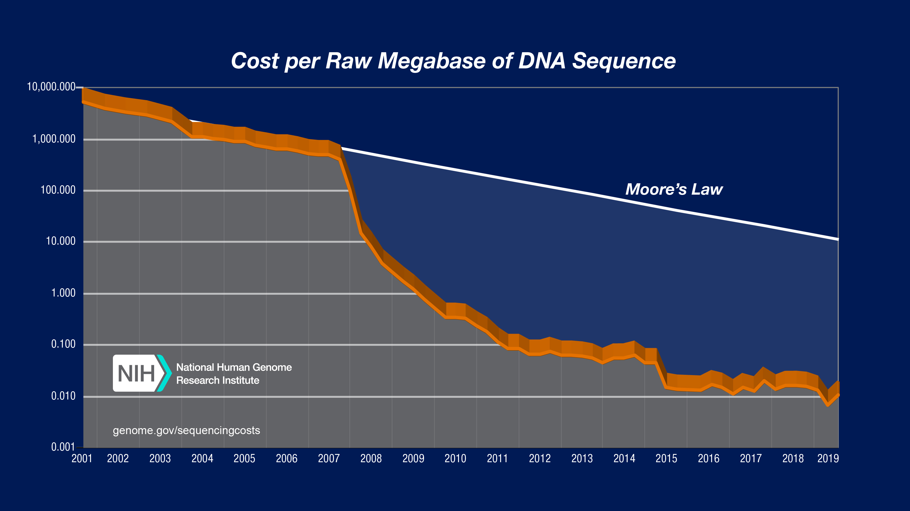

### 0. 几种变异类型

常见的变异类型有SNP、InDel、SV、CNV等。重测序中最关注的是SNP，其次是(small) InDel。其他的几种结构变异的研究不是太多。

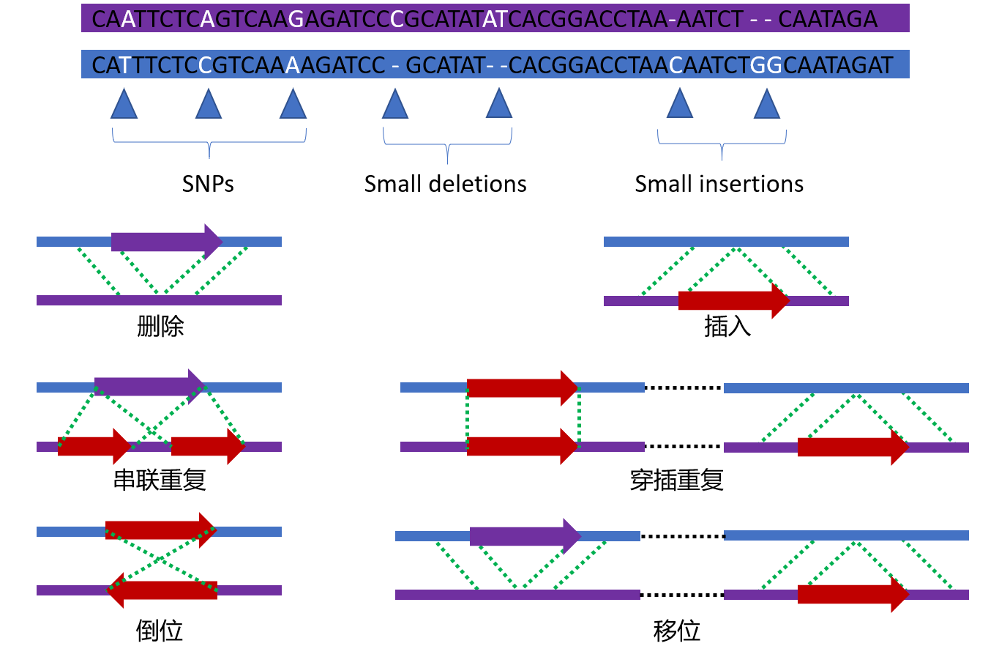

### 1. 重测序和从头组装

有参考基因组的物种的全基因组测序叫做重测序，没有参考基因组的物种的全基因组测序则需要从头组装。随着测序价格的降低，越来越多物种的参考基因组都已经测序组装完成。_plant genomes_ \[4\]网站实时显示全基因组测序已经完成的植物，其中2012年以后爆发式增长。在群体遗传学研究中更多的是有参考基因组的物种，尤其是模式物种，植物中常见的是拟南芥、水稻和玉米。

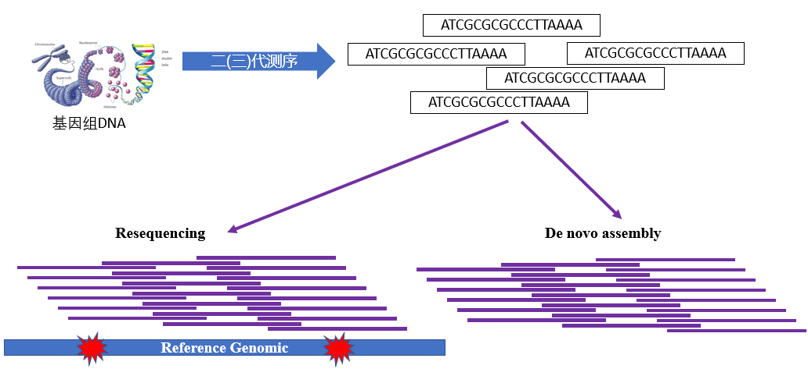

**群体重测序方案推荐\[32\]**  
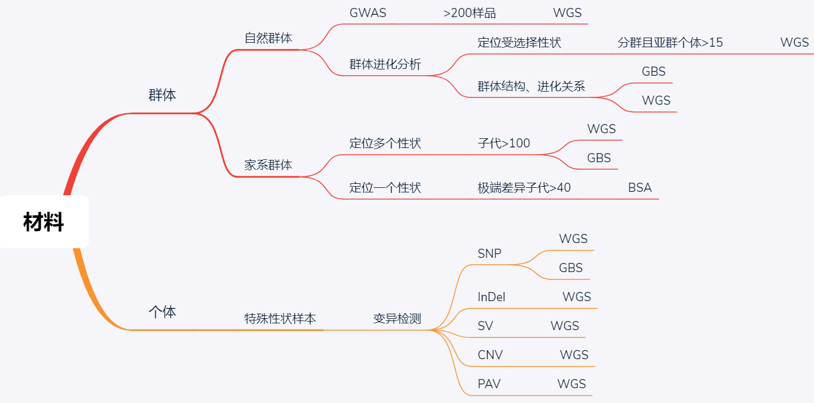

### 2. 重测序分析流程\[5\]

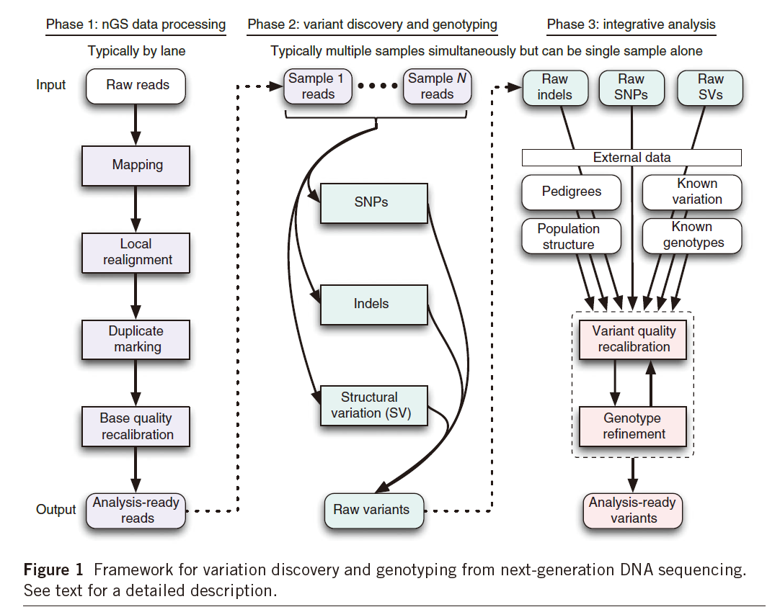

### 3. 群体进化选择

#### 3.1 正选择\[6\]

正选择似乎可以更好地用自然选择来解释。就是一个基因或位点能够使个体有着更强的生存力或者是育性，这样就会使得这个个体的后代更多，如此一来，这个基因或位点在群体中就越来越多。

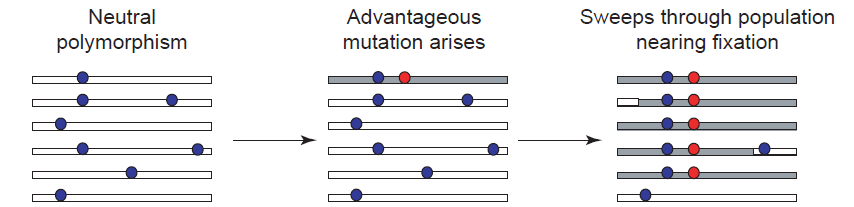

正选择能够使有利的突变基因或位点在群体中得到传播，但是与此同时却降低了群体的多态性水平。也就是说原先该位点周围的核苷酸组成是多样性的，在经过正选择之后，这个位点周围核苷酸的多样性就渐渐的趋于同质化了。这就好比一块田，里面本来有水稻和稗草及其他杂草，由于稗草的适应性增强，稗草在逐渐增多，水稻慢慢变少，最后甚至是只剩下了稗草。

我们将这种选择之后多态性降低的情况叫做选择扫荡（Selective Sweep)。检测选择扫荡的软件有SweeD\[7\]。选择扫荡有可能是人工选择的结果，如2014年 Nature Genetics关于非洲栽培稻的文章就使用了SweeD来检测非洲栽培稻基因组上受人工选择的区域\[8\]。

#### 3.2 负选择

负选择和正选择刚好是相反的。简单理解成群体中的某个个体出现了一个致命的突变，从而自己或者是后代从群体中被淘汰。这也导致群体中该位点的多态性的降低。就好比我有10株水稻，其中一株在成长过程中突然不见了，那么对我的这个小的水稻群体来说，这个消失的水稻的独有的位点在群体中就不见了，整体的多态性就降低了。

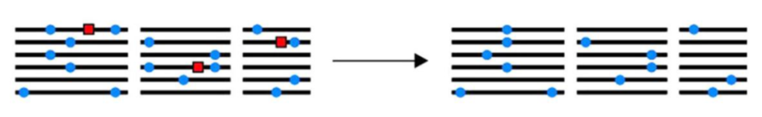

#### 3.3 平衡选择\[9\]

平衡选择指多个等位基因在一个群体的基因库中以高于遗传漂变预期的频率被保留，如杂合子优势。

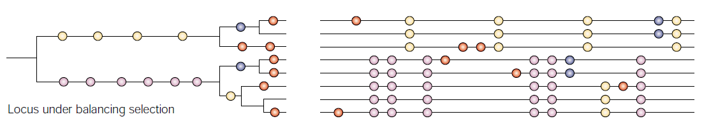

平衡选择检测的算法有BetaScan2\[10\]，这是个Python脚本，输入文件只需要过滤好的SNP数据即可。

### 4. 群体遗传学中的统计指标

#### 4.1 群体多态性参数

计算公式为：  
  
其中是有效群体大小，是每个位点的突变速率。但是群体大小往往是无法精确知道的，需要对其进行估计。

#### 4.2 分离位点数目

分离位点数是的估计值，表示相关基因在多序列比对中表现出多态性的位置。计算公式为：  
  
其中为分离位点数量，比如SNP数量。  
为个体数量的倒数和：  


#### 4.3 核苷酸多样性

指的是核苷酸多样性，值越大说明核苷酸多样性越高。通常用于衡量群体内的核苷酸多样性，也可以用来推演进化关系\[11\]。计算公式为：

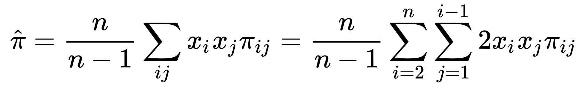

where  and  are the (original) respective frequencies of the  th and  th sequences,  is the number of nucleotide differences per nucleotide site between the  th and  th sequences, and  is the number of sequences in the sample.

可以理解成先在群体内两两求，再计算群体的均值。计算的软件最常见的是`vcftools`，也有对应的R包`PopGenome`。通常是选定有一定的基因组区域，设定好窗口大小，然后滑动窗口进行计算。

3KRG文章就计算了水稻不同亚群间4号染色体部分区域上的值\[12\]，能够看出控制水稻籽粒落粒性的基因 _Sh4_\[13\] 位置多态性在所有的亚群中都降低了。说明这个基因在所有的亚群中都是受到选择的，这可能是人工选择的结果。

#### 4.3.1 利用杂合度(heterozygosity)计算核苷酸多样性
> https://www.jianshu.com/p/53727b4f646b

某个位点的第个等位基因的样本频率为，那么该位点所有等位基因的频率和应该是1。先考虑二倍体的双等位基因，那就是。衡量单个多态位点变异 (variation) 的一个方法是计算样本**杂合度 (heterozygosity)**，公式如下（  表示样本中序列的数量）：

)

上面这个公式是针对一个位点的，如果是针对一条序列的话，那其实就是将整条序列的杂合度加起来即可，即：


其中表示的是分离位点的数量，表示的是第个分离位点的杂合度。在**Wright-Fisher模型**（无限位点的二倍体）下，%20%3D%20%5Ctheta)，因此有时这个统计量也叫。此外，在单态位点（monomorphic site）的杂合度是0。

**一个例子：**  
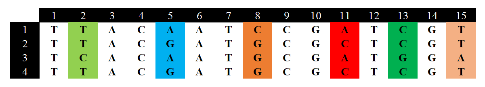

假设现在有4个样本，15个位点，但是只有6个位点是分离位点，我们先计算每个分离位点的杂合度：根据公式可知，对分离位点1（图中的第二列序列），有两个等为位点，分别是T和C，其中T有3个，C有1个，那么对T来说，它的频率就是0.75，对C来说它的频率就是0.25。根据公式可得：

![h = \frac{4}{3}\sum[1-(0.75^2 + 0.25^2) ]= 0.50](https://math.jianshu.com/math?formula=h%20%3D%20%5Cfrac%7B4%7D%7B3%7D%5Csum%5B1-(0.75%5E2%20%2B%200.25%5E2)%20%5D%3D%200.50)

我们以此计算就能得到其他5个分离位点的杂合度分别为：0.667，0.5，0.667，0.5，0.5；那么就能计算值了：


但是我们通常关注的是每个位点的均值：


我们将的计算进行推广就能得到下面这个公式：

%2F2%7D)

其中表示的是第条序列和第条序列之间不同核苷酸的数量，分母表示的是个序列之间进行比较的唯一次数（非重复比较）。

应用该公式，对于4条序列，，然后以此进行比较：第一条vs第二条=3个不同的核苷酸；第一条vs第三条=4个不同的核苷酸；第一条vs第四条=3个不同的核苷酸；第二条vs第三条=5个不同的核苷酸；第二条vs第四条=0个不同的核苷酸；第三条vs第四条=5个不同的核苷酸。所以：

%2F2%7D%20%3D%203.33)

> 需要注意的是，我们在计算序列之间的差异时应当去除InDel。当使用第一个公式并将InDel当作缺失值时，计算杂合度不考虑这些缺失值，所以针对不同位点其  是不同的；使用第二个公式，则在序列的两两比较之中会排除所有含有InDel等gap的位置。不同的公式给出的结果具有一定差异（往往是第一种的结果更大），因此，在处理基因组这种大数据时，通常使用第一个公式（各杂合度加和），且其计算速度更快。

#### 4.4 群体内选择检验: Tajima's D

Tajima's D是日本学者Tajima Fumio 1989年提出的一种统计检验方法，用于检验DNA序列在演化过程中是否遵循中性演化模型\[14\]。计算公式为：  
%7D%7D)

D值大小有如下三种生物学意义：  
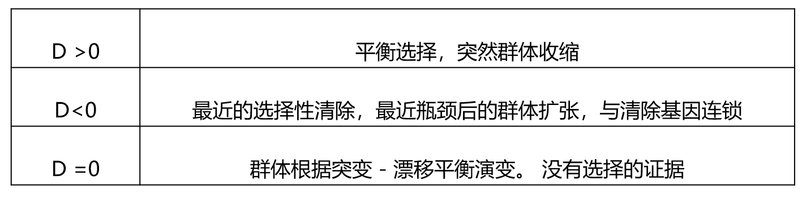

#### 4.5 群体间分歧度检验: Fst

叫固定分化指数，用于估计亚群间平均多态性大小与整个种群平均多态性大小的差异，反映的是群体结构的变化。其简单估计的计算公式为：  
  
的取值范围是\[0,1\]。当时，表明亚群间有着明显的种群分化。  
在中性进化条件下，的大小主要取决于遗传漂变和迁移等因素的影响。假设种群中的某个等位基因因为对特定的生境的适应度较高而经历适应性选择，那该基因的频率在种群中会升高，种群的分化水平增大，使得种群有着较高的值。  
值可以和GWAS的结果一起进行分析，超过一定阈值的区域往往和GWAS筛选到的位点是一致的，如2018年棉花重测序的文章\[15\]：

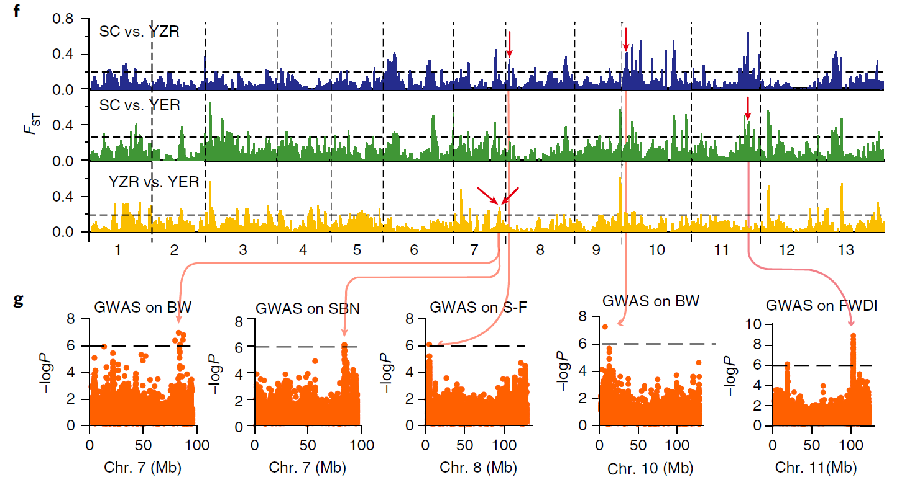

#### 4.6 群体分歧度检验: ROD

ROD可以基于野生群体和驯化群体间核苷酸多态性参数的差异识别选择型号，也可以测量驯化群体和野生型群体相比损失的多态性。计算公式为：  
  
和一样，ROD也可以和GWAS结合起来，如2019年油菜重测序文章\[16\]：

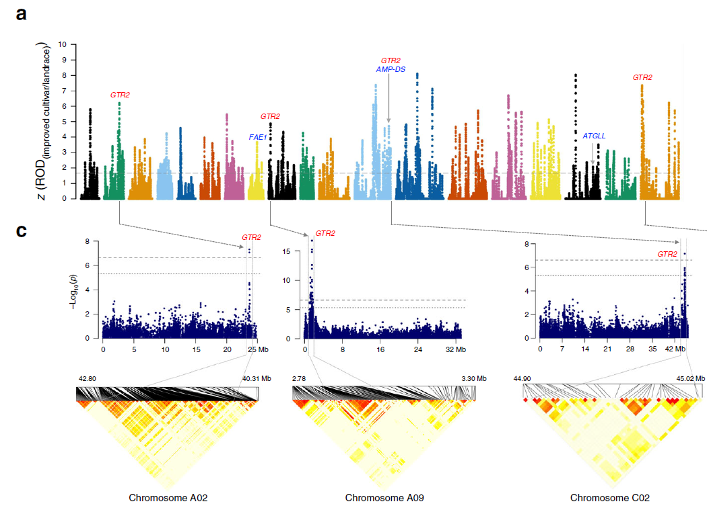

### 5. 群体结构分析

群体结构分析可以简单理解成采样测序的这些个体可以分成几个小组，以及给每个个体之间的远近关系是怎么样的。群体结构分析三剑客， 分别是 **进化树** 、 **PCA** 和 **群体结构图** 。

#### 5.1 进化树

进化树就是将个体按照远近关系分别连接起来的图。

- 进化树算法
  - 基于距离
    - 非加权算术平均对群法UPGMA
    - 邻接法Neighbor-joining
  - 基于特征
    - 最大简约法—最小变化数（祖先状态最小化）
    - 最大似然法—所有枝长和模型参数最优化
    - 贝叶斯推断—基于后验概率
- 进化树类型
  - 有根树：有根树就是所有的个体都有一个共同的祖先
  - 无根树：无根树只展示个体间的距离，无共同祖先

#### 5.2 PCA图

PCA是很常见的降维方法，如微生物研究中常用来检验样品分群情况。PCA计算的软件很多，`plink`可以直接用vcf文件计算PCA，R语言也可以进行PCA计算。

PCA图在群体重测序中有如下几种作用：

- 查看分群信息：就是测序的样品大概分成几个群    
- 检测离群样本：离群样本就是在PCA图看起来和其他样本差异很大的样本，有可能是这个样本的遗传背景和其他样本本来就很大，也有可能是样本混淆了，比如了将野生型的样本标记成了驯化种进行测序。如果有离群样本，那在后续的类似于GWAS的分析中就需要将离群样本进行剔除。当然如果样本本来就是个很特别的，那就另当别论。
- 推断亚群进化关系：可以从PCA图可以看出群体的进化关系，尤其是地理位置的进化关系    

#### 5.3 群体分层图

进化树和PCA能够看出来群体是不是分层的，但是无法知道群体分成几个群合适，也无法看出群体间的基因交流，更无法看出个体的混血程度。这时候就需要群体分层图了，如葡萄群体重测序文章图\[18\]。  

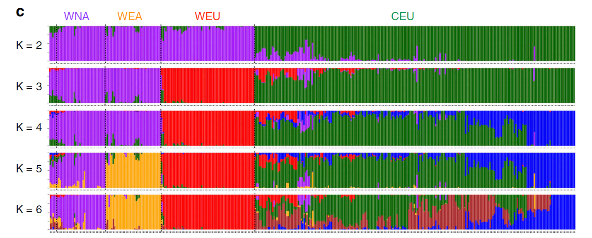

群体分层图的本质是堆叠的柱状图，和微生物研究中的物种组成柱状图类似。每个柱子是一个样本，可以看出一个样本的血缘组成，有几种颜色就说明该样本由几个祖先而来，如果只有一个色，那就说明这个个体很纯。

常用的软件有 `structure` 和 `ADMIXTURE` \[19\]。两款软件给出的结果都是K值。一般选择最低的点为最终的K值。群体分层图的可视化有个极强大的R包：`Pophelper`\[20\]。

### 6. 连锁不平衡分析

要理解 LD 衰减图，我们就必须先理解连锁不平衡（Linkage disequilibrium，LD）的概念\[22\]。连锁不平衡是由两个名词构成，连锁 + 不平衡。前者，很容易让我们产生概念混淆；后者，让这个概念变得愈加晦涩。因此从一个类似的概念入手，大家可能更容易理解 LD 的概念，那就是基因的共表达。

基因的共表达，通常指的是两个基因的表达量呈现相关性。比较常见的例子就是：转录组因子和靶基因间的关系。因为转录因子对它的靶基因有正调控作用，所以转录因子的表达量提高会导致靶基因的表达量也上调，两者往往存在正相关关系。这个正相关关系，可以使用相关系数  来度量，这个数值在 -1~1 之间。总而言之，相关性可以理解为两个元素共同变化，步调一致。

类似的，连锁不平衡（LD）就是度量两个分子标记的基因型变化是否步调一致，存在相关性的指标。如果两个 SNP 标记位置相邻，那么在群体中也会呈现基因型步调一致的情况。比如有两个基因座，分别对应 A/a 和 B/b 两种等位基因。如果两个基因座是相关的，我们将会看到某些基因型往往共同遗传，即某些单倍型的频率会高于期望值。

参照王荣焕等\[23\]的方法进行LD参数计算：  
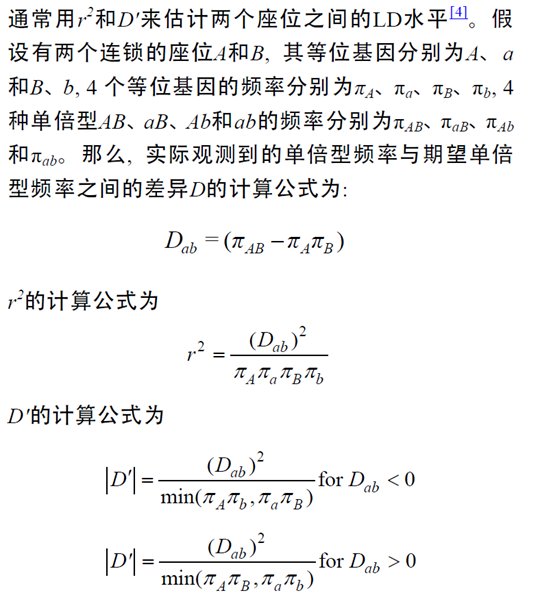

#### 6.1 LD衰减分析

随着标记间的距离增加，平均的LD程度将降低，呈现出衰减状态，这种情况叫LD衰减。LD衰减分析的作用：

- 判断群体的多样性差异，一般野生型群体的LD衰减快于驯化群体
- 估计GWAS中标记的覆盖度，通过比较LD衰减距离(0.1)和标记间的平均距离来判断标记是否足够。

### 7. GWAS

GWAS(genome-wide association study)，全基因组关联分析，常用在医学和农学领域。简单理解成将SNP等遗传标记和表型数据进行关联分析，检测和表型相关的位点，然后再倒回去找到对应的基因，研究其对表型的影响。这些被研究的表型在医学上常常是疾病的表型；在农学上常常是受关注的农艺性状，比如水稻的株高、产量、穗粒数等。

#### 7.1 GWAS流程

- 样品准备就是要收集不同的个体，比如3KRG就3000多个水稻材料\[12\]，然后对这些材料进行全基因组测序，还需要表型数据，比如水稻的株高、产量等。
- 基因型的检测就是前面的变异检测，只是变异检测完的SNP数据还需要过滤才能进行后续的关联分析。
- 关联分析这一步只需要将基因型数据和表型数据丢给软件就行了。

#### 7.2 GWAS数学模型

目前使用最广泛的模型是混合线性模型\[26\]，所有的参数软件（如Emmax）会自动完成计算：  
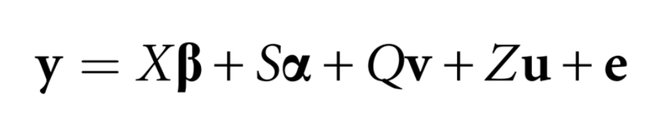

#### 7.3 GWAS结果

GWAS结果文件通常只有两个图，一个是曼哈顿图，另外一个是Q-Q图。一般是先看Q-Q图，如果Q-Q正常，曼哈顿图的结果才有意义。

- Q-Q图：用于推断关联分析使用的模型是否正确
- 曼哈顿图：图中横着的虚线通常是研究者设定的，最严格的的阈值线是Bonfferonin()。阈值线以上的点就是很值得关注的位点。后续就是验证实验了，比如验证不同的单倍型的生物学功能。

### 8 其他统计指标和算法

#### 8.1 MSMC

MSMC（multiple sequentially Markovian coalescent）\[27\]，底层算法很复杂，类似于PSMC。MSMC的主要功能是推断有效群体大小和群体分离历史。

#### 8.2 LAMP

LAMP(Local Ancestry in Admixed Populations，混杂群体的局部族源推断)，用于推断采用聚类的方法假设同时检测的位点间不存在重组情况，对每组相邻的 SNP 进行检测分析\[28\]，在运算速度和推断准确度上都有了质的飞跃。

#### 8.3 Treemix

用于推断群体分离和混合\[29\]。其结果图和进化树长得特别相似，可以将得到的结果和进化树进行比较。

前文提到的很多软件和算法都是用来推断群体进化的，也就是找到群体的祖先。都可以看成族源推断。具体的差异可以参考综述\[31\]。

**参考文献**

\[1\]. [自然选择(维基百科)](https://links.jianshu.com/go?to=%255Bhttps%3A%2F%2Fzh.wikipedia.org%2Fwiki%2F%25E8%2587%25AA%25E7%2584%25B6%25E9%2580%2589%25E6%258B%25A)  
\[2\]. Kimura, Motoo. "Evolutionary rate at the molecular level." **_Nature_**. 217.5129 (1968): 624-626 .  
\[3\]. [测序价格变化趋势](https://links.jianshu.com/go?to=https%3A%2F%2Fwww.genome.gov%2Fabout-genomics%2Ffact-sheets%2FDNA-Sequencing-Costs-Data)  
\[4\]. [plant genomes](https://links.jianshu.com/go?to=https%3A%2F%2Fwww.plabipd.de%2Ftimeline_view.ep)  
\[5\]. DePristo, Mark A., et al. "A framework for variation discovery and genotyping using next-generation DNA sequencing data." **_Nature Genetics_**. 43.5 (2011): 491.  
\[6\]. Biswas, Shameek, and Joshua M. Akey. "Genomic insights into positive selection." **_TRENDS in Genetics_**. 22.8 (2006): 437-446.  
\[7\]. Pavlidis, Pavlos, et al. "Sweed: likelihood-based detection of selective sweeps in thousands of genomes." **_Molecular biology and evolution_** 30.9 (2013): 2224-2234.  
\[8\]. Wang, Muhua, et al. "The genome sequence of African rice (_Oryza glaberrima_) and evidence for independent domestication." **_Nature Genetics_** 46.9 (2014): 982.  
\[9\]. Bamshad, Michael, and Stephen P. Wooding. "Signatures of natural selection in the human genome." **_Nature Reviews Genetics_** 4.2 (2003): 99.  
\[10\]. Siewert, Katherine M., and Benjamin F. Voight. "BetaScan2: Standardized statistics to detect balancing selection utilizing substitution data." **_BioRxiv_** (2018): 497255.  
\[11\]. Yu, N.; Jensen-Seaman MI; Chemnick L; Ryder O; Li WH (March 2004). **_Genetics_**. 166 (3): 1375–83.  
\[12\]. Wang, Wensheng, et al. "Genomic variation in 3,010 diverse accessions of Asian cultivated rice." **_Nature_** 557.7703 (2018): 43.  
\[13\]. Li, C., Zhou, A. & Sang, T. Rice domestication by reducing shattering. **_Science_** 311, 1936–1939 (2006).  
\[14\]. Tajima, Fumio. "Statistical method for testing the neutral mutation hypothesis by DNA polymorphism." **_Genetics_** 123.3 (1989): 585-595.  
\[15\]. Du, Xiongming, et al. "Resequencing of 243 diploid cotton accessions based on an updated A genome identifies the genetic basis of key agronomic traits." **_Nature Genetics_** 50.6 (2018): 796.  
\[16\]. Lu, Kun, et al. "Whole-genome resequencing reveals Brassica napus origin and genetic loci involved in its improvement." **_Nature communications_**. 10.1 (2019): 1154.  
\[17\]. Zhou, Z., Jiang, Y., Wang, Z. et al. Resequencing 302 wild and cultivated accessions identifies genes related to domestication and improvement in soybean. **_Nat Biotechnol_** 33, 408–414 (2015).  
\[18\]. Liang, Z., Duan, S., Sheng, J. et al. Whole-genome resequencing of 472 Vitis accessions for grapevine diversity and demographic history analyses. **_Nat Commun_** 10, 1190 (2019).  
\[19\]. Alexander, D.H., Lange, K. Enhancements to the ADMIXTURE algorithm for individual ancestry estimation. **_BMC Bioinformatics_** 12, 246 (2011).  
\[20\]. Francis, Roy M. "pophelper: an R package and web app to analyse and visualize population structure." **_Molecular ecology resources_** 17.1 (2017): 27-32.  
\[21\]. [http://www.royfrancis.com/pophelper/articles/index.html](https://links.jianshu.com/go?to=http%3A%2F%2Fwww.royfrancis.com%2Fpophelper%2Farticles%2Findex.html).  
\[22\]. [https://www.omicshare.com/forum/thread-878-1-1.html](https://links.jianshu.com/go?to=https%3A%2F%2Fwww.omicshare.com%2Fforum%2Fthread-878-1-1.html).  
\[23\]. WANG Rong-Huan, WANG Tian-Yu, LI Yu. Linkage disequilibrium in plant genomes\[J\]. **_HEREDITAS_**, 2007, 29(11): 1317-1323.  
\[24\]. Ozaki, K., Ohnishi, Y., Iida, A. et al. Functional SNPs in the lymphotoxin-α gene that are associated with susceptibility to myocardial infarction. **_Nat Genet_** 32, 650–654 (2002).  
\[25\]. Klein, Robert J., et al. "Complement factor H polymorphism in age-related macular degeneration." **_Science_** 308.5720 (2005): 385-389.  
\[26\]. Yu, Jianming, et al. "A unified mixed-model method for association mapping that accounts for multiple levels of relatedness." **_Nature genetics_** 38.2 (2006): 203.  
\[27\]. Schiffels, Stephan, and Richard Durbin. "Inferring human population size and separation history from multiple genome sequences." **_Nature genetics_** 46.8 (2014): 919.  
\[28\]. Sankararaman, Sriram, et al. "Estimating local ancestry in admixed populations." **_The American Journal of Human Genetics_** 82.2 (2008): 290-303.  
\[29\]. Pickrell, Joseph K., and Jonathan K. Pritchard. "Inference of population splits and mixtures from genome-wide allele frequency data." **_PLoS genetics_** 8.11 (2012): e1002967.  
\[30\]. Chen, Jia-hui, et al. "Genome-wide analysis of Cushion willow provides insights into alpine plant divergence in a biodiversity hotspot." **_Nature communications_** 10.1 (2019): 1-12.  
\[31\]. 孙宽，侯一平。法医族源推断的分子生物学进展 \[J\]. **_法医学杂志_**，2018,34 (03):286-293.  
\[32\]. genek.tv


## Determination of Haplotypes from Genotype information
> [http://www.biorecipes.com/Haplotypes/code.html](http://www.biorecipes.com/Haplotypes/code.html)


## 群体选择信号分析
> https://www.jianshu.com/p/7f0e3897f818

### 群体进化与选择信号

- 生活在世界不同区域的生物群体在历史长河中经历千万年的自然选择、人工驯化、迁徙、遗传漂变等事件的洗礼，有的物种灭绝，有的物种分化出不同的亚种或亚群,甚至逐渐演变成新的物种。群体进化研究就是用来追溯和揭露这个进化过程的。
- 现代群体进化研究，开始基于全基因组的变异信息，分析群体的遗传背景、群体结构、遗传多样性、基因交流情况、物种的形成机制以及群体的进化方向等生物学问题。
- 群体进化主要的应用方向:
  - 人工驯化机制研究: 通过对野生型和驯化型群体的研究，发现人工驯化作用下受选择的区域，进而鉴定到与重要经济性状相关的基因。
  - 自然选择机制分析: 研究生存于不同地理环境下的群体，挖掘适应性进化过程中受到选择的区域，进而为育种提供环境适应性基因资源。
  - 种群历史研究: 通过分析物种的起源地及各个分布区域中群体的遗传变异信息，探索物种的进化过程。  
- 选择信号分析是群体进化这个大的研究领域中的一个研究方向/方法，多用于前两个应用方向的研究。

* 由于人工选择或自然选择作用造成的基因组结构特征的变化称为选择信号。选择信号分析是生物信息分析中的“考古学”。它可以帮助我们寻找生物群体在千万年的进化过程中，在基因组上留下的痕迹。  
* 这些信号与动物的选育方向以及驯化适应机制紧密相关，因此对选择信号进行检测有助于挖掘与动物经济性状相关的基因，了解性状形成的潜在的遗传学基础，解析动物的驯化适应机制，解析群体间的差异机制。对于畜禽遗传改良具有重要意义。

**选择信号分析的特性和应用场景**

对于物种的群体遗传研究，本身就涉及到多个领域，如考古学、生态学、社会学，然后才是基因组学和生物信息学分析。所以涉及群体遗传的研究项目,需要尽量将这几类因素综合在一起讨论，才能形成完整的故事。  
1. 有明确的研究方向和研究目的(如:研究猪的高原适应性)  
2. 样本材料具有相关特性且与研究目的相契合(如:藏猪具有高原适应性)  
3. 对材料背景非常了解，包括起源地/栖息地、(地理位置..环境和生态)、 迁徙历史、驯化历史、育成历史等(四面环山的四川盆地成为冰川时期动物群体的避难所)  
4. 当定位到受选择的区域之后，把受选择区域的位点做基因注释，需要了解与所研究性状相关的基因、蛋白、通路等(受选择区域中发现'vitamin B6 binding相关基因:维生素B6可帮助血红蛋白合成和促进氧的绑定)  
5. 建议每个亚群个体数量不小于10个，且来自不同家系

**选择信号分析的一般流程**

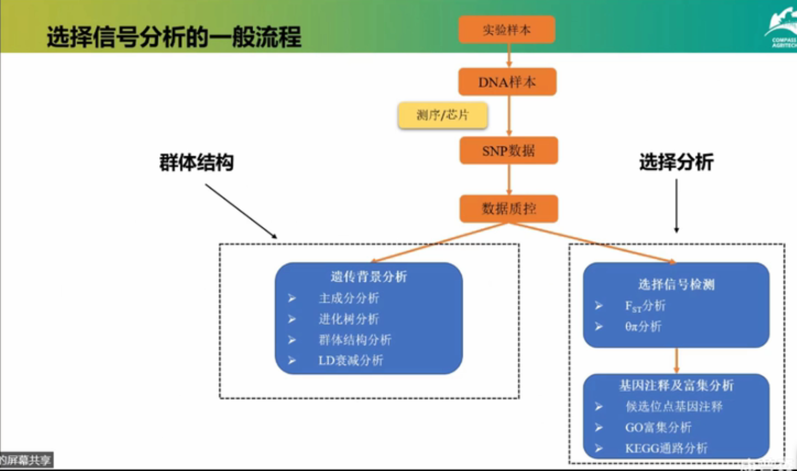

### 遗传背景分析

#### 一、主成分分析(Principal Component Analysis)

PCA是一种线性代数中的数据处理方法，它利用降维的思想，从高维度数据(如测序得到的百万级别SNP位点数据) 中提取关键的信息，以便我们使用更少的变量(指标)就可以对样本进行有效区分。这些被提取出的信息按照其效应从大到小排列，我们称之为主成分1(Principal Component1)、主成分2、主成分3...

PCA分析的应用场景:  
1. 检测离群样本
2. 推断群体分层和亚群间的遗传距离

#### 二、进化树

又称为系统发生树，它利用样本间的差异度将样本进行聚类，用一种类似树状分支的图形来概括各物种之间的亲缘关系，可用来描述物种之间的进化关系和遗传距离远近。

不同的构树方法  
1. 基于距离的方法:首先通过各个物种之间的比较，根据一 定的假设(进化距离模型)推导得出分类群之间的进化距离，构建一个进化距离矩阵。 进化树的构建则是基于这个矩阵中的进化距离关系。(UPGMA, NJ)
2. 基于特征的方法:不计算序列间的距离，而是将序列中有差异的位点作为单独的特征，并根据这些特征来建树(ML MP)

进化树的解读  
1. 枝长:枝长累积距离越近的样本差异越小  
2. 自展值:进化树分支可信度（蓝圈，百分比75%以上比较可信）  
3. 标尺:代表序列的差异程度

#### 三、群体结构 (structure) 分析

先预设群体由若干亚群(k=n)构成,通过模拟算法找出在k=n的情况下，最合理的样本分类方法。最后再根据每次模拟的最大似然值，找出最适用这群体的K值。

应用场景:  
1. 推算亚群划分情况  
2. 推算群体基因交流程度  
3. 推算个体的血统构成比例  

主流软件:  
1. STRUCTURE  
2. fastSTRUCTURE  
3. Admixture

#### 四、LD衰减分析

连锁不平衡: 当位于某一座位的特定等位基因与另一座位的某一等位基因同时出现的概率大于群体中随机分布的两个等位基因同时出现的概率时，就称这两个座位处于连锁不平衡状态。

一般而言，两个位点在基因组上离得越近，相关性就越强，LD系数就越大。反之，LD系数越小。也就是说，随着位点间的距离不断增加，LD系数通常情况下会慢慢下降。这个规律，通常就会使用LD衰减图来呈现。

LD衰减图就是利用曲线图来呈现基因组上分子标记间的平均LD系数随着标记间距离增加而降低的过程。大概的计算原理就是先统计基因组上两两标记间的LD系数大小，再按照标记间的距离对D系数进行分类,最终可以计算出一定距离的分子标记间的平均LD系数大小。

**LD衰减分析的应用**  
1. 评估群体特性和选择强度:驯化选择会导致群体遗传多样性下降，位点间的连锁程度更高。所以，通常驯化程度越高选择强度越大的群体,LD衰减速度也越慢。例如商品化群体比自然群体通常更大的LD衰减距离。类似的自然选择、遗传漂变导致的群体遗传多样性下降，也会减慢LD衰减的速度。  
2. 检测受选择基因组区域:与有利突变紧密连锁的中性位点会由于选择作用在基因组上形成高频率的核心单倍型，以其为中心向基因组两侧扩展会形成长范围的扩展单倍型。然而随着与有利突变间距的增加，连锁不平衡程度会相应衰减，在一定范围内各扩展单倍型纯合的总和占核心单倍型纯合的比例可以被用来检测基因组范围内的选择作用。  
3. GWAS分析中评估标记密度是否足够: GWAS分析本质就是利用标记和功能突变的相关性(LD关系)，来检测与性状相关的功能突变的位置。一般而言LD系数大于0.8就是强相关。如果LD系数小于0.1，则可以认为没有相关性。如果LD衰减到0.1这么大的区间内都没有标记覆盖的话即使这个区间有一一个效应很强的功能突变，也是检测不到关联信号的。所以通常可以通过比较LD衰减(到0.1)距离和标记间的平均距离来判断标记是否对全基因组有足够的覆盖度。(GWAS最低标记量≈基因组大小/LD衰减距离)

### 选择信号检测方法

常用群体内检测指标的计算方法大致分为三种：
1. 基于核苷酸多态性降低的π、θw
2. 基于分离位点频率的Tajima’D
3. 基于连锁不平衡增加的EHH、iHS

以上三类指标对应于基因组受选择特征的三个维度，而后才有了群体间的选择指标：
1. 由π衍生的π ratio、ROD、Fst
2. 由EHH衍生的XPEHH

对于单个物种，基于选择的效应，选择信号检测的方法可以被分为4大类:  
1. 基于等位基因频率谱的方法  
2. 基于连锁不平衡增加的方法  
3. 基于群体分化的方法  
4. 基于基因组杂合度的方法

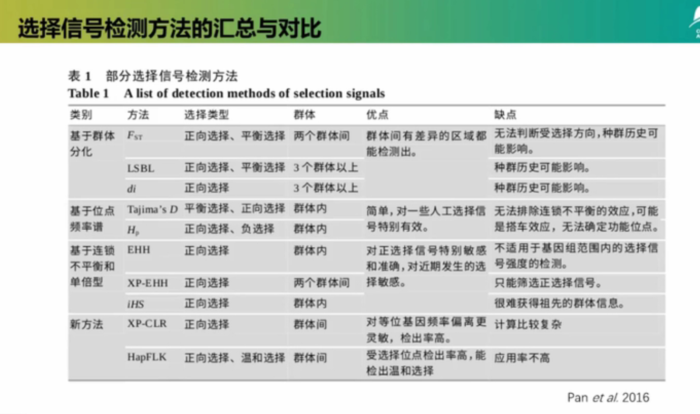

#### 一、基于等位基因频率谱

基因型频率和基因频率的改变是选择作用在基因组上最直接的体现。基因频谱(site-frequency spectrum)就是指某种等位基因在基因组上某个目标区域内出现的频繁程度。

符合中性模型的群体，其群体中存在广泛的遗传多态，当突变发生时总能够维持在一个较低的频率，只有当群体基因组上出现或存在有利突变时，选择才会发生作用，从而产生所谓的选择清除或搭车效应。

代表性的检测方法: Tajima's D, Fu andLi'sD, Fay and Wu'sH, CLR, Hp

Tajima's D检验的目的是区分随机演变的DNA序列(“中性”)和在非随机过程中演化的DNA序列，包括定向选择或平衡选择。Tajima's D的计算原理:多态位点数量和平均非匹配数量的差值。D=0时，符合中性假设，群体未受到选择; D<0时，受到定向向选择; D>0时，受到平衡选择。

#### 二、基于连锁不平衡

基于连锁不平衡理论，位点间的连锁不平衡程度会随标记间距离的增加而逐渐降低。因此，在基因组上可以观察到选择作用造成的不同长度的扩展单倍型纯合(Extended Haplotype Homozygousity)。

该方法的基本原理是:在中性条件下，基因组很难形成长范围的连锁不平衡的单倍型，因为新突变需要经历漫长的遗传漂变才能达到较高频率，而在漫长的时间里会发生大量基因重组事件，使得这种连锁不断被打破。而当群体处于正向选择作用下时，致因突变及其连锁位点在正选择的作用下，在短时间内会达到较高频率，形成大片段的纯合单倍型。扩展单倍型纯合度检验正是基于这样的特征来筛选受选择基因。

代表性的检测方法: EHH, XP-EHH, iHS, nSL, OmegaPlus

#### 三、基于群体分化

同一物种不同群体之间由于环境不同或选择目标不同，其基因组等位基因频率会表现出歧化选择的效应。这种现象在相同基因座位不同等位基因均受到选择时表现尤为明显，即选择加速群体分化。因此，基于群体分化的方法，不同群体同一等位基因频率存在的差异程度大于两个群体处于中性条件下的期望时，就推断该位点存在选择作用。

代表性的检测方法: Weir and Cockerhan's Fst, LSBL, di

Fst的取值范围为0-1，1表示群体间完全分化的位点，0表示在群体间完全没有分化的位点。基于Fst的的检测方法多采用基因组单位点扫描的策略，而这样的方式容易受到遗传漂变等因素的影响，产生假阳性的显著位点。为尽量减少假阳性的发生，通常采用滑动窗口的策略，降低这些干扰因素，增加选择信号检测的准确性。

#### 四、基于基因组杂合度

当基因组上特定区域受到选择时，由于“选择性清除”作用的存在，该区域及其连锁的区域表现为多态性降低，同时纯和度增加。因此对基因组的杂合度进行检测，可以推断出基因组中受到选择的区域。基因组上受选择程度越高，则杂合度程度越低。

代表性的检测方法: θπRatio, ROH

核苷酸多态性θπ比率越偏离1，受选择程度越高。

θπ比率的检测公式如下: θπratio=θπA/θπB

其中，θπA和θπB分别代表A群体和B群体的θπ值。θπ比率大于1， 反映A群体的基因组杂合度大于B群体的杂合度，则B群体相应基因组区域受到选择。θπ 比率小于1,则A群体的基因组杂合度低于B群体，则选择发生在A群体对应的基因组区域。

#### 选择信号的应用策略

- 由于单纯一种选择信号检测方法容易造成假阳性选择信号的产生，目前选择信号检测普遍采用两种或多种检测方法进行组合策略，不同检测方法相互验证，用以避免假阳性，例如基于群体分化和基于基因组杂合度检测组合的策略、基于连锁不平衡的检测方法与基于基因组杂合度检测方法组合的策略等。也有文献使用3种以上的方法同时进行选择信号检测，筛选2种或以上方法检测重叠的位点。
- 此外，在功能基因挖掘方面，选择信号检测可以与其他功能基因挖掘策略进行组合，提高基因定位的效率和准确性，如选择信号检测与全基因组关联分析的组合，选择信号与拷贝数变异检测的组合。

#### iHS检测群体内的选择信号(基于单体型haplotype的选择信号的检测)

在selective sweeps选择过程中，有些强烈受到选择的位点variants由于LD的因素会连带着其附近的位点variants一起被保留，并且不会受到重组recombination的打断。一些低重组区域的haplotypes的长度会高于那些高重组区域的haplotypes的长度。因此，对比同一genomic区域在不同群体中的haplotype的长度可以用来判断是否受到选择。例如：在一个群体内部，如果某一个体强烈受到选择，其haplotype的长度会远长于其它个体；同理，对于两个群体之间的比较，某一群体受到选择，则其基因组中的受选择区域的haplotypes会比未受到选择群体中的haplotypes更长。

例如：使用selscan软件计算了澳洲野犬的iHS，并通过常染色体上20 kb的滑动窗口通过规范（在selscan的软件中）对分数进行归一化。如果其中30%的站点的iHS绝对值高于阈值(或iHS绝对值的前1%)，我们将窗口确定为候选区域。（参考Genomic regions under selection in the feralization of the dingoes）

[https://www.jianshu.com/p/23ab344d66f7](https://www.jianshu.com/p/23ab344d66f7)

##### 1.数据文件准备

```bash
# 提取vcf 压缩 
bcftools view -S id.txt test.vcf.gz -Ov > sampleid.vcf
bgzip -c -f sampleid.vcf > sampleid.vcf.gz
# 过滤，去多等位基因位点，最大缺失率（max-missing）<10%即检出率>90%的SNP位点，最小等位基因频率（MAF）>0.03（哈代温伯格平衡检验的P值大于10^-6 -hwe）；--min-alleles 2 --max-alleles 2 去除多等位基因和等位基因缺失
vcftools --vcf sampleid.vcf --remove-indels --max-missing 0.9 --maf 0.03 --min-alleles 2 --max-alleles 2 --recode --recode-INFO-all --out sampleid.miss.snp.recode.vcf
# 去其他染色体，由于参考基因组版本问题，这里存在很多位于随机或未知染色体上的变异位点，所以需要先过滤掉这些位点
vcftools --vcf sampleid.miss.snp.recode.vcf --recode --recode-INFO-all --not-chr XXX --out test_noincludeXXX
# 转格式
plink --vcf test_noincludeXXX.miss.snp.recode.vcf --recode --allow-extra-chr --out test_noincludeXXX.miss.snp.recode
# 换map文件位置名称 ，空格分隔
awk '{print$1,$1":"$4,$3,$4}' test_noincludeXXX.misssnp.recode.map > test_noincludeXXX.misssnp.recode.pos.map
# 转换成vcf格式
plink --allow-extra-chr --file test_noincludeXXX.misssnp.recode.pos --make-bed --out test_noincludeXXX.misssnp.recode.pos
# 更换染色体，加头，压缩
```

##### 2.vcf文件的phasing，beagle转换格式

由于后面计算时selscan软件对vcf文件格式要求：前九列同标准的vcf格式一样，后面紧接着的个体的基因型尽量是phasing后的。文件格式如下：< quality ><individual 1 genotype > ... < individual N genotype >，因此首先使用beagle软件转换格式

> 1 100 rs1 0 1 . . . . 0|1 0|0  
> 1 200 rs2 0 1 . . . . 1|1 1|0  
> 1 300 rs3 0 1 . . . . 0|0 1|0  
> 1 400 rs4 0 1 . . . . 0|0 1|0  
> 1 500 rs5 0 1 . . . . 1|0 0|1

```bash
perl -pe "s/\s\.:/\t.\/.:/g" test.miss.snp.recode.vcf | bgzip -c > out.vcf.gz
# 重测序数据会遇到这种问题
java -jar /home/software/beagle.25Nov19.28d.jar gt=out.vcf.gz out=test.beagle ne=44 > test.beagle.vcf.log
#有报错：java.lang.OutOfMemoryError: Java heap space 解决办法：
nohup java -jar -Xmn12G -Xms24G -Xmx48G  /home/software/beagle.25Nov19.28d.jar gt=test_noincludeXXX.misssnp.recode.pos-chr-36head.vcf  out=test.beagle ne=44 > test.beagle.vcf.log
```

##### 3.准备分染色体的vcf文件，单倍型以及基于单倍型的分析都需要逐条染色体运行，所以需要把vcf文件以及map按照染色体ID进行拆分。

```bash
for i in {1..30}
do
  vcftools --vcf test.beagle.vcf --chr ${i} --recode --recode-INFO-all --out ${i}.test
done
# 得到${i}.test.recode.vcf文件
```

##### 4.准备分染色体的map文件

```bash
for k in {1..30}
do
  vcftools --vcf ${k}.test.recode.vcf --plink --out ${k}.MT
done
# 得到${k}.MT.map文件
```

##### 5.map计算遗传距离

```bash
for k in {1..30}
do
  awk 'BEGIN{OFS=" "} {print 1,".",$4/1000000,$4}' ${k}.MT.map > ${k}.MT.map2
done
# 得到${k}.MT.map2文件
```

##### 6.计算iHS

```bash
for k in {1..30}
do
  selscan --ihs --vcf ${k}.test.recode.vcf --map ${k}.MT.map2 --out ${k}.iHS
done
# 得到 ${k}.iHS.ihs.out文件，运行时间久！


# 重测序数据直接计算iHS（对每个100K窗口单倍型进行打分，标准化使其正态分布，并统计绝对值>2的SNP所占的比例）

# 提取结果
for k in {1..30}
do
  awk '{print '${k}',$2,$3,$4,$5,$6}' ${k}.iHS.ihs.out > ${k}.hu.ihs.out
  sed -i 's/ /\t/g' ${k}.hu.ihs.out
done

# 标准化（将norm文件第7列数据即iHS数据进行统计，统计绝对值>2的SNP所占的比例）
for k in {1..30}
do
  /home/software/selscan/bin/linux/norm --ihs --files ${k}.hu.ihs.out --bp-win --winsize 100000
done

# 提取结果
for k in {1..30}
do
  awk '{print '${k}',$1,$2,$4}' ${k}.hu.ihs.out.100bins.norm.100kb.windows > ${k}.hu3.ihs.out.100kb.windows
done

# 得到两个文件 XXX.hu.ihs.out.100bins.norm.100kb.windows与XXX.hu.ihs.out.100bins.norm
cat ./*.hu3.ihs.out.100kb.windows > all.hu3.ihs.out.100kb.windows
sort -k 4n,4 all.hu3.ihs.out.100kb.windows > all.hu3.ihs.out.100kb.windows.sort

# 按照第四列取前5%的位点，画图（此处也可使用XXX.hu.ihs.out.100bins.norm文件画图，但数据量过大，推荐使用XXX.hu.ihs.out.100bins.norm.100kb.windows）
# 制作表格，格式如下，逗号分隔保存：
# X SNP CHR BP P 
# 1 snp1 1 2400001 0.265873
# 2 snp2 1 2500001 0.449057
# 3 snp3 1 2600001 0.596059
```

##### 7.画曼哈顿图

```R
install.packages('qqman')
library('qqman')
data1 <- read.table("all.iHS.csv", header = T, sep = ',') 
color_set <- c("#8DA0CB", "#E78AC3", "#A6D854", "#FFD92F", "#E5C494", "#66C2A5", "#FC8D62")
par(cex = 0.9)
manhattan(data1, logp = F, col = color_set)
```

### 8.SnpEff注释

[https://www.jianshu.com/p/b2b45d2523db](https://www.jianshu.com/p/b2b45d2523db)  
[https://www.cnblogs.com/zhanmaomao/p/10964636.html](https://links.jianshu.com/go?to=https%3A%2F%2Fwww.cnblogs.com%2Fzhanmaomao%2Fp%2F10964636.html)


## 群体进化选择消除分析
> https://www.jianshu.com/p/48ed392f6129

要做选择性消除分析，首先就要把如下的理论记住熟记于心。

### 中性进化假说

分子水平上，生物的演化或物种的进化并不是自然选择引起的，而是由中性/近中性的突变等位基因经过遗传漂变引起的，从而形成分子水平上的进化性变化或种内变异。

分子演化的驱动力：遗传漂变
1. 突变大多是中性的，对生物个体的生存既无害处也无益处
2. 中性突变经过随机的“遗传漂变”固定，在分子水平上进化不依赖于自然选择
3. 中性突变决定进化的速率，对于所有生物几乎是恒定的

### 物种进化过程中遇到的选择

- 正选择（positive selection）：自然选择“选留”一些稀少的等位基因，拥有这些等位基因的个体能繁殖更多的后代；这样的突变基因往往具有与原来基因不同的功能，而且该功能使得拥有它的生物更能适应环境。
- 负选择（negative selection）：指群体中出现有害突变等位基因时，携带该等位基因的个体会因为生存力或育性降低而从群体中淘汰，也叫净化选择。
- 选择消除：当一个有利突变发生后，这个突变基因的适合度越高，就越容易被选择固定。当这个基因被快速固定之后，与此基因座连锁的染色体区域，由于搭车效应也被固定下来，大片紧密连锁的染色体区域因此失去多态性，这种由于搭车效应引起多态性下降的现象，遗传上称为选择清除。
- 背景选择：负选择在清除有害突变时，也会随之清除与其连锁的中性位点的变异。

**选择消除和背景选择都会导致基因组上受选择的区域遗传多样性下降，两者很难区分，但背景选择在群体中不会导致高频等位基因突变出现。**

选择消除区域是基因组**多样性下降**且**存在高频等位基因**的区域。

### 群体多态性估计参数

#### θπ和θw

**θ = 4Neμg**

- Ne:有效群体大小
- μ:每年每位点核苷酸突变速率（中性突变率）
- g:时间（个体从出生到繁育下一代的时间，比如人25年）

θ是群体多态性度量的理论值，在实际分析中，有两个参数近似估计θ，分别是θπ和θw。
- θπ（核苷酸多态性）：群体中任意两条不同序列（个体）的碱基差异数（SNP）取平均值。
- θW（Watterson估值）：基于全部序列内分离位点个数。

S1：ATCCGCCGAT  
S2：ATCCACGCTT  
S3：CGTGATGCTT  
S4：CGTGGTCGAA  
D12 = 4；D13 = 9；D14 = 6；D23 = 5；D24 = 10；D34 = 5  
θπ = (D12+D13+D14+D23+D24+D34)/6 = 6.5  
θW = K/a = 10/（1+1/2+1/3+1/4+1/5+1/6+1/7+1/8+1/9）= 3.53  
k : 分离位点数，即总的SNP数  
a = 1+1/2+1/3+ … +1/(k–1)

#### 中性检验（Tajima's D）

**Tajima’D = (θπ–θW)/Var(θπ–θW)**

- 如果某个位点是中性突变的话，则θπ = θw，Tajima's D = 0；
- θπ < θw，Tajima’s D < 0：由于定向选择或群体扩张，群体中存在许多低频率的等位基因（稀有等位基因），θπ减小；
- θπ > θw，Tajima’s D > 0：由平衡选择或瓶颈效应，群体中高等/中等频率的等位基因较多， θπ增大。

平衡选择与定向选择都属于正选择的范畴，因此，只要D值显著背离0，就可能是自然选择的结果；而当D值不显著背离0时，则为中性突变。

### 选择信号检测方法

#### 1.基于基因组杂合度的方法

刚刚提到，选择消除区域是当基因组上特定区域受到选择时，由于“选择性清除”作用的存在，该区域及其连锁的区域表现为多态性降低，同时纯和度增加。因此对基因组的杂合度进行检测，可以推断出基因组中受到选择的区域。基因组上受选择程度越高，则杂合度程度越低。

代表性的检测方法: θπRatio, ROH

核苷酸多态性θπ比率越偏离1，说明多态性越低，受选择程度越高。θπ比率的检测公式如下:θπ ratio=θπA/θπB

其中，θπA和θπB分别代表A群体和B群体的θπ值。θπ比率大于1， 反映A群体的基因组杂合度大于B群体的杂合度，则B群体相应基因组区域受到选择。θπ 比率小于1,则A群体的基因组杂合度低于B群体，则选择发生在A群体对应的基因组区域。

#### 2.基于群体分化的方法

同一物种不同群体之间由于环境不同或选择目标不同，其基因组等位基因频率会表现出歧化选择的效应。这种现象在相同基因座位不同等位基因均受到选择时表现尤为明显，即选择加速群体分化。因此，基于群体分化的方法，不同群体同一等位基因频率存在的差异程度大于两个群体处于中性条件下的期望时，就推断该位点存在选择作用。

代表性的检测方法: Weir and Cockerhan's Fst, LSBL, di

Fst其实是π的变形指标，计算公式为：Fst=(π Between-π Within)/π Between。
- π Between ：群体间的所有两两个体间差异的均值
- π within ：亚群内所有两两个体间差异的均值

Fst取值范围为0-1，1表示群体间完全分化的位点，0表示在群体间完全没有分化的位点。基于Fst的的检测方法多采用基因组单位点扫描的策略，而这样的方式容易受到遗传漂变等因素的影响，产生假阳性的显著位点。为尽量减少假阳性的发生，通常采用滑动窗口的策略，降低这些干扰因素，增加选择信号检测的准确性。

#### 3.基于等位基因频率谱的方法

基因型频率和基因频率的改变是选择作用在基因组上最直接的体现。基因频谱(site-frequency spectrum)就是指某种等位基因在基因组上某个目标区域内出现的频繁程度。

符合中性模型的群体，其群体中存在广泛的遗传多态，当突变发生时总能够维持在一个较低的频率，只有当群体基因组上出现或存在有利突变时，选择才会发生作用，从而产生所谓的选择清除或搭车效应。

代表性的检测方法: Tajima's D, Fu andLi'sD, Fay and Wu'sH, CLR, Hp

Tajima's D检验的目的是区分随机演变的DNA序列(“中性”)和在非随机过程中演化的DNA序列，包括定向选择或平衡选择。Tajima's D的计算原理:多态位点数量和平均非匹配数量的差值。D=0时，符合中性假设，群体未受到选择; D<0时，受到定向向选择; D>0时，受到平衡选择。

#### 4.基于连锁不平衡增加的方法

基于连锁不平衡理论，位点间的连锁不平衡程度会随标记间距离的增加而逐渐降低。因此，在基因组上可以观察到选择作用造成的不同长度的扩展单倍型纯合(Extended Haplotype Homozygousity)。

该方法的基本原理是:在中性条件下，基因组很难形成长范围的连锁不平衡的单倍型，因为新突变需要经历漫长的遗传漂变才能达到较高频率，而在漫长的时间里会发生大量基因重组事件，使得这种连锁不断被打破。而当群体处于正向选择作用下时，致因突变及其连锁位点在正选择的作用下，在短时间内会达到较高频率，形成大片段的纯合单倍型。扩展单倍型纯合度检验正是基于这样的特征来筛选受选择基因。

代表性的检测方法: EHH, XP-EHH, iHS, nSL, OmegaPlus

### 选择信号的应用策略

由于单纯一种选择信号检测方法容易造成假阳性选择信号的产生，目前选择信号检测普遍采用两种或多种检测方法进行组合策略，不同检测方法相互验证，例如基于群体分化和基于基因组杂合度检测组合的策略、基于连锁不平衡的检测方法与基于基因组杂合度检测方法组合的策略等。

#### 1.群体分化结合基因组杂合度（Fst & θπ）

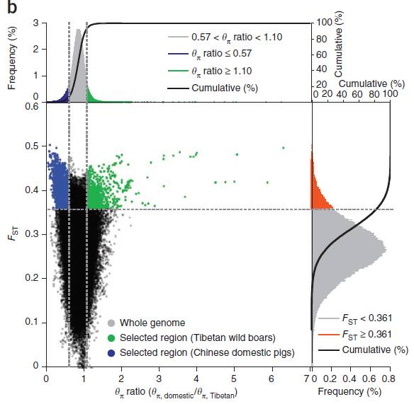

横坐标为θπ ratio（驯化／野生），纵坐标为Fst值，分别对应上面的频率分布图和右侧的频率分布图，中部的点图则代表不同窗口内的相应的Fst和θπ ratio。其中最上方蓝色和绿色区域为θπ选择出来的top 5%区域，红色区域为Fst所选择top 5%区域，中间蓝色和绿色区域为Fst和θπ的交集，即为候选的位点。

#### 2.等位基因频率结合基因组杂合度（Tajima’s D & θπ）

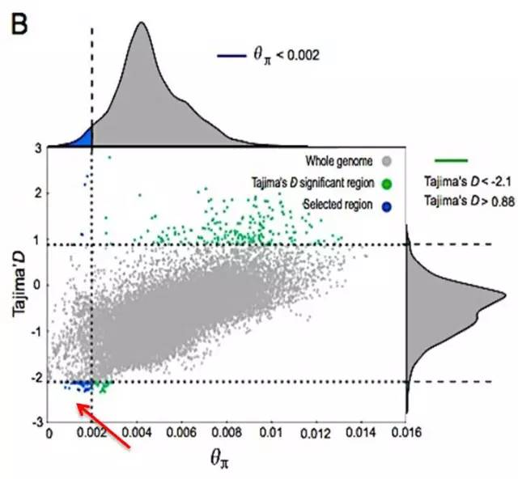

横坐标为θπ 值，纵坐标为Tajima’s D值，分别对应上面的频率分布图和右侧的频率分布图，中部的点图则代表不同窗口内的相应的θπ和Tajima’s D值。其中蓝色区域为θπ选择出来的top 5%区域，绿色区域为Tajima’s D选择出的top 5% 区域，红色箭头所指的区域为θπ和Tajima’s D的交集，即为候选的位点。


## 基因流分析
> https://www.jianshu.com/p/6d5965b19fa7  
> https://www.jianshu.com/p/92694c46cf5c

### 基本概念

- **基因渗入**(introgression)： 是在遗传学中，指两个基因库间的基因流动，通常是经过种间杂交产生。基因渗入是一个长期的过程，它可能需要许多代杂交才能产生回交。
- **ABBA BABA test**（也称为D统计）：为偏离严格的分叉进化历史提供了简单而有力的统计测试。因此，它们经常使用它研究SNP基因组层面的基因渗入。
- **不完全谱系分选**：基因树与物种谱系树或种群树不一致的现象。

### 基因流

在群体遗传学上，基因流（也称基因迁移）是指从一个物种的一个种群向另一个种群引入新的遗传物质，从而改变群体“基因库”的组成。通过基因交流向群体中引入新的等位基因，是遗传变异一个非常重要的来源，影响群体遗传多样性，产生新的性状组合。

**举个例子：**

假设在一个鸟类群体中，某个时期在该地理位置发生地壳运动，形成一座山脉(地质事件)将群体分割开来。一段时间后鸟类为了适应其所处的地理环境，被山脉分割的两个群体羽毛颜色发生改变（一个群体是阴性红色hh，一个群体是显性蓝色HH），其它羽毛颜色的鸟类不适应环境逐渐灭绝。如果两个群体还没有产生生殖隔离，在某段时间鸟类迁徙、人类活动等事件影响，两个群体都由外来个体引入，即每个亚群都由新的等位基因引入，那么群体的基因频率和基因型频率都会发生改变，结果就是原来蓝色鸟类群体会有红色羽毛鸟类，同样红色羽毛群体中也会存在蓝色羽毛鸟类。

基因流可以塑造、改变生态系统和物种多样性，这对自然和科学研究感兴趣的人来说非常重要。

### 群体遗传结构和基因流关系  

物种很少会形成单一的大群体，通常以某种方式细分为多个子群体（亚群）。实际上，子群体不可能是一些明显的单一的群体或亚结构，应该是连续的。然而，即使在有效的连续群体中，不同地理分布的亚群也有不同的基因频率（不同亚群的部分个体因某种形式的隔离不能随机交配）。

**一些个体从一个群体迁移到另一个群体就会把基因带到新的群体，从而产生基因流动。**基因流越大，群体间的相似性越大，会导致群体间基因频率和基因型频率呈现哈迪-温伯格平衡（在一个随机交配的大群体中，没有突变、选择等外界环境因素的影响，基因频率和基因型频率世代恒定）。自然选择和遗传漂变会使群体之间的差异增加，而基因流的作用是“弱化”群体间的遗传差异，群体之间趋于一致。

人类GWAS研究中，常把哈迪-温伯格平衡作为标记过滤的重要参数。

近年来，研究者通过基因流，对群体之间的关系进行研究。可以说，基因流是影响群体进化的一个重要因素。目前，基因流研究的几种模式包括：陆岛模式、海岛模式、阶石模式、距离隔离模式、层次模式等。

- **陆岛模式（Continent-Island Model）**，在陆地和岛屿之间一些种群发生基因交流。由于陆地上种群足够大，岛屿比较小，基因流向应该是从陆地到岛屿，即使存在部分个体由岛屿到陆地，这种微弱的基因流并不能改变陆地上群体的基因型频率，可以忽略。岛屿上基因频率的改变主要由岛屿和陆地之间基因频率差异的大小以及迁移个体的数量决定。
- **海岛模式（Island Model）**,前面说过，亚群之间在空间上应该是连续的，但不排除群体结构的极端类型—不连续，我们将彻底的不连续的亚群分布称作海岛模式。基因流可发生在不同亚群之间，各个亚群基因频率变化呈现跳跃式而不具有连续性。海岛模式适合于对一个物种有利的生境区域及其类似区域被不利生境分隔开来的情况。
- **阶石模式（Stepping-Stone Model）**，它是一维的海岛模式，基因交流多发生在邻近亚群之间，导致相邻亚群具有更大的遗传相似性。
- **距离隔离模式（Isolation-By-Distance Model）**，一般针对活动范围有限，出生到死亡基本没有较大范围移动过的物种。各个亚群在空间上连续分布，根据个体间能够随机交配范围的限制，将群体划分为许多邻里，每个邻里就是不同亚群间个体能够随机交配的区域，基因频率在邻里间差异小，不同亚群在地理位置和遗传距离之间存在关系。

### 基因流研究方法  

目前针对基因流的研究，主要基于上述群体结构模式，检验亚群间存在基因流的指标有基因频率、基因型频率、Fst、Nm等。如果研究者不了解群体结构，一般都会选择“海岛模式”，基因流在群体间是随机的、均一的而且群体也要达到漂变-迁移平衡，迁移个体来自所有其他群体中随机的一个遗传变异群体。

#### **ABBA-BABA（D统计）**

如下图，H1和H2为姊妹群体，H3为基因交流可能来源的群体，H4为外群，假设一个祖先位点基因型为A，进化过程中产生突变基因型B，则H1群体和H2群体得到基因型A或基因型B的概率均为50%。

在实际项目分析中，一般研究四群体之间的基因渗入（introgression）事件，检测其是否符合ABBA还是BABA模式。

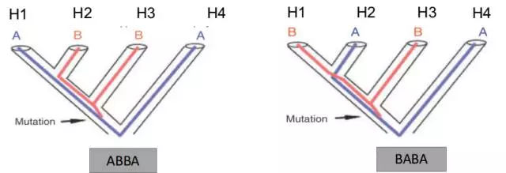

根据D-统计的原理，我们可以通过计数ABBA、BABA、BBAA的模式数目进行基因流的判断（如下图），由于P1和P2是姊妹群，它们之间共有的等位基因数实际上是最多的，只需要判断ABBA和BABA的模式数目，可以大致判断基因流。

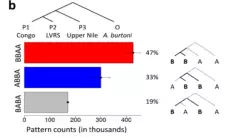

#### D-统计原理

在不完全谱系分选的情况下，两种姐妹物种与第三种密切相关的物种共享大约相同比例的衍生等位基因。也就是说：如果物种“H1”和“H2”是姐妹而“H3”是密切相关的物种，那么由“H1”和“H3”共享但不和“H2”共享的衍生的等位基因的数量，应该和由“H2”和“H3”共享但不和“H1”共享的衍生的等位基因的数量应该大致相似。如果杂交导致物种“H3”与两个物种“H1”和“H2”中的一个之间的发生基因渗入，则“H3”应该与该物种共享更多的衍生等位基因，导致"H1"和"H2"的衍生等位基因中产生不对称共享。

上述，即所谓的“ABBA-BABA test”的基础，其量化的D统计量可以用来测量基因渗入的程度。除了三种“H1”，“H2”和“H3”之外，ABBA-BABA test还需要第四种“H4”，它应该是“H1”，“H2”和“H3”的共同外群。仅用于确定哪个等位基因是祖先等位基因，然后将祖先等位基因标记为“A”，将衍生等位基因标记为“B”。在最简单的情况下，其中仅从四个物种中的每一个中采样单个单倍体序列，“ABBA位点”是物种“H2”和“H3”共享衍生的等位基因“B”而“H1”保留祖先等位基因，“BABA位点”是“H1”和“H3”共享衍生的等位基因“B”而“H2”保留祖先等位基因“A”。**D统计量定义为**ABBA位点和BABA位点的数量差与两种类型位点的总和的比值。

D = \[sum(ABBA) – sum(BABA)\] / \[sum(ABBA) + sum(BABA)\]

如果没有基因渗入，这个D统计量预计为0；在没有不完整谱系排序并在“H2”和“H3”之间进行基因交流的极端情况下为1，在“H1”和"H3"之间发生基因交流的极端情况下为-1 ；但按惯例，如果“H1”变得更接近“H3”，则交换“H1”和“H2”，这样D统计量保持在区间 \[0, 1\] 间。

#### D-统计实操（SNP data）

推荐使用Dsuite（[https://github.com/millanek/Dsuite](https://github.com/millanek/Dsuite)）

#### Treemix介绍
> https://bitbucket.org/nygcresearch/treemix/wiki/Home

treemix由Joseph K. Pickrell和Jonathan K. Pritchard开发，文章Inference of population splits and mixtures from genome-wide allele frequency data. 通过从多个种群中获得等位基因频率，返回该种群的最大似然树，并推断可能发生的杂交事件。

Treemix软件使用全基因组的等位基因频率数据，推断多个群体的分化和混合的模式。该软件输入数据为多个群体的等位基因频率数据，可以生成这些群体的最大似然树，并且可以推测群体混合事件。

可在最大似然树上展示渗入事件（箭头）：

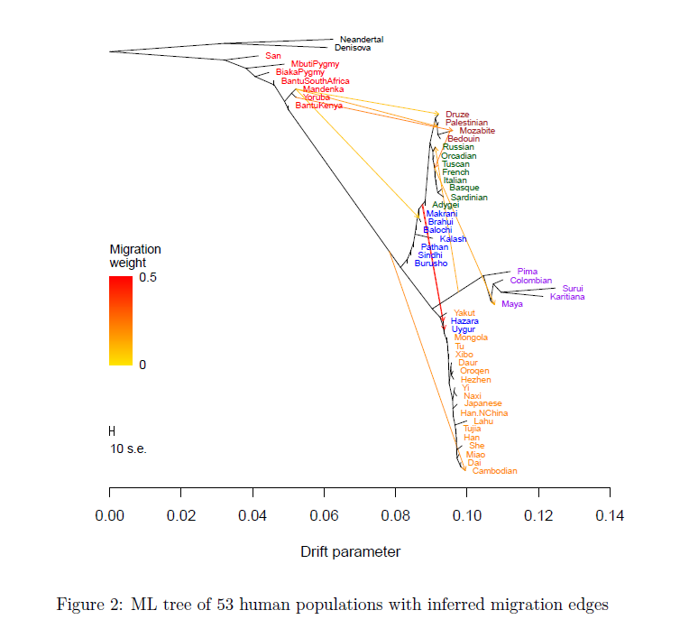

#### Treemix基本原理

1. 使用基因频率数据可以计算出每对群体之间的协方差，这是实际的协方差（Real value）
2. 使用基因型频率数据可以构建最大似然树，利用两个种群在树上的关系，可以计算出协方差的估计值（Estimated value）
3. 通过实际值与估计值之间的差，判断两个种群之间是否发生基因流。即如果实际值小于估计值，说明我们构建出来的树，夸大了种群之间的差异，提示种群之间有基因交流，因为基因流会减少种群之间的差异

#### Treemix的使用

##### 下载需要用到格式转换脚本

[conversion script](https://github.com/speciationgenomics/scripts)

##### 输入文件

1. 存储每个个体基因型的vcf文件（YourFileName.vcf）
2. 样品分组文件（第一列和第二列都为样本名称，第三列为分类单元名称，population.txt）
3. 分组的排序文件（poporder.txt）

前两个文件是构建进化树所必须的。第三个文件规定了热图中的分组顺序。

##### 运算

```bash
导入vcf文件
File=YourFileName.vcf
#导入clust文件
clust=population.txt
#LD过滤
plink --vcf $File --indep-pairwise 100 20 0.2 -out ${File%%.*}_LD100_20_02 --make-bed
plink --bfile ${File%%.*}_LD100_20_02 --extract ${File%%.*}_LD100_20_02.prune.in --out ${File%%.*}_LD100_20_02_vcf --recode vcf-iid
#使用文件格式转换脚本生成treemix输入文件
gzip ${File%%.*}_LD100_20_02_vcf.vcf
vcf2treemix.sh ${File%%.*}_LD100_20_02_vcf.vcf.gz $clust
#运行treemix
for i in {0..15}
do
  treemix -i ${File%%.*}_LD100_20_02_vcf.treemix.frq.gz -m $i -o ${File%%.*}_LD100_20_02_vcf.$i -root 1 -bootstrap -k 200 > treemix_${i}_log
done
```

##### 数据可视化

```R
#R环境
source("plotting_funcs.R")
poporder="poporder.txt"
#绘制-m等于11的结果
outstem="YourFileName_100_20_02_vcf.11"
#绘制FigureC
plot_tree(outstem)
#绘制FigureB（残差图）
plot_resid(outstem,poporder)
```


