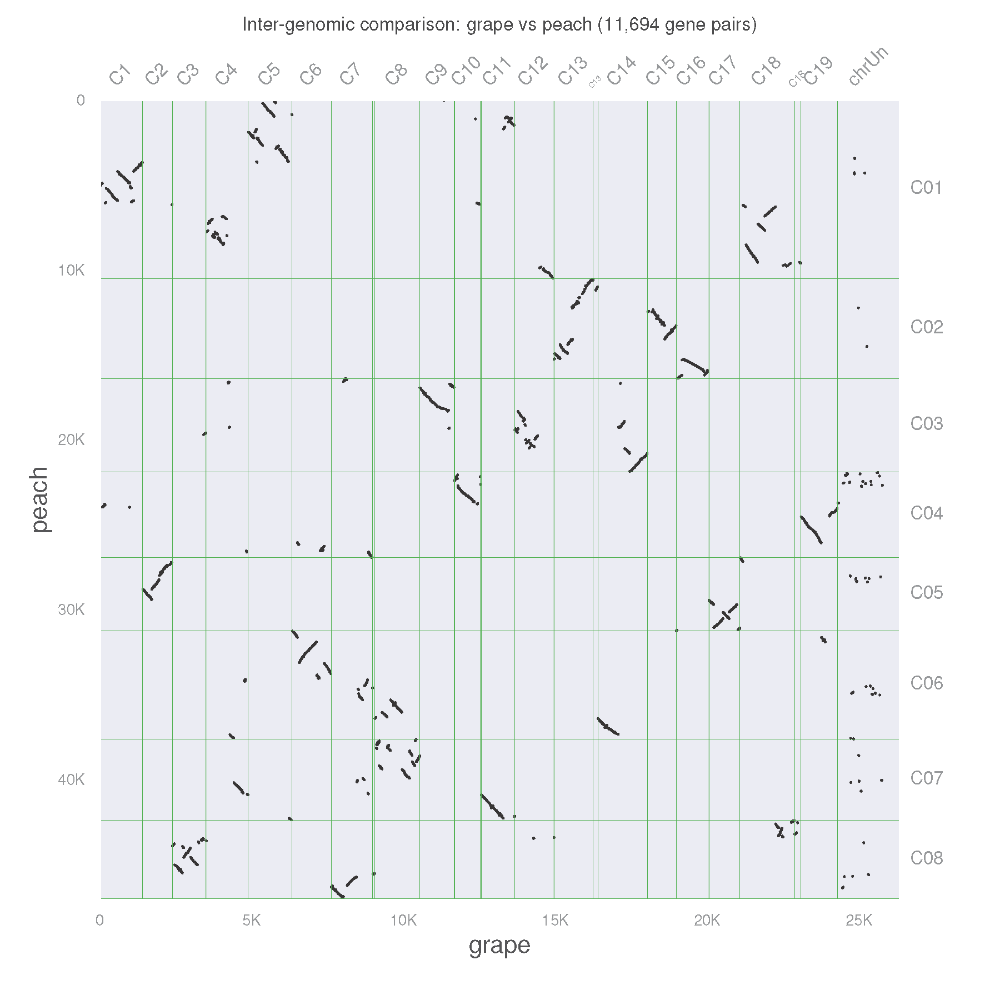
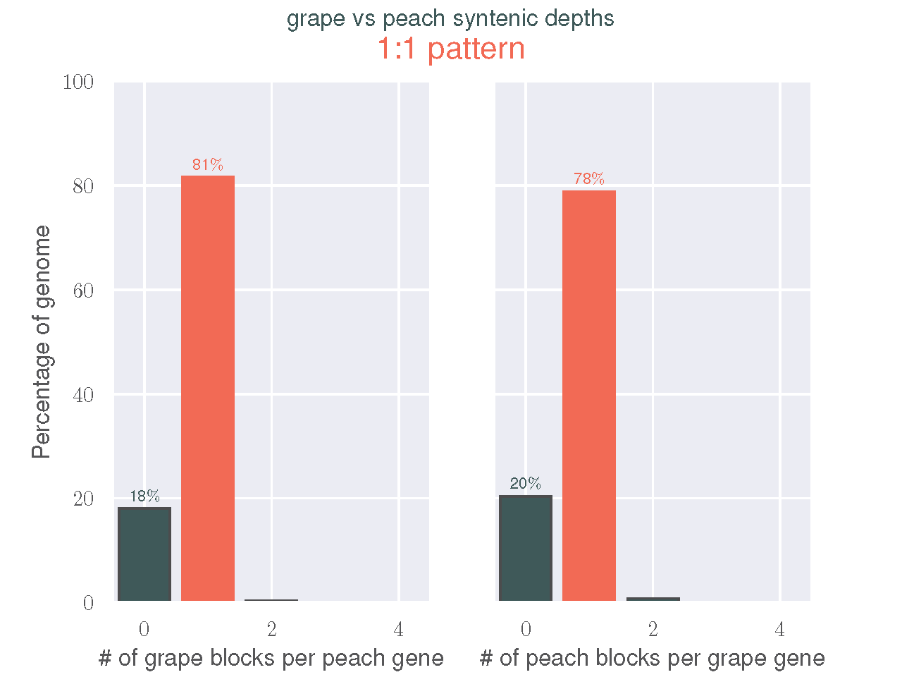
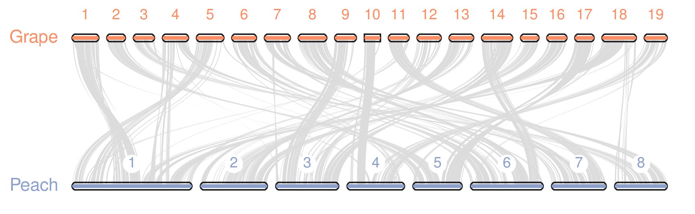
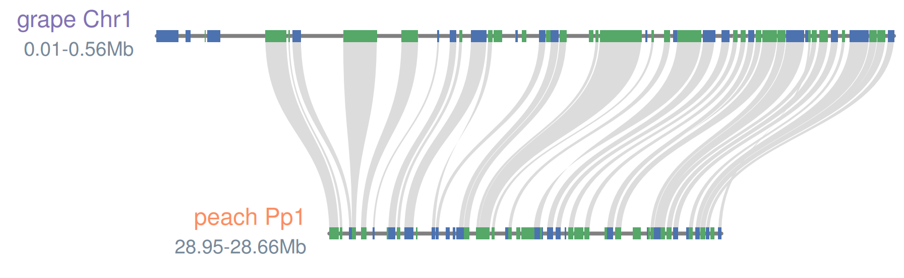

# 使用JCVI进行MCScan共线性(synteny)分析与可视化

> 参考：  
> https://github.com/tanghaibao/jcvi  
> https://sr-c.github.io/2019/01/11/jcvi-MCscan/

## 安装

推荐使用`conda`安装`jcvi`，并安装依赖软件`BEDTools`、`EMBOSS`和`LAST`
```bash
conda create --name jcvi python=3.9 jcvi bedtools emboss last
```

在此之前，建议按照[官网教程](https://tug.org/texlive/quickinstall.html)安装`texlive`,而不要使用`conda`中的`texlive-core`
```bash
wget https://mirror.ctan.org/systems/texlive/tlnet/install-tl-unx.tar.gz
tar -xzf install-tl-unx.tar.gz
cd install-tl-*
perl install-tl

# 若无管理员权限需要安装在家目录
# 在交互界面按"D"，再按"1"
# 更改"TEXDIR"至合适位置
# 再按提示完成安装（约需1.5h)
```

## 准备数据

`jcvi`支持直接从[phytozome](https://phytozome-next.jgi.doe.gov/)下载数据（需要先注册）

查看可下载的物种，常见的植物物种都可以直接下载
```bash
python -m jcvi.apps.fetch phytozome
```

下载与整理数据
```bash
# download sequences and coordinates of grape and peach
python -m jcvi.apps.fetch phytozome Vvinifera,Ppersica

# convert the GFF to BED file
python -m jcvi.formats.gff bed --type=mRNA --key=Name Vvinifera_145_Genoscope.12X.gene.gff3.gz -o grape.bed
python -m jcvi.formats.gff bed --type=mRNA --key=Name Ppersica_298_v2.1.gene.gff3.gz -o peach.bed

# clean headers to remove description fields from Phytozome FASTA files
python -m jcvi.formats.fasta format Vvinifera_145_Genoscope.12X.cds.fa.gz grape.cds
python -m jcvi.formats.fasta format Ppersica_298_v2.1.cds.fa.gz peach.cds
```

## 共线性分析

```bash
python -m jcvi.compara.catalog ortholog grape peach
```
程序默认按照可用线程，调用全部进行`LAST`比对

## 可视化

### 点阵图

在共线性分析后，程序会自动绘制点阵图。手动运行方式如下
```bash
python -m jcvi.graphics.dotplot grape.peach.anchors
```

在两者的点阵图中，不论水平方向或者竖直方向查看，都可以发现不超过3次的共线性区域。这说明，🍇和🍑之间发生了基因组三倍体化的事件，使得出现了这样3:3的模式。

如果仔细观察，还可以发现3个共线性区域中常常有一个信号更强，对应着两个基因组之间的直系同源区域。如果我们只想要得到这些1:1直系同源的区域呢？我们只需要重复之前的比对，同时加上选项`--cscore=.99`即可。`C-score`是由`LAST`比对区域到`BLAST`比对区域的比值确定。(C-score is defined by the ratio of LAST hit to the best BLAST hits to either the query and hit)。`0.99`的`C-score`阈值有效地过滤`LAST`比对结果，从而得到最佳相互比对结果(reciprocal best hit, RBH)。

```bash
# remove old file
rm grape.peach.last.filtered grape.peach.anchors

python -m jcvi.compara.catalog ortholog grape peach --cscore=.99
```



还可以手动查看synteny depth分布

```bash
python -m jcvi.compara.synteny depth --histogram grape.peach.anchors
```



### 共线性图

首先先从`.anchors`文件中产生更简要的`.simple`文件
```bash
python -m jcvi.compara.synteny screen --minspan=30 --simple grape.peach.anchors grape.peach.anchors.new
```

此外，除了原始BED文件和`.simple`文件文件，还需要手动设置两个文件用于绘图（注意，文件末尾不能存在多余的空行）

1. `seqids`：设定绘制哪些染色体，一般会去掉较小和未定位的scaffolds，下方设定了19个🍇的染色体与8个🍑的染色体
```vim
chr1,chr2,chr3,chr4,chr5,chr6,chr7,chr8,chr9,chr10,chr11,chr12,chr13,chr14,chr15,chr16,chr17,chr18,chr19
Pp1,Pp2,Pp3,Pp4,Pp5,Pp6,Pp7,Pp8
```
2. `layout`：设定画板上如何绘制。整体上`canvas`绘图的`x`,`y`轴的定位在`0-1`之间，前三行设定了染色体轨道的位置，循环，颜色，标签，垂直排列以及对应的BED文件。下方的`track0`就是🍇，`track1`就是🍑。下一节就是设定在哪些tracks之间绘制共线性关系。`e,0,1`代表着绘制`track0`与`track1`之间的共线性，使用`grape.peach.anchors.simple`文件中的详细信息。
```vim
# y, xstart, xend, rotation, color, label, va,  bed
.6,     .1,    .8,       0,      , Grape, top, grape.bed
.4,     .1,    .8,       0,      , Peach, top, peach.bed
# edges
e, 0, 1, grape.peach.anchors.simple
```

绘图
```bash
python -m jcvi.graphics.karyotype seqids layout
```



### 局部可视化

首先从基因水平提取匹配的区块

```bash
python -m jcvi.compara.synteny mcscan grape.bed grape.peach.lifted.anchors --iter=1 -o grape.peach.i1.blocks
```

参数`--iter=1`表明从每个🍇区域中提取1个最佳匹配区域。若将`--iter`设置为2，那么每个🍇区域就会有2个对应的🍑区域。这一点对于基因组重复区域的绘制很有帮助。

目前`grape.peach.i1.blocks`中包含有很多局部区域，我们可以手动选择需要绘制的部分。

```bash
head -50 grape.peach.i1.blocks > blocks.select
```

最终，我们仍然需要一个`layout`文件进行绘图，`blocks.layout`文件如下

```vim
# x,   y, rot,   ha,     va,   color, ratio,       label
0.5, 0.6,   0, left, center,       m,     1,  grape Chr1
0.5, 0.4,   0, left, center, #fc8d62,     1,  peach Pp1
# edges
e, 0, 1
```

然后，我们就可以进行绘制了

```bash
cat grape.bed peach.bed > grape_peach.bed
python -m jcvi.graphics.synteny blocks.select grape_peach.bed blocks.layout
```



### 调整与美化

#### 设置颜色

**species1.species2.anchors.simple**
```bash
g*GSVIVT01012028001 GSVIVT01000604001   ppa011886m  ppa008534m  392 +
GSVIVT01010441001   GSVIVT01000970001   ppa022891m  ppa001358m  115 -
...
# g: green; r: red; etc.
```

#### 多物种

**layout**
```bash
# y, xstart, xend, rotation, color, label, va,  bed
 .7,     .2,    .4,      45,      , Grape,    top, grape.bed
 .5,     .2,    .8,       0,      , Peach,    top, peach.bed
 .7,     .4,    .8,     -45,      , Cacao, bottom, cacao.bed
# edges
e, 0, 1, grape.peach.anchors.simple
e, 1, 2, peach.cacao.anchors.simple
```

**seqids**
```bash
chr1,chr2,chr3,chr4,chr5,chr6,chr7,chr8,chr9,chr10,chr11,chr12,chr13,chr14,chr15,chr16,chr17,chr18,chr19
scaffold_1,scaffold_2,scaffold_3,scaffold_4,scaffold_5,scaffold_6,scaffold_7,scaffold_8
scaffold_1,scaffold_2,scaffold_3,scaffold_4,scaffold_5,scaffold_6,scaffold_7,scaffold_8,scaffold_9,scaffold_10
```

**三角形layout**
```bash
# y, xstart, xend, rotation, color, label, va,  bed
 .5,     .025,     .625,      60,      , Grape, top, grape.bed
 .2,       .2,       .8,       0,      , Peach, top, peach.bed
 .5,     .375,     .975,     -60,      , Cacao, top, cacao.bed
# edges
e, 0, 1, grape.peach.anchors.simple
e, 1, 2, peach.cacao.anchors.simple
e, 0, 2, grape.cacao.anchors.simple
```
