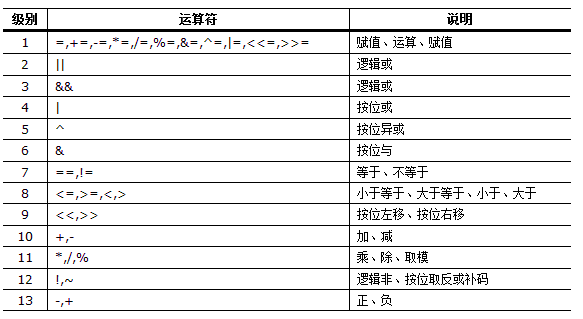

# Linux使用技巧

- [Linux使用技巧](#linux使用技巧)
  - [Docker](#docker)
    - [Docker从入门到实践](#docker从入门到实践)
    - [Win10家庭版用WSL2运行Docker Desktop，将数据从C盘迁移到其他目录](#win10家庭版用wsl2运行docker-desktop将数据从c盘迁移到其他目录)
    - [Docker创建共享文件夹](#docker创建共享文件夹)
  - [鳥哥的Linux私房菜](#鳥哥的linux私房菜)
  - [Linux常用命令](#linux常用命令)
  - [Linux特殊符号](#linux特殊符号)
  - [三十分钟学会AWK](#三十分钟学会awk)
  - [三十分钟学会SED](#三十分钟学会sed)
  - [Learn Vim Progressively](#learn-vim-progressively)
  - [Linux查看系统基本信息](#linux查看系统基本信息)
  - [Bash和Sh的区别](#bash和sh的区别)
  - [利用.bashrc个性化配制bash环境](#利用bashrc个性化配制bash环境)
  - [利用.vimrc个性化配置vim](#利用vimrc个性化配置vim)
  - [Bash下使用`rsync`和`crontab`备份文件](#bash下使用rsync和crontab备份文件)
  - [Linux中for循环的几个常用写法](#linux中for循环的几个常用写法)
  - [Linux下将文件夹命名为今天的日期的方法](#linux下将文件夹命名为今天的日期的方法)
  - [Linux下使ls命令只显示目录的方法](#linux下使ls命令只显示目录的方法)
  - [Linux下替换`^M`字符方法](#linux下替换m字符方法)
  - [Linux下将多行文件合并为一行](#linux下将多行文件合并为一行)
  - [Linux中cut命令](#linux中cut命令)
  - [Ubuntu镜像使用帮助](#ubuntu镜像使用帮助)
  - [Ubuntu下使用apt install XX(or sudo apt install XX)报错Unable to locate package](#ubuntu下使用apt-install-xxor-sudo-apt-install-xx报错unable-to-locate-package)
  - [Linux管理员修改普通用户密码](#linux管理员修改普通用户密码)
  - [Linux下使用`sudo`命令出现not in the sudoers file](#linux下使用sudo命令出现not-in-the-sudoers-file)
  - [Linux下安装Miniconda](#linux下安装miniconda)
  - [WSL更改登录用户](#wsl更改登录用户)
  - [WSL中Vim字体改变的解决方案](#wsl中vim字体改变的解决方案)
  - [Linux字符串变量操作](#linux字符串变量操作)
    - [截取](#截取)
    - [删除与替换](#删除与替换)
    - [变量声明](#变量声明)
  - [Linux下`nohup`命令](#linux下nohup命令)
    - [耗时很长的程序忘加nohup就运行了怎么办](#耗时很长的程序忘加nohup就运行了怎么办)
  - [awk基本操作符、内置函数与变量](#awk基本操作符内置函数与变量)
    - [awk操作符的优先级](#awk操作符的优先级)
    - [awk内置函数](#awk内置函数)
    - [awk内置变量](#awk内置变量)
  - [awk同时处理多个文件](#awk同时处理多个文件)
  - [Linux下文件批量重命名](#linux下文件批量重命名)
    - [`mv`命令](#mv命令)
    - [`rename`命令](#rename命令)
  - [Bash中括号及`expr`的用法](#bash中括号及expr的用法)
    - [小括号`()`](#小括号)
    - [中括号`[]`](#中括号)
    - [大括号`{}`](#大括号)
    - [示例](#示例)
    - [expr用法](#expr用法)
  - [Linux下按Tab补全命令时忽略大小写](#linux下按tab补全命令时忽略大小写)
  - [Linux `tar` 命令](#linux-tar-命令)
    - [语法](#语法)
    - [参数](#参数)
    - [示例](#示例-1)
  - [Bash脚本传递参数](#bash脚本传递参数)
    - [位置参数](#位置参数)
    - [参数名匹配](#参数名匹配)
  - [Linux `echo` 不换行输出的两种方式](#linux-echo-不换行输出的两种方式)
  - [Linux下批量中止多个进程](#linux下批量中止多个进程)
  - [Linux下`split`命令将一个大文件按行拆分成小文件](#linux下split命令将一个大文件按行拆分成小文件)
  - [sed正则表达式匹配，各种括号的转义和不转义](#sed正则表达式匹配各种括号的转义和不转义)
    - [Sed正则表达式详细介绍](#sed正则表达式详细介绍)
      - [行开始 `^`](#行开始-)
      - [行尾 `$`](#行尾-)
      - [单个字符 `.`](#单个字符-)
      - [匹配字符集合 `[]`](#匹配字符集合-)
      - [不匹配字符集 `[^]`](#不匹配字符集-)
      - [字符范围 `[-]`](#字符范围--)
      - [零到一次出现 `\?`](#零到一次出现)
      - [一次或多次出现 `\+`](#一次或多次出现-)
      - [零或多次出现 `*`](#零或多次出现-)
      - [n个重复 `\{n\}`](#n个重复-n)
      - [最少出现n个 `\{n,\}`](#最少出现n个-n)
      - [m到n次出现 `\{m, n\}`](#m到n次出现-m-n)
      - [或 `\|` `\(\|\)`](#或--)
  - [awk中的回溯引用 (back references)](#awk中的回溯引用-back-references)
  - [Linux两个文件求交集、并集、差集](#linux两个文件求交集并集差集)
    - [定义](#定义)
    - [方法一：`sort`+`uniq`](#方法一sortuniq)
    - [方法二：`comm`，用于比较两个已排过序的文件](#方法二comm用于比较两个已排过序的文件)
    - [方法三：`grep`](#方法三grep)
    - [方法四：`awk`](#方法四awk)


## Docker
> Docker is a tool to run Linux containers based on selected images.

### Docker从入门到实践
> [https://yeasy.gitbook.io/docker_practice/](https://yeasy.gitbook.io/docker_practice/)

### Win10家庭版用WSL2运行Docker Desktop，将数据从C盘迁移到其他目录

Win10开始使用Hyper-V运行docker，家庭版无此功能，所以只能pro版本才能用docker desktop。后来升级到2004系统后，家庭版可升级WSL(Windows Subsystem for Linux)至WSL2，便可基于WSL2运行docker desktop，但相较于Hyper-V的区别在于，其数据由WSL2代为管理，无法在docker里设置镜像存储路径。

安装docker后，docker会自动创建2个发行版：`docker-desktop`和`docker-desktop-data`，其默认安装在C盘，在`%LOCALAPPDATA%/Docker/wsl`目录里，而docker的运行数据、镜像文件都存在`%LOCALAPPDATA%/Docker/wsl/data/ext4.vhdx`中，比较占用C盘空间，故考虑将其迁移至D盘。

对于WSL发行版的迁移，网上教程基本均需使用LxRunOffline，但其虽然可以迁移例如Ubuntu的发行版，但迁移不了docker自动创建的2个发行版。故考虑如下两种方式：

**方法一：使用wsl命令**

* 关闭docker desktop
* 关闭所有发行版
```
wsl --shutdown
```
* 导出docker-desktop-data
```
wsl --export docker-desktop-data D:\docker-desktop-data.tar
```
* 注销docker-desktop-data
```
wsl --unregister docker-desktop-data
```
* 重新导入docker-desktop-data
```
wsl --import docker-desktop-data D:\Tools\WSL\docker-desktop-data\ D:\docker-desktop-data.tar --version 2
```
* _注：只迁移docker-desktop-data即可，另一个占用空间较小_

**方法二：修改注册表（未直接验证，理论上及其他操作证明应当可行）**

* 关闭docker desktop
* 打开`powershell`，输入`whoami /user`，获得[SID]；用`wsl --shutdown`命令关闭所有发行版
* 运行`regedit`，跳转至`HKEY_USERS\[SID]\SOFTWARE\Microsoft\Windows\CurrentVersion\Lxss`
* 在下属的文件文件夹中（文件夹名为一个UUID）找到`DistributionName`为`docker-desktop-data`的项
* 将其`BasePath`改为目标目录，如`\\?\D:\Tools\WSL\docker-desktop-data`，并将原目录下`ext4.vhdx`拷贝至该目录
* 重启即可使用

### Docker创建共享文件夹

* 检查docker是否安装成功
```
docker info
```
* 装载镜像
```
docker load -i ~/Downloads/bioinfo_PartI-PartII-PartIII1-3.tar.gz
```
* 创建共享文件夹
```
mkdir ~/Documents/bioinfo_tsinghua_share
```
* 创建容器（**win10下共享文件夹需用绝对路径**）
```
docker run --name=bioinfo_tsinghua -dt -h bioinfo_docker --restart unless-stopped -v C:/Users/[username]/Documents/bioinfo_tsinghua_share:/home/test/share bioinfo_tsinghua
```
* 将docker中的`/home/test/share`由`root`所有改为`test`所有
```
docker exec -u root bioinfo_tsinghua chown test:test /home/test/share
```
* 以`test`用户运行docker
```
docker exec -it bioinfo_tsinghua bash
```
* _注：以`root`用户运行docker_
```
docker exec -it -u root bioinfo_tsinghua bash
```


## 鳥哥的Linux私房菜
> [http://linux.vbird.org/linux_basic/](http://linux.vbird.org/linux_basic/)

## Linux常用命令
> [https://mp.weixin.qq.com/s/cri9CEbVJizZIO9WwiCJ0g](https://mp.weixin.qq.com/s/cri9CEbVJizZIO9WwiCJ0g)

## Linux特殊符号
> [https://mp.weixin.qq.com/s/IO8Ckahig14RIvyDPX5lhw](https://mp.weixin.qq.com/s/IO8Ckahig14RIvyDPX5lhw)

## 三十分钟学会AWK
> [https://github.com/mylxsw/growing-up/blob/master/doc/%E4%B8%89%E5%8D%81%E5%88%86%E9%92%9F%E5%AD%A6%E4%BC%9AAWK.md](https://github.com/mylxsw/growing-up/blob/master/doc/%E4%B8%89%E5%8D%81%E5%88%86%E9%92%9F%E5%AD%A6%E4%BC%9AAWK.md)

## 三十分钟学会SED
> [https://github.com/mylxsw/growing-up/blob/master/doc/%E4%B8%89%E5%8D%81%E5%88%86%E9%92%9F%E5%AD%A6%E4%BC%9ASED.md](https://github.com/mylxsw/growing-up/blob/master/doc/%E4%B8%89%E5%8D%81%E5%88%86%E9%92%9F%E5%AD%A6%E4%BC%9ASED.md)

## Learn Vim Progressively
> [http://yannesposito.com/Scratch/en/blog/Learn-Vim-Progressively/](http://yannesposito.com/Scratch/en/blog/Learn-Vim-Progressively/)


## Linux查看系统基本信息

* 查看版本当前操作系统内核信息
```bash
uname -a
```
* 查看当前操作系统版本信息
```bash
cat /proc/version
```
* 查看版本当前操作系统发行版信息
```bash
cat /etc/issue
```
* 查看cpu相关信息，包括型号、主频、内核信息等
```bash
cat /proc/cpuinfo
```
* 查看服务器名称
```bash
hostname
```
* 查看网络信息
```bash
cat /etc/sysconfig/network-scripts/ifcfg-eth0
cat /etc/sysconfig/network-scripts/ifcfg-l0
```
* 查看磁盘信息
```bash
lsblk       查看磁盘信息 - 列出所有可用块设备的信息，而且还能显示他们之间的依赖关系，但是它不会列出RAM盘的信息
fdisk -l    观察硬盘实体使用情况，也可对硬盘分区
df -h       查看磁盘总体情况
du -sh      查看当前文件夹磁盘占用
```
* 查看进程与用户信息
```bash
ps -ef      查看所有进程
ps -aux     按用户查看进程
top         实时显示进程状态
w           查看活动用户
id <usr>    查看指定用户信息
```
* [更多内容](https://blog.csdn.net/qq_31278903/article/details/83146031)


## Bash和Sh的区别
> Bash is the most commonly used linux shell.

* sh(或Shell命令语言)是由POSIX标准描述的一种编程语言。它有很多实现(ksh88, dash，…)。bash也可以被认为是sh的实现。因为sh是规范，不是实现，`/bin/sh`是在大部分POSIX系统上实际实现的符号连接（or 硬链接）。
* bash是兼容sh的一种实现（虽然在几年之前被视为POSIX标准），但随着时间流逝，它需要更多的扩展。这里面的一些扩展会改变有效的POSIX shell脚本的行为，所以bash本身不是有效的POSIX shell，而是POSIX shell语言的方言。但bash可以执行`--posix`切换，使得它更加的兼容POSIX，同时也尝试通过调用sh来模仿POSIX。
* 长期以来，在大部分GNU/Linux系统上，`/bin/sh`都是指向`/bin/bash`。结果，几乎可以忽略两者之间的区别了。但是这种情况最近开始改变。
* 在`/bin/sh`不指向`/bin/bash`（在某些情况下甚至都不存在`/bin/bash`）的系统中，一些常见的例子是：
  * 现代的debian和ubuntu系统上，`sh`默认是`dash`的符号链接
  * Busybox，它通常在Linux系统引导时作为initramfs的一部分运行。它使用了ash shell实现。
  * BSDs，以及通常所有非linux系统。OpenBSD 使用pdksh，Korn shell的后代。FreeBSD的sh是原始UNIX Bourne shell的后代。Solaris有它自己的sh，但长期以来都不是与POSIX兼容的，是一种Heirloom项目提供的一个开源实现。
* 如何找到`/bin/sh`在我们系统上的指向
  * `/bin/sh`的复杂之处是：它可以是符号链接也可以是硬链接。
  * 如果是符号链接，可以尝试：
  ```bash
  file -h /bin/sh
  /bin/sh: symbolic link to dash
  ```
  * 如果是硬链接，可以尝试：
  ```bash
  find -L /bin -samefile /bin/sh
  /bin/sh.distrib
  /bin/dash
  /bin/sh
  ```
  * 注：实际上`-L`标志同时包括符号链接和硬链接，但是这种方法的缺点是它不是可移植的，POSIX不需要`find`来支持`-samefile`选项，尽管GNU `find`和FreeBSD `find`都支持它。
* Shebang：在计算领域中，Shebang（也称为Hashbang）是一个由井号和叹号构成的字符序列#!，其出现在文本文件的第一行的前两个字符。最终，通过在脚本的第一行编写Shebang来决定使用sh还是bash。
```bash
# 1. 使用sh
#!/bin/sh
# 2. 使用bash（如果不可用会失败并带上错误信息）
#!/bin/bash
# 3. 使用dash
#!/bin/dash
```


## 利用.bashrc个性化配制bash环境

**示例一**

```vim
# .bashrc
# Source global definitions
if [ -f /etc/bashrc ]; then
        . /etc/bashrc
fi

# User specific environment and startup programs
if [ -f $HOME/shortcuts ]; then
        source $HOME/shortcuts
fi
PATH=$HOME/bin:$PATH
export PATH

# User specific aliases and functions
alias qstat="qstat -u '*'"
#alias screen="/usr/bin/screen -D -R"
#alias rm="$HOME/bin/del.sh"
#alias undel="$HOME/bin/del.sh -u"
#alias ls="ls --color"
alias ld="ls -d"
alias c="clear"
alias l="ls -alh"
alias lf="ls -F|grep /"
alias lt="ls -tlr"
alias mv="mv -i"
alias cp="cp -pi"
alias diff="diff -b"

#PERL5LIB=$MYHOME/perllib:$MYHOME/perllib/lib64/perl5/site_perl/5.8.5:$MYHOME/perlib/lib/perl5/site_perl/5.8.5
#export PERL5LIB
#export R_LIBS_USER=~/R:/data/apps/R_library
```

**示例二**

```vim
# ~/.bashrc: executed by bash(1) for non-login shells.
# see /usr/share/doc/bash/examples/startup-files (in the package bash-doc)
# for examples

# If not running interactively, don't do anything
case $- in
    *i*) ;;
      *) return;;
esac

# don't put duplicate lines or lines starting with space in the history.
# See bash(1) for more options
HISTCONTROL=ignoreboth

# append to the history file, don't overwrite it
shopt -s histappend

# for setting history length see HISTSIZE and HISTFILESIZE in bash(1)
HISTSIZE=1000
HISTFILESIZE=2000

# check the window size after each command and, if necessary,
# update the values of LINES and COLUMNS.
shopt -s checkwinsize

# If set, the pattern "**" used in a pathname expansion context will
# match all files and zero or more directories and subdirectories.
#shopt -s globstar

# make less more friendly for non-text input files, see lesspipe(1)
[ -x /usr/bin/lesspipe ] && eval "$(SHELL=/bin/sh lesspipe)"

# set variable identifying the chroot you work in (used in the prompt below)
if [ -z "${debian_chroot:-}" ] && [ -r /etc/debian_chroot ]; then
    debian_chroot=$(cat /etc/debian_chroot)
fi

# set a fancy prompt (non-color, unless we know we "want" color)
case "$TERM" in
    xterm-color|*-256color) color_prompt=yes;;
esac

# uncomment for a colored prompt, if the terminal has the capability; turned
# off by default to not distract the user: the focus in a terminal window
# should be on the output of commands, not on the prompt
#force_color_prompt=yes

if [ -n "$force_color_prompt" ]; then
    if [ -x /usr/bin/tput ] && tput setaf 1 >&/dev/null; then
    # We have color support; assume it's compliant with Ecma-48
    # (ISO/IEC-6429). (Lack of such support is extremely rare, and such
    # a case would tend to support setf rather than setaf.)
    color_prompt=yes
    else
    color_prompt=
    fi
fi

if [ "$color_prompt" = yes ]; then
    PS1='${debian_chroot:+($debian_chroot)}\[\033[01;32m\]\u@\h\[\033[00m\]:\[\033[01;34m\]\w\[\033[00m\]\$ '
else
    PS1='${debian_chroot:+($debian_chroot)}\u@\h:\w\$ '
fi
unset color_prompt force_color_prompt

# If this is an xterm set the title to user@host:dir
case "$TERM" in
xterm*|rxvt*)
    PS1="\[\e]0;${debian_chroot:+($debian_chroot)}\u@\h: \w\a\]$PS1"
    ;;
*)
    ;;
esac

# enable color support of ls and also add handy aliases
if [ -x /usr/bin/dircolors ]; then
    test -r ~/.dircolors && eval "$(dircolors -b ~/.dircolors)" || eval "$(dircolors -b)"
    alias ls='ls --color=auto'
    #alias dir='dir --color=auto'
    #alias vdir='vdir --color=auto'

    alias grep='grep --color=auto'
    alias fgrep='fgrep --color=auto'
    alias egrep='egrep --color=auto'
fi

# colored GCC warnings and errors
#export GCC_COLORS='error=01;31:warning=01;35:note=01;36:caret=01;32:locus=01:quote=01'

# some more ls aliases
alias ll='ls -alF'
alias la='ls -A'
alias l='ls -CF'

# Add an "alert" alias for long running commands.  Use like so:
#   sleep 10; alert
alias alert='notify-send --urgency=low -i "$([ $? = 0 ] && echo terminal || echo error)" "$(history|tail -n1|sed -e '\''s/^\s*[0-9]\+\s*//;s/[;&|]\s*alert$//'\'')"'

# Alias definitions.
# You may want to put all your additions into a separate file like
# ~/.bash_aliases, instead of adding them here directly.
# See /usr/share/doc/bash-doc/examples in the bash-doc package.

if [ -f ~/.bash_aliases ]; then
    . ~/.bash_aliases
fi

# enable programmable completion features (you don't need to enable
# this, if it's already enabled in /etc/bash.bashrc and /etc/profile
# sources /etc/bash.bashrc).
if ! shopt -oq posix; then
  if [ -f /usr/share/bash-completion/bash_completion ]; then
    . /usr/share/bash-completion/bash_completion
  elif [ -f /etc/bash_completion ]; then
    . /etc/bash_completion
  fi
fi

# personal alias
alias c="clear"
alias ca="cat -A"
```


## 利用.vimrc个性化配置vim

* 复制一份vim配置模板到个人目录下
```bash
cp /usr/share/vim/vimrc ~/.vimrc
```
* 利用`vim`编辑该文件
```vim
"" 系统自带文件关键内容如下
"
" Vim5 and later versions support syntax highlighting. Uncommenting the next
" line enables syntax highlighting by default.
if has("syntax")
  syntax on
endif
"
" If using a dark background within the editing area and syntax highlighting
" turn on this option as well
set background=dark
"
" Uncomment the following to have Vim jump to the last position when
" reopening a file
if has("autocmd")
  au BufReadPost * if line("'\"") > 1 && line("'\"") <= line("$") | exe "normal! g'\"" | endif
endif
"
" Uncomment the following to have Vim load indentation rules and plugins
" according to the detected filetype.
"if has("autocmd")
"  filetype plugin indent on
"endif
"
" The following are commented out as they cause vim to behave a lot
" differently from regular Vi. They are highly recommended though.
"set showcmd        " Show (partial) command in status line.
"set showmatch      " Show matching brackets.
"set ignorecase     " Do case insensitive matching
"set smartcase      " Do smart case matching
"set incsearch      " Incremental search
"set autowrite      " Automatically save before commands like :next and :make
"set hidden         " Hide buffers when they are abandoned
"set mouse=a        " Enable mouse usage (all modes)
"
" Source a global configuration file if available
if filereadable("/etc/vim/vimrc.local")
  source /etc/vim/vimrc.local
endif
"
"" 实用设置
"
set nocompatible    "去掉有关vi一致性模式，避免以前版本的bug和局限
set nu!             "显示行号
set guifont=Luxi/ Mono/ 9   "设置字体，字体名称和字号
filetype on         "检测文件的类型
set history=1000    "记录历史的行数
set background=dark "背景使用黑色
syntax on           "语法高亮度显示
set autoindent      "vim使用自动对齐，也就是把当前行的对齐格式应用到下一行(自动缩进）
set cindent         "cindent是特别针对C语言语法自动缩进
set smartindent     "依据上面的对齐格式，智能的选择对齐方式，对于类似C语言编写上有用
set tabstop=4       "设置tab键为4个空格
set shiftwidth=4    "设置当行之间交错时使用4个空格
set ai!             "设置自动缩进
set showmatch       "设置匹配模式，类似当输入一个左括号时会匹配相应的右括号
set guioptions-=T   "去除vim的GUI版本中的toolbar
set vb t_vb=        "当vim进行编辑时，如果命令错误，会发出警报，该设置去掉警报
set ruler           "在编辑过程中，在右下角显示光标位置的状态行
set nohls           "默认情况下，寻找匹配是高亮度显示，该设置关闭高亮显示
set incsearch       "在程序中查询一单词，自动匹配单词的位置；如查询desk单词，当输到/d时，会自动找到第一个d开头的单词，当输入到/de时，会自动找到第一个以ds开头的单词，以此类推，进行查找；当找到要匹配的单词时，别忘记回车
set backspace=2     "设置退格键可用
```
* 保存退出
* [更多内容](https://blog.csdn.net/amoscykl/article/details/80616688)


## Bash下使用`rsync`和`crontab`备份文件

* Install `rsync` and `crontab`
```bash
# in Ubuntu
sudo apt -y install rsync
sudo apt -y install crontabs
# in CentOS
yum -y install rsync
yum -y install crontabs
```
* Prepare backup directory
```bash
mkdir /mac/backup
```
* Prepare a backup script, for example, `~/backup.sh`
```bash
#!/bin/bash
#backup.sh
#1. Local backup  
RSYNC="rsync --stats  --compress --recursive --times --perms --links --delete --max-size=100M --exclude-from=/home/john/.rsync/exclude"
echo "1. Backup of /home/john start at:"
date
$RSYNC /home/john/data/  /mac/backup/
echo "Backup end at:"
date
#2. Remote backup 
RSYNC="rsync --stats  --compress --recursive --times --perms --links --delete --max-size=100M"
echo "2. Backup 172.22.220.20:/data/ to /mac/backup2/ start at:"
date
$RSYNC john@172.22.220.20:/home/john/data/ /mac/backup2/
echo "Backup end at:"
date
exit 0
```
* Using `crontab` command to execute the backup script routinely, and record in a log file, for example, execute the command `~/backup.sh > ~/backup.log` in 5:10am everyday:
  * add executable permission
  ```bash
  chmod +x ~/backup.sh
  ```
  * open crontab and edit it by the following command: 
  ```bash
  crontab -e    # or crontab ~/cronjob
  ```
  * type in the following lines or write the following in a file (i.e. `~/crontab`):
  ```bash
  # minute hour day_in_month month day_in_week command
      10   5  * * *   ~/backup.sh > ~/backup.log
  ```
  * exit and save


## Linux中for循环的几个常用写法

* 数字型循环
```bash
#!/bin/bash
# 1
for ((i=1;i<=10;i++))
do
    echo $(expr $i \* 3 + 1);
done
# 2
for i in $(seq 1 10)
do
    echo $(expr $i \* 3 + 1);
done
# 3
for i in {1..10}
do
    echo $(expr $i \* 3 + 1);
done
# 4
awk 'BEGIN{for(i=1; i<=10; i++) print i}'
exit 0
```
* 字符型循环
```bash
#!/bin/bash
# 1
for i in `ls`;
do 
    echo $i is file name\! ;
done
# 2
for i in $* ;
do
    echo $i is input chart\! ;
done
# 3
for i in f1 f2 f3 ;
do
    echo $i is appoint ;
done
# 4
list="rootfs usr data data2"
for i in $list;
do
    echo $i is appoint ;
done
exit 0
```
* 路径查找型循环
```bash
#!/bin/bash
# 1
for file in /proc/*;
do
    echo $file is file path \! ;
done
# 2
for file in $(ls *.sh)
do
    echo $file is file path \! ;
done
exit 0
```


## Linux下将文件夹命名为今天的日期的方法

```bash
alias today="date +F%"  # +F% format is like 2020-01-01
mkdir results-$(today)
```


## Linux下使ls命令只显示目录的方法

```bash
ls -F | grep '/$'   #最易用，若将其结果保存在变量里，可用循环遍历并用cd访问
ls -l | grep '^d'   #显示信息最完整
```
附：ls与cd连用示例
```bash
#!/bin/bash
dir=`ls -F | grep "/$"`
for i in $dir
do
    cd $i
    files=`ls`  # or files=$(ls)
    for j in $files
    do
        cat $j >> /home/test/share/all.out
    done
    cd ..
done
exit 0
```


## Linux下替换`^M`字符方法

在Linux下使用`vi`或`cat -A`查看一些在Windows下创建的文本文件，有时会发现在行尾有一些`^M`，既影响文件的查看，也影响利用`awk`等命令对文件进行操作，见下：
```bash
cat -A text.txt
1^M$
2^M$
3^M$
4^M$
5^M$
6^M$
7^M$
8^M$
```
有如下解决方法：

* 使用`dos2unix`命令（**建议所有在win下创建的文件均先在root用户下运行此命令转换一下格式**）
```bash
dos2unix text.txt
```
* 使用vi的替换功能，在vi的命令模式下输入:
```
:%s/^M$//g          #去掉行尾的^M
:%s/^M//g           #去掉所有的^M
:%s/^M/[ctrl-v]+[enter]/g   #将^M替换成回车
:%s/^M/\r/g         #将^M替换成回车
```
* 使用`sed`命令
```bash
sed -e 's/^M/\n/g' text.txt #注意：^M需使用[ctrl-v] [ctrl-m]生成，并非直接输入
```
* 注：在vim的.vimrc文件中把fileformat=unix去掉便不会显示（默认不显示^M）


## Linux下将多行文件合并为一行

* 注意：对于win下文件（非linux创建），建议先运行`dos2unix`命令
* 使用`awk`命令
```bash
awk 'BEGIN{ORS=" "} {print}' text.txt
# ORS：输出行分隔符，默认\n，此处改为空格，故可使两行合并
awk 'BEGIN{RS=EOF} {gsub(/\n/," "); print}' text.txt
# RS：输入行分隔符，默认\n，此处改为EOF文件结尾，故可一次读入整个文件，方便替换操作
```
* 使用`sed`命令：`sed`默认按行处理，`N`可以让其读入下一行，再对\n进行替换，这样就可以将两行并做一行。但为了将所有行并作一行，需要采用其跳转功能。`:flag`在代码开始处设置一个标记`flag`，在代码执行到结尾处时利用跳转命令`t flag`重新跳转到标号`flag`处，重新执行代码，这样就可以递归将所有行合并成一行。
```bash
sed ':flag; N; s/\n/ /g; t flag;' text.txt
```
* 使用`xargs`命令
```bash
cat text.txt | xargs
```
* 附：文件合并、行筛选、多行合并脚本示例
```bash
#!/bin/bash
dir=`ls -F | grep "/$"`
for i in $dir
do
    echo $i >> all.out
    cd $i
    files=`ls`
    for j in $files
    do
        dos2unix $j
        echo $j >> ../all.out
        awk 'BEGIN{ORS=" "}; /^[^0-9]/{print}' $j >> ../all.out
        echo -e "\n" >> ../all.out
    done
    cd ..
done
exit 0
```


## Linux中cut命令

* cut是一个选取命令，其以行为单位，选择性输出符合条件的内容到标准输出，使用格式为：
```bash
cut <option> <file>
```
* 命令选项：
```bash
-b <输出范围>, --bytes=LIST：设置输出的字节数或范围
-c <输出范围>, --characters=LIST：设置输出的字符数或范围
-d <分隔符>, --delimiter=DELIM：指定列（或字段）的分隔字符。默认分隔符是制表符Tab。只能和-f选项一起使用
-f <输出范围>, --fields=LIST：设置输出字段，默认字段分隔符是空格
-n：与命令选项-b一起使用，不分割宽字符
--complement：反向选择输出字节、字符或字段
-s, --only-delimited：若行没有分隔符，则不显示该行。此选项只能和-f选项一起使用
--output-delimiter=STRING：使用字符串作为输出分隔符，默认是输入分隔符
--help：显示帮助信息
--version：显示版本信息
```
* 使用示例
```bash
cut -c 3 text.txt       #输出第三位上的字符
cut -c 3-5 text.txt     #输出第三至五位（均含）上的字符
cut -c 3-4,6 text.txt   #输出第三至五位、第六位上的字符
cut -c 3- text.txt      #输出第三个字符到最后一个字符
cut -c -2,5- text.txt   #输出开始至第二个字符、第五个字符至最后一个字符
cut -b 3-5 text.txt     #使用字节为单位来进行，若文件以单字节编码字符，则与c结果一致
cut -f 2 text.txt       #输出第二列，默认列分隔符为Tab
cut -f 2,3,5 text.txt   #输出第二、三、五列，默认列分隔符为Tab
cut -d ' ' -f 2-5 text.txt  #输出第二至五列，列分隔符改为空格
cut -d ',' -f 2- text.txt   #输出第二至最后，列分隔符改为逗号（常见于csv文件）
```


## Ubuntu镜像使用帮助

* [清华大学开源软件镜像站](https://mirrors.tuna.tsinghua.edu.cn/)
* Ubuntu的软件源配置文件是`/etc/apt/sources.list`。将系统自带的该文件做个备份，再将该文件替换为下面内容，即可使用TUNA的软件源镜像。
```vim
# ubuntu版本: 18.04 LTS
# 默认注释了源码镜像以提高 apt update 速度，如有需要可自行取消注释
deb https://mirrors.tuna.tsinghua.edu.cn/ubuntu/ bionic main restricted universe multiverse
# deb-src https://mirrors.tuna.tsinghua.edu.cn/ubuntu/ bionic main restricted universe multiverse
deb https://mirrors.tuna.tsinghua.edu.cn/ubuntu/ bionic-updates main restricted universe multiverse
# deb-src https://mirrors.tuna.tsinghua.edu.cn/ubuntu/ bionic-updates main restricted universe multiverse
deb https://mirrors.tuna.tsinghua.edu.cn/ubuntu/ bionic-backports main restricted universe multiverse
# deb-src https://mirrors.tuna.tsinghua.edu.cn/ubuntu/ bionic-backports main restricted universe multiverse
deb https://mirrors.tuna.tsinghua.edu.cn/ubuntu/ bionic-security main restricted universe multiverse
# deb-src https://mirrors.tuna.tsinghua.edu.cn/ubuntu/ bionic-security main restricted universe multiverse
# 以下为预发布软件源，不建议启用
# deb https://mirrors.tuna.tsinghua.edu.cn/ubuntu/ bionic-proposed main restricted universe multiverse
# deb-src https://mirrors.tuna.tsinghua.edu.cn/ubuntu/ bionic-proposed main restricted universe multiverse
```


## Ubuntu下使用apt install XX(or sudo apt install XX)报错Unable to locate package
* 正常情况下，只需要更新软件列表
```bash
sudo apt update
```
* 当上述命令无效时，尝试升级
```bash
sudo apt upgrade
```
* 注：一般情况下更改了软件源之后需要重新`update`


## Linux管理员修改普通用户密码

* root修改普通用户的密码
```bash
sudo passwd <user_name>
```
* [root查看普通用户密码](https://blog.csdn.net/lws123253/article/details/89228589)
* 普通用户修改自己的密码
```bash
passwd
```


## Linux下使用`sudo`命令出现not in the sudoers file

* 使用`su -`命令切换到root身份。注意该命令有`-`，与`su`不同，在用命令`su`的时候只是切换到root，但没有把root的环境变量传过去，还是当前用户的环境变量，用`su -`命令将环境变量也一起带过去，就像和root登录一样
* 使用`visudo`命令编辑`sudo`权限文件。注意，该命令为一个单词
* 出现vim编辑窗口，在文件合适位置加入`<user_name>   ALL=(ALL) ALL`语句
* 保存退出后，便把自己加入了`sudo`组，可以使用`sudo`命令了


## Linux下安装Miniconda

1. 进入[清华大学开源软件镜像站 - Anaconda镜像使用帮助](https://mirror.tuna.tsinghua.edu.cn/help/anaconda/)，下翻找到Miniconda镜像使用帮助
2. 进入[Miniconda安装包下载地址](https://mirrors.tuna.tsinghua.edu.cn/anaconda/miniconda/)
3. 直接下载对应版本的`sh`文件，或将光标定位在所需文件，复制链接地址，再使用`wget -c <url>`下载
4. 运行该文件，即执行命令`bash Miniconda***.sh`，根据提示按Enter键或者输入yes即可
5. 安装完成后，会在家目录`~`下生成一个`Minconda3`文件夹
6. 运行`source .bashrc`，激活`conda`，这时会发现终端前出现了`(base)`，表示已进入`conda`环境
7. `conda`安装成功之后，逐行运行下面的命令，添加国内镜像，方便以后下载软件。
  ```
  conda config --add channels https://mirrors.tuna.tsinghua.edu.cn/anaconda/pkgs/free
  conda config --add channels https://mirrors.tuna.tsinghua.edu.cn/anaconda/cloud/conda-forge
  conda config --add channels https://mirrors.tuna.tsinghua.edu.cn/anaconda/cloud/bioconda
  conda config --set show_channel_urls yes
  ```
8. 注：若不希望终端前一直显示`base`，仅在需用`conda`时才调用，可在`.bashrc`最后加上一句`conda deactivate`使其默认不运行。需使用时输入`conda activate`激活之。


## WSL更改登录用户

* 对于Ubuntu系统，在`Windows PowerShell`中运行`ubuntu config --default-user <username>`即可


## WSL中Vim字体改变的解决方案

* 问题：安装好WSL版本的Ubuntu1804之后，由于默认字体不适合长时间阅读且不美观，便从属性窗口设置了新字体，但是发现在启动Vim的时候会出现字体变回原来的字体的情况。
* 解决方法：运行`regedit`修改注册表，定位至`HKEY_CURRENT_USER\Console\C:_Program Files_WindowsApps_CanonicalGroupLimited.Ubuntu18.04onWindows_1804<...>ubuntu1804.exe`，方括号中内容根据实际情况修改，在其中添加：`CodePage`（`DWORD`类型、值`0x01b5`）


## Linux字符串变量操作

### 截取

```bash
${#var}         变量长度
${var:pos}      从位置pos至结尾提取子串（位置从0开始）
${var:pos:len}  从位置pos开始提取长度为len的子串
```

* **示例**
1. 取得字符串长度
```bash
string=abc12342341          #等号两边不要有空格
echo ${#string}             #结果11
expr length $string         #结果11
expr "$string" : ".*"       #结果11  分号两边要有空格，这里的:和match的用法差不多
```
2. 字符串所在位置
```bash
str="abcdef"            #等同于str=abcdef
expr index $str "bc"    #2  此处字符串对应的下标从1开始
expr index $str "c"     #3
expr index $str "x"     #0
expr index $str ""      #0
```
3. 从字符串开头到子串的最大长度
```bash
string=abc12342341
expr match $string 'abc.*3' #结果9（按最长匹配，*为通配符）
```
4. 字符串截取
```bash
string=abc12342341
echo ${string:4}        #2342341  从第4位开始截取后面所有字符串（下标从0开始！）
echo ${string:3:6}      #123423   从第3位开始截取后面6位
echo ${string: -4}      #2341     截取后4位（注意：冒号右边有空格）
echo ${string:(-4)}     #2341     截取后4位
echo ${string:(-6):5}   #34234    截取后6位再截取5前五位，即从倒数第二个位置向左提取6个字符
expr substr $string 3 3 #123      从第3位开始截取后面3位（下标从1开始！）
```
5. 匹配内容
```bash
string=abc12342341
expr match $string '\([a-c]*[0-9]*\)'  #abc12342341
expr $string : '\([a-c]*[0-9]\)'       #abc1
expr $string : '.*\([0-9][0-9][0-9]\)' #341  显示括号中匹配的内容
```
6. 截取不匹配内容
```bash
string=abc12342341
echo ${string#a*3}     #42341       从string左边开始，去掉最短匹配子串
echo ${string#c*3}     #abc12342341 从string左边开始，什么也没有匹配到
echo ${string#*c1*3}   #42341       从string左边开始，去掉最短匹配子串
echo ${string##a*3}    #41          从string左边开始，去掉最长匹配子串
echo ${string%3*1}     #abc12342    从string右边开始，去掉最短匹配子串
echo ${string%%3*1}    #abc12       从string右边开始，去掉最长匹配子串
```
7. 比较
```bash
[[ "a.txt" == a* ]]        #逻辑真 (pattern matching)
[[ "a.txt" =~ .*\.txt ]]   #逻辑真 (regex matching)
[[ "abc" == "abc" ]]       #逻辑真 (string comparision)
[[ "11" < "2" ]]           #逻辑真 (string comparision), 按ascii值比较
```
8. 连接
```bash
s1="hello"  
s2="world"  
echo ${s1}${s2}123   #等同于echo $s1$s2123
```

### 删除与替换

* 巧记方法：`#`和`%`是删除符号。在键盘上，`#`在`$`的左边，所以是从左边开始删除，`%`在`$`的右边，所以是从右边开始删除。`/`是替换符。
```bash
${var#pattern}  从变量头部开始匹配模式，将符合的最短数据删除
${var##pattern} 从变量头部开始匹配模式，将符合的最长数据删除
${var%pattern}  从变量尾部开始匹配模式，将符合的最短数据删除
${var%%pattern} 从变量尾部开始匹配模式，将符合的最长数据删除
${var/pattern/replacement}  将第一个符合旧模式的数据替换为新模式
${var//pattern/replacement} 将全部符合旧模式的数据替换为新模式
${var/#pattern/replacement} 从开头完整匹配并替换
${var/%pattern/replacement} 从末尾完整匹配并替换
```
* **示例**
1. 输出文件的后缀
```bash
# 用#会匹配上第一个点和之前的内容，删除之后就获得了后缀名txt
var1=me.txt
echo ${var1#*.} 
# 假如文件名中本身含有点(.)就会让上一种写法失效，此时应该用##来匹配最长数据，同样获得txt
var2=me.pdf.txt
echo ${var2##*.} 
```
2. 输出文件名
```bash
# %删除了从右边起第一个点及其右边的字符，仅剩文件名
echo ${var1%%.}
me
# 假如文件名中本身含有点也是会让上一种写法失效，此时需用%来做最短匹配
echo ${var2%.}
me.pdf
```
3. 替换部分字符
```bash
var=hello123hello123
# 替换第一个
echo ${var/123/456}
hello456hello123
# 全部替换
echo ${var//123/456}
hello456hello456
```

### 变量声明


## Linux下`nohup`命令

`nohup`英文全称no hang up（不挂起），用于在系统后台不挂断地运行命令，退出终端不会影响程序的运行。在默认情况下（非重定向时），程序会输出一个名叫 nohup.out 的文件到当前目录下，如果当前目录的 nohup.out 文件不可写，则输出重定向到 $HOME/nohup.out 文件中。

**语法格式：**
```bash
nohup Command [ Args ] [ & ]
```

**参数说明：**
```bash
Command  要执行的命令。
Args     一些参数，可以指定输出文件。
&        让命令在后台执行，终端退出后命令仍旧执行。
```

**示例：**

以下命令在后台执行1.sh脚本，并重定向输出到1.log文件：

```bash
nohup 1.sh > 1.log 2>&1 &

# 2>&1: 将标准错误2重定向到标准输出&1，标准输出&1再被重定向输出到1.log文件中
# 0 – stdin (standard input，标准输入)
# 1 – stdout (standard output，标准输出)
# 2 – stderr (standard error，标准错误输出)
```

如果要停止运行，你需要使用以下命令查找到`nohup`运行脚本到PID，然后使用`kill`命令来删除：
```bash
ps -aux | grep "1.sh" 
kill -9 <PID>

# 参数说明：
a   显示所有程序
u   以用户为主的格式来显示
x   显示所有程序，不区分终端机
```

### 耗时很长的程序忘加nohup就运行了怎么办

* 按`Ctrl+z`把程序挂起，操作后屏幕会出现如下提示([1]中的1表示命令的作业号)：
```bash
^Z
[1]+  Stopped   rsync -av * test@192.168.0.1:/tmp
```
* 用`jobs`命令查看下任务状态，跟刚才的屏幕提示一致，程序被暂时终止，作业号还是1：
```bash
[1]+  Stopped   rsync -av * test@192.168.0.1:/tmp
```
* 使用`bg %1`命令把作业号为1的任务放入后台，并从停止状态变为运行状态，相当于加了`&`后接着运行。再用`jobs`查看，任务状态变成了运行中。
```bash
bg %1
[1]+ rsync -av * test@192.168.0.1:/tmp &
jobs
[1]+  Running   rsync -av * test@192.168.0.1:/tmp &
```
* 运行`disown -h %1`，表示在终端关闭时不对作业号为1的程序发送终止信号，外部因素将不影响程序的运行。可通过ps命令查看任务进程。
```bash
disown -h %1
ps -auwx | grep rsync
```
* 提示：
  * 例子中使用的是`rsync`同步，从节省时间来看，不是一个很好的例子。因为把命令停掉再运行一次时，已经同步完整的数据不会再同步，时间损失不会太大。这也是使用同步命令`rsync`相比于`scp`的一个好处。
  * 例子中的`rsync`或其它涉及两个服务器交互的命令，都需要我们人为输入登录密码，因此直接加`nohup &`运行是行不通的，无法接受密码的输入。因此通过上面这个操作先在前台启动运行、输入密码，再放入后台不挂断运行。当然也可以使用ssh免密码登录远程服务器。
  * 如果程序运行时，已加了`&`放入后台了，则只需运行`jobs`获得作业号，再运行`disown`不挂断即可。
  * 程序作业号不一定都是1，如果之前就有程序在后台运行，作业号相应的会自加。
  * `nohup`和`disown`都可以使程序不挂断，可以获得一样的效果，但原理不太一致。`nohup`可以使程序忽略挂断信号(SIGHUP)或者使程序脱离终端的控制，从而终端不能再对其发送挂断信号(SIGHUP)；`disown`则是内生于shell，告诉shell在终止时不对程序发送挂断信号(SIGHUP)。


## awk基本操作符、内置函数与变量

### awk操作符的优先级


### awk内置函数

* 算术
```bash
atan2(y,x)  返回 y/x 的反正切
cos(x)      返回 x 的余弦，x 是弧度
sin(x)      返回 x 的正弦，x 是弧度
exp(x)      返回 x 幂函数
log(x)      返回 x 的自然对数
sqrt(x)     返回 x 平方根
int(x)      返回 x 的截断至整数的值
rand()      返回任意数字 n，其中 0 <= n < 1
srand(sed)  将 rand 函数的种子值设置为 sed
```
* 字符串
```bash
gsub(reg,str1,str2)     使用str1替换所有str2中符合正则表达式reg的子串，无赋值操作
sub(reg,str1,str2)      含义与gsub相同，只不过gsub是替换所有匹配，sub只替换第一个匹配
index(str,sub)          返回sub在str中第一次出现的索引，注意索引从1开始计算，如果没有则返回0
length(str)             返回str字符串的长度，length函数还可以返回数组元素的个数
blength(str)            返回字符串的字节数
match(str,reg)          与index函数一样，只不过reg使用正则表达式，例如match("hello",/lo/)
split(str,array,reg)    将str分隔成数组保存到array中，分隔使用正则reg，或者字符串都可以，返回数组长度
tolower(str)            转换为小写
toupper(str)            转换为大写
substr(str,start,len)   截取字符串，从start索引开始的len个字符，如不指定len则截取到末尾，索引从1开始
```
* 其他
```bash
system(cmd)                         执行系统命令，返回退出码
mktime( YYYY MM dd HH MM ss [DST])  生成时间格式
strftime(format,timestamp)          格式化时间输出，将时间戳转换为时间字符串
systime()                           得到时间戳,返回从1970年1月1日开始到当前时间(不计闰年)的整秒数
```
* 完整函数列表请查阅[手册](https://www.gnu.org/software/gawk/manual/gawk.html)

### awk内置变量

awk中同样定义了很多内置变量，我们可以直接像使用普通变量一样使用他们，由于awk的版本众多，有些内置变量并不是得到所有awk版本的支持。**[A][N][P][G]表示支持该变量的工具，[A]=awk、[N]=nawk、[P]=POSIXawk、[G]=gawk**

```bash
[A] $k          当前记录的第k个字段（列）
[A] $0          当前行文本内容
[N] ARGC        命令行参数的数目
[G] ARGIND      命令行中当前文件的位置（从0开始）
[N] ARGV        包含命令行参数的数组
[G] CONVFMT     数字转换格式（默认值为%.6g）
[P] ENVIRON     环境变量关联数组
[N] ERRNO       最后一个系统错误的描述
[G] FIELDWIDTHS 字段宽度列表（用空格键分隔）
[A] FILENAME    当前输入文件的名
[P] FNR         同NR，但相对于当前文件
[A] FS          字段分隔符（默认是任何空格）
[G] IGNORECASE  如果为真，则进行忽略大小写的匹配
[A] NF          表示字段数，在执行过程中对应于当前的字段数
[A] NR          表示记录数，在执行过程中对应于当前的行号
[A] OFMT        数字的输出格式（默认值是%.6g）
[A] OFS         输出字段分隔符（默认值是一个空格）
[A] ORS         输出记录分隔符（默认值是一个换行符）
[A] RS          记录分隔符（默认是一个换行符）
[N] RSTART      由match函数所匹配的字符串的第一个位置
[N] RLENGTH     由match函数所匹配的字符串的长度
[N] SUBSEP      数组下标分隔符（默认值是34）
```


## awk同时处理多个文件

`awk`的数据输入有两个来源，标准输入和文件，后一种方式支持多个文件。

1. `shell`的`Pathname Expansion`方式
```bash
awk '{...}' *.txt
# *.txt先被shell解释，替换成当前目录下的所有*.txt，如当前目录有1.txt和2.txt，则命令最终为awk '{...}' 1.txt 2.txt
```

2. 直接指定多个文件
```bash
awk '{...}' a.txt b.txt c.txt ...
# awk对多文件的处理流程是，依次读取各个文件内容，先读a.txt，再读b.txt....
```

那么，在多文件处理的时候，如何判断`awk`目前读的是哪个文件，而依次做对应的操作呢？

1. 当`awk`读取的文件只有两个的时候，比较常用的方法有：
   1. `awk 'NR==FNR{...}NR>FNR{...}' file1 file2`
   2. `awk 'NR==FNR{...}NR!=FNR{...}' file1 file2`
   3. `awk 'NR==FNR{...;next}{...}' file1 file2`
2. 了解`FNR`(已读入当前文件的记录数)和`NR`(已读入的总记录数)这两个`awk`内置变量的意义就很容易知道这些方法是如何运作的：
   1. 对于`awk 'NR==FNR{...}NR>FNR{...}' file1 file2`，读入file1的时候，已读入file1的记录数FNR一定等于awk已读入的总记录数NR，因为file1是awk读入的首个文件，故读入file1时执行前一个命令块{...}。读入file2的时候，已读入的总记录数NR一定大于读入file2的记录数FNR，故读入file2时执行后一个命令块{...}。
   2. 对于`awk 'NR==FNR{...;next}{...}' file1 file2`，读入file1时，满足NR==FNR，先执行前一个命令块，但因为其中有next命令，故后一个命令块{...}是不会执行的。读入file2时，不满足NR==FNR，前一个命令块{..}不会执行，只执行后一个命令块{...}。
3. 当`awk`处理的文件超过两个时，显然上面那种方法就不适用了。因为读第3个文件或以上时，也满足`NR>FNR (NR!=FNR)`，显然无法区分开来。所以就要用到更通用的方法了：
   1. 利用当前被处理参数标志: `awk 'ARGIND==1{...}ARGIND==2{...}ARGIND==3{...}...' file1 file2 file3 ...`
   2. 利用命令行参数数组: `awk 'FILENAME==ARGV[1]{...}FILENAME==ARGV[2]{...}FILENAME==ARGV[3]{...}...' file1 file2 file3 ...`
   3. 把文件名直接加入判断，但不通用: `awk 'FILENAME=="file1"{...}FILENAME=="file2"{...}FILENAME=="file3"{...}...' file1 file2 file3 ...`


## Linux下文件批量重命名

### `mv`命令
```bash
for i in `ls *.gz`
do
    mv $i ${i:0:5}  #Example：仅截取从首位开始的五位作为文件名
done
```

### `rename`命令
* GNU版本：`rename old new file_list`
  * Example：`rename "chr" "" *.gz*`
* perl版本：`rename 's/old/new/[g]' file_list`
  * Example：`rename 's/chr/chrom/g' *.gz*`


## Bash中括号及`expr`的用法

### 小括号`()`
* 单小括号`(...)`
  * 命令组：括号中的命令将会新开一个子shell顺序执行，所以括号中的变量不能够被脚本余下的部分使用。括号中多个命令之间用分号隔开，最后一个命令可以没有分号，各命令和括号之间不必有空格。
  * 命令替换：等同于cmd，shell扫描一遍命令行，发现了`(cmd)`结构，便将其中的cmd执行一次，得到其标准输出，再将此输出放到原来命令。如`a=$(ls)` 等同于 a=\`ls\`
  * 用于初始化数组：如`array=(a b c d)`
* 双小括号`((...))`
  * 整数扩展：这种扩展计算是整数型的计算，不支持浮点型。`((exp))`结构扩展并计算一个算术表达式的值，如果表达式的结果为0，那么返回的退出状态码为0，或者是"False"，而一个非零值的表达式所返回的退出状态码将为1，或者是"True"。若表达式是逻辑判断，为真则退出码为1，假则为0。
  ```bash
  echo $((1+2)) #result: 3
  echo $((1<2)) #result: 1
  echo $((1>2)) #result: 0
  ```
  * 只要括号中的运算符、表达式符合C语言运算规则，都可用在`$((exp))`中，甚至是三目运算符。作不同进制运算时，输出结果全都自动转化成了十进制，如`echo $((16#5f))`的结果为95
  * 单纯用`((x))`也可重定义变量值，如`a=5; ((a++))`可将`$a`重定义为6
  * 双括号中的变量可以不使用`$`符号前缀。双括号内支持多个表达式用逗号分开。
  ```bash
  a=1; b=2
  ((a++,b++))
  echo $a, $b   #result: 2, 3
  ```

### 中括号`[]`
* 单中括号`[...]`
  * bash的内部命令：`[`和`test`是等同的。如果我们不用绝对路径指明，通常我们用的都是bash自带的命令。`if/test`结构中的左中括号是调用`test`的命令标识，右中括号是关闭条件判断的，括号两边有空格。这个命令把它的参数作为比较表达式或者作为文件测试，并且根据比较的结果来返回一个退出状态码。
  * `test`和`[]`中可用的比较运算符只有`==`和`!=`，两者都是用于字符串比较的，不可用于整数比较，整数比较只能使用`-eq`、`-gt`这种形式。无论是字符串比较还是整数比较都不支持大于号小于号。如果实在想用，对于字符串比较可以使用转义形式，如果比较"ab"和"bc"：`[ ab \< bc ]`，结果为真，也就是返回状态为0。`[]`中的逻辑与和逻辑或使用`-a`和`-o`表示。
  ```bash
  if [ 'a' == 'b' ]; then
      echo "a=b"
  else
      echo "a!=b"
  fi
  #result: a!=b
  if [ 1 -lt 2 ]; then
      echo '1<2'
  else
      echo '1>2'
  fi
  #result: 1<2
  if [ 1 \< 2 ]; then
      echo '1<2'
  else
      echo '1>2'
  fi
  #result: 1<2
  ```
  * 字符范围：用作正则表达式的一部分，描述一个匹配的字符范围。作为test用途的中括号内不能使用正则。
  * 在一个array结构的上下文中，中括号用来引用数组中每个元素的编号。
  * 表达式计算：`count=1; echo $[${count} + 1]  #result: 2`
* 双中括号`[[...]]`
  * `[[`是bash程序语言的关键字，并不是一个命令。`[[]]`结构比`[]`结构更加通用。在`[[`和`]]`之间所有的字符都不会发生文件名扩展或者单词分割，但是会发生参数扩展和命令替换。
  * 支持字符串的模式匹配，使用`=~`操作符时甚至支持shell的正则表达式。字符串比较时可以把右边的作为一个模式，而不仅仅是一个字符串，比如`[[ hello == hell? ]]`，结果为真。`[[]]`中匹配字符串或通配符不需要引号。
  ```bash
  if [[ abcdefg =~ ^[a-z0-9]+$ ]]; then
      echo "match"
  else
      echo "no match"
  fi
  #result: match
  if [[ "012345abc" =~ ^[0-9]+$ ]]; then
      echo "match"
  else
      echo "no match"
  fi
  #result: no match
  ```
  * 使用`[[ ... ]]`条件判断结构，而不是`[ ... ]`，能够防止脚本中的许多逻辑错误。如`&&`、`||`、`<`和`>`能够正常存在于`[[]]`条件判断结构中，但在`[]`结构中会报错。
  ```bash
  if [[ 1 < 2 ]]; then
  　　echo '1<2'
  else
  　　echo '1>2'
  fi
  #result: 1<2
  ```
  * bash把双中括号中的表达式看作一个单独的元素，并返回一个退出状态码。

### 大括号`{}`
* 大括号拓展：通配(globbing)将对大括号中的文件名做扩展。在大括号中，不允许有空白，除非这个空白被引用或转义。
  * 对大括号中的以逗号分割的文件列表进行拓展。如`touch {a,b}.txt`结果为`a.txt b.txt`
  * 对大括号中以点点(..)分割的顺序文件列表起拓展作用，如`touch {a..d}.txt`结果为`a.txt b.txt c.txt d.txt`
* 代码块：又称内部组，这个结构事实上创建了一个匿名函数。与小括号中的命令不同，大括号内的命令不会新开一个子shell运行，即脚本余下部分仍可使用括号内变量。括号内的命令间用分号隔开，最后一个也必须有分号。`{}`的第一个命令和左括号之间必须要有一个空格。
* 获取变量：`${x}`或`$x`
* [特殊用法](http://m.blog.chinaunix.net/uid-22606185-id-4023973.html)

### 示例
```bash
if ($i<5)
if [ $i -lt 5 ]
if [ $a -ne 1 -a $a != 2 ]
if [ $a -ne 1] && [ $a != 2 ]
if [[ $a != 1 && $a != 2 ]]
for i in $(seq 0 4); do echo $i; done
for i in `seq 0 4`; do echo $i; done
for ((i=0;i<5;i++)); do echo $i; done
for i in {0..4}; do echo $i; done
```

### expr用法
* `expr`命令是一个手工命令行计数器，用于求表达式变量的值，一般用于整数值，也可用于字符串。
* 运算表达式用法
```bash
count=1; num=2
echo `expr $count + $num`
echo $[${count} + ${num} + 1]
echo $((${count} + ${num}))
echo $((count + num))
```
* 运算
```bash
expr 2 + 2
echo $(( 2 + 2))
expr 3 - 2
expr 1 \* 2 #进行乘法运算时需要转义
expr 3 / 2
expr 3 % 2
```
* 正则匹配，返回分组结果，每次只能设定一个分组
```bash
expr "a/b/c/1.log" : '.*/\(.*\)/[0-9]\+.log$'   #result: c
expr "a/b/c/1.log" : '.*/\([0-9]\+\).log$'      #result: 1
```
* match用法：从开头匹配，返回字符所在下标（下标从1开始），未匹配返回0，使用通配符时返回最后一个匹配字符所在下标
```bash
expr match "abcde" "a"      #result: 1
expr match "abcde" "b"      #result: 0
expr match "abcde" ".*b"    #result: 2
expr match "abcde" ".*c"    #result: 3
expr match "abcde" ".*cd"   #result: 4
expr match "abcde" ".*ed"   #result: 0
expr match "abcde" ".*cde"  #result: 5
```
* 字符串操作
```bash
a='12345'; echo ${a:1:2}    #result: 23     切片（下标从0开始）
expr substr "abcdefg" 1 3   #result: abc    子串（下标从1开始）
expr index "abc" "b"        #result: 2      第一个子串出现的位置
expr length "abcde"         #result: 5      计算字符串长度
expr $a : ".*"              #result: 5      同上
```


## Linux下按Tab补全命令时忽略大小写

执行`vim ~/.inputrc`，添加如下内容，保存重启终端后即可。
```vim
set completion-ignore-case on
```


## Linux `tar` 命令

Linux tar（英文全拼：tape archive ）命令用来建立、还原备份文件，它可以加入、解开备份文件内的文件。

### 语法
```bash
tar [-ABcdgGhiklmMoOpPrRsStuUvwWxzZ][-b <区块数目>][-C <目的目录>][-f <备份文件>][-F <Script文件>][-K <文件>][-L <媒体容量>][-N <日期时间>][-T <范本文件>][-V <卷册名称>][-X <范本文件>][-<设备编号><存储密度>][--after-date=<日期时间>][--atime-preserve][--backuup=<备份方式>][--checkpoint][--concatenate][--confirmation][--delete][--exclude=<范本样式>][--force-local][--group=<群组名称>][--help][--ignore-failed-read][--new-volume-script=<Script文件>][--newer-mtime][--no-recursion][--null][--numeric-owner][--owner=<用户名称>][--posix][--erve][--preserve-order][--preserve-permissions][--record-size=<区块数目>][--recursive-unlink][--remove-files][--rsh-command=<执行指令>][--same-owner][--suffix=<备份字尾字符串>][--totals][--use-compress-program=<执行指令>][--version][--volno-file=<编号文件>][文件或目录...]
```

### 参数
```bash
-A或--catenate    #新增文件到已存在的备份文件。
-b<区块数目>或--blocking-factor=<区块数目>    #设置每笔记录的区块数目，每个区块大小为12Bytes。
-B或--read-full-records    #读取数据时重设区块大小。
-c或--create    #建立新的备份文件。
-C<目的目录>或--directory=<目的目录>    #切换到指定的目录。
-d或--diff或--compare    #对比备份文件内和文件系统上的文件的差异。
-f<备份文件>或--file=<备份文件>    #指定备份文件。
-F<Script文件>或--info-script=<Script文件>    #每次更换磁带时，就执行指定的Script文件。
-g或--listed-incremental    #处理GNU格式的大量备份。
-G或--incremental    #处理旧的GNU格式的大量备份。
-h或--dereference    #不建立符号连接，直接复制该连接所指向的原始文件。
-i或--ignore-zeros    #忽略备份文件中的0 Byte区块，也就是EOF。
-k或--keep-old-files    #解开备份文件时，不覆盖已有的文件。
-K<文件>或--starting-file=<文件>    #从指定的文件开始还原。
-l或--one-file-system    #复制的文件或目录存放的文件系统，必须与tar指令执行时所处的文件系统相同，否则不予复制。
-L<媒体容量>或-tape-length=<媒体容量>    #设置存放每体的容量，单位以1024 Bytes计算。
-m或--modification-time    #还原文件时，不变更文件的更改时间。
-M或--multi-volume    #在建立，还原备份文件或列出其中的内容时，采用多卷册模式。
-N<日期格式>或--newer=<日期时间>    #只将较指定日期更新的文件保存到备份文件里。
-o或--old-archive或--portability    #将资料写入备份文件时使用V7格式。
-O或--stdout    #把从备份文件里还原的文件输出到标准输出设备。
-p或--same-permissions    #用原来的文件权限还原文件。
-P或--absolute-names    #文件名使用绝对名称，不移除文件名称前的"/"号。
-r或--append    #新增文件到已存在的备份文件的结尾部分。
-R或--block-number    #列出每个信息在备份文件中的区块编号。
-s或--same-order    #还原文件的顺序和备份文件内的存放顺序相同。
-S或--sparse    #倘若一个文件内含大量的连续0字节，则将此文件存成稀疏文件。
-t或--list    #列出备份文件的内容。
-T<范本文件>或--files-from=<范本文件>    #指定范本文件，其内含有一个或多个范本样式，让tar解开或建立符合设置条件的文件。
-u或--update    #仅置换较备份文件内的文件更新的文件。
-U或--unlink-first    #解开压缩文件还原文件之前，先解除文件的连接。
-v或--verbose    #显示指令执行过程。
-V<卷册名称>或--label=<卷册名称>    #建立使用指定的卷册名称的备份文件。
-w或--interactive    #遭遇问题时先询问用户。
-W或--verify    #写入备份文件后，确认文件正确无误。
-x或--extract或--get    #从备份文件中还原文件。
-X<范本文件>或--exclude-from=<范本文件>    #指定范本文件，其内含有一个或多个范本样式，让ar排除符合设置条件的文件。
-z或--gzip或--ungzip    #通过gzip指令处理备份文件。
-Z或--compress或--uncompress    #通过compress指令处理备份文件。
-<设备编号><存储密度>    #设置备份用的外围设备编号及存放数据的密度。
--after-date=<日期时间>    #此参数的效果和指定"-N"参数相同。
--atime-preserve    #不变更文件的存取时间。
--backup=<备份方式>或--backup    #移除文件前先进行备份。
--checkpoint    #读取备份文件时列出目录名称。
--concatenate    #此参数的效果和指定"-A"参数相同。
--confirmation    #此参数的效果和指定"-w"参数相同。
--delete    #从备份文件中删除指定的文件。
--exclude=<范本样式>    #排除符合范本样式的文件。
--group=<群组名称>    #把加入设备文件中的文件的所属群组设成指定的群组。
--help    #在线帮助。
--ignore-failed-read    #忽略数据读取错误，不中断程序的执行。
--new-volume-script=<Script文件>    #此参数的效果和指定"-F"参数相同。
--newer-mtime    #只保存更改过的文件。
--no-recursion    #不做递归处理，也就是指定目录下的所有文件及子目录不予处理。
--null    #从null设备读取文件名称。
--numeric-owner    #以用户识别码及群组识别码取代用户名称和群组名称。
--owner=<用户名称>    #把加入备份文件中的文件的拥有者设成指定的用户。
--posix    #将数据写入备份文件时使用POSIX格式。
--preserve    #此参数的效果和指定"-ps"参数相同。
--preserve-order    #此参数的效果和指定"-A"参数相同。
--preserve-permissions    #此参数的效果和指定"-p"参数相同。
--record-size=<区块数目>    #此参数的效果和指定"-b"参数相同。
--recursive-unlink    #解开压缩文件还原目录之前，先解除整个目录下所有文件的连接。
--remove-files    #文件加入备份文件后，就将其删除。
--rsh-command=<执行指令>    #设置要在远端主机上执行的指令，以取代rsh指令。
--same-owner    #尝试以相同的文件拥有者还原文件。
--suffix=<备份字尾字符串>    #移除文件前先行备份。
--totals    #备份文件建立后，列出文件大小。
--use-compress-program=<执行指令>    #通过指定的指令处理备份文件。
--version    #显示版本信息。
--volno-file=<编号文件>    #使用指定文件内的编号取代预设的卷册编号。
```

### 示例
* 压缩文件：`tar -czvf test.tar.gz 1.txt  #压缩1.txt文件为test.tar.gz`
* 列出压缩文件内容：`tar -tzvf test.tar.gz`
* 解压文件：`tar -xzvf test.tar.gz`
* 排除目录中的某些文件，然后进行压缩：`tar --exclude=folder/*.txt -czvf test.tgz folder`


## Bash脚本传递参数

### 位置参数

通过在命令行的位置，来表示传入对应脚本的参数。这是最简单的一种，如下我们将4个参数对应START, END, SCFID 和 GENE 进行传入参数。

```bash
#!/bin/bash

START=${1}
END=${2}
SCFID=${3}
GENE=${4}

echo The ${GENE} is on Chr${SCFID}:${START}-${END} 
```

这时在执行的时候，只需在命令行输入对应参数即可，参数之间使用空格分割。

```bash
bash gene.sh 5000000 6000000 785 Cyp6a9
## The Cyp6a9 is on Chr785:5000000-6000000
```

这种方法虽然简单，但是输入参数的时候必须严格对应，不能空缺参数，不能颠倒位置，这对脚本的新用户是十分不友好的。

**参数处理**

* `$#`: 传递到脚本的参数个数
* `$*`: 以一个单字符串显示所有向脚本传递的参数。如执行`"$*"`，以`"$1 $2 … $n"`的形式输出所有参数。
* `$$`: 脚本运行的当前进程ID号
* `$!`: 后台运行的最后一个进程的ID号
* `$@`: 在引号中返回每个参数。如执行`"$@"`，以`"$1" "$2" … "$n"`的形式输出所有参数。
* 注：`$*`与`$@`，相同点都是引用所有参数，不同点只有在双引号中体现出来。假设在脚本运行时写了三个参数`1、2、3`，则`"$*"`等价于`"1 2 3"`（传递了一个参数），而`"$@"`等价于`"1" "2" "3"`（传递了三个参数）。
* `$-`: 显示Shell使用的当前选项，与`set`命令功能相同。
* `$?`: 显示最后命令的退出状态。0表示没有错误，其他任何值表明有错误。

### 参数名匹配

另一种传递参数的方式就是使用关键词，通过关键词匹配进行参数传递，这种情况下的参数传入方式就比较灵活了，不依赖于参数位置。

```bash
#!/bin/bash
usage() {
  echo "Usage: ${0} [-s|--start] [-e|--end] [-i|--scfid] [-g|--gene]" 1>&2
  exit 1 
}
while [[ $# -gt 0 ]];do
  key=${1}
  case ${key} in
    -s|--start)
      START=${2}
      shift 2
      ;;
    -e|--end)
      END=${2}
      shift 2
      ;;
    -i|--scfid)
      SCFID=${2}
      shift 2
      ;;
    -g|--gene)
      GENE=${2}
      shift 2
      ;;
    *)
      usage
      shift
      ;;
  esac
done
    
echo The ${GENE} is on Chr${SCFID}:${START}-${END}
```

这时在命令行，可以不按照顺序输入参数，也可以使用双横线和全称的方式输入：

```bash
bash gene.sh -s 5000000 -e 6000000 -i 785 -g Cyp6a2 
bash gene.sh -e 6000000 -i 785 -g Cyp6a2 -s 5000000
bash gene.sh -e 6000000 -i 785 --gene Cyp6a2 -s 5000000
## ...
```

当然，如果命令参数没有找到匹配，会提示错误：

```bash
bash gene.sh dsafda
## Usage: ./gene.sh [-s|--start] [-e|--end] [-i|--scfid] [-g|--gene]
```

这种参数传入的方式有两个关键，一个是使用`case`语句，另一个是使用了`shift`。`shift`的作用主要是移动位置参数。每执行一次都讲第一个位置参数向右移动一次。当然，如果是`shift n`就是每执行一次，向右移动n个位置。参考：[https://www.computerhope.com/unix/bash/shift.htm](https://link.zhihu.com/?target=https%3A//www.computerhope.com/unix/bash/shift.htm)

有时候我们常使用等号`=`来进行参数传递，整体做法和使用上述空格是一样的。

```bash
bash gene.sh -s=5000000 -e=6000000 -i=785 -g=Cyp6a2 
```


## Linux `echo` 不换行输出的两种方式

* 方法一：`echo -n text`
* 方法二：`echo -e "text\c"`
* `echo -e`可以处理特殊字符，其后可接的特殊字符有：
  ```bash
  \c  最后不加上换行符号
  \f  换行但光标仍旧停留在原来的位置
  \n  换行且光标移至行首
  \r  光标移至行首，但不换行
  \t  插入tab
  \v  与\f相同
  \\  插入\字符
  ```


## Linux下批量中止多个进程

```bash
ps -f | grep python | grep -v grep | cut -c 9-15 | xargs kill -9
```


## Linux下`split`命令将一个大文件按行拆分成小文件

```bash
split [OPTION]... [FILE [PREFIX]]
-l  指定行数，每个文件多少行
-b  指定大小，每个文件100M，这种可能会破坏一行的完整性
-d  指定用数字递增为生成的文件名编号，最后以test为前缀
-a  指定有几位数字作为后缀，这里指定了2位，则从00开始

split -l 7000 1.csv -d -a 2 test
split -b 100M 1.csv -d -a 2 test
```


## sed正则表达式匹配，各种括号的转义和不转义

* \[ \] 需要匹配的时候，需要转义
  ```bash
  echo "[ ]" | sed 's/\[.*\]/aaa/g'
  ```
* ( ) 需要匹配的时候，不要转义
  ```bash
  echo "( )" | sed 's/( )/c/g'
  ```
* { } 需要匹配的时候，不要转义
  ```bash
  echo "{ }" | sed 's/{ }/c/g'
  ```
* 当需要匹配数字，字母等使用中括号时候，不要转义；但使用大括号作为特殊字符时（表示前面的字符出现的次数），需要转义
  ```bash
  echo "333" | sed 's/[0-9]\{3\}/ccc/g'
  ```
* 当需要适配符，需要使用`\1`来替换正则表达式的对应参数时，不能写`(regrexxxx)`，而要写`\(regrexxxx\)`；后面回溯引用写`\1`
  ```bash
  echo "{1234567}" | sed 's/{\([0-9]*\)}/\1/g'
  ```
* 在做为特别字符时候`+`必须转义为`\+`才有效，而`*`则不需要
  ```bash
  echo "ccc" | sed 's/c*/aaa/g'  #正确
  echo "ccc" | sed 's/c\*/aaa/g' #错误
  echo "ccc" | sed 's/c+/aaa/g'  #错误
  echo "ccc" | sed 's/c\+/aaa/g' #正确
  ```
### Sed正则表达式详细介绍
> 详见[此文](https://www.yiibai.com/sed/sed_regular_expressions.html)

#### 行开始 `^`
```bash
sed -n '/^The/p' books.txt
```

#### 行尾 `$`
```bash
sed -n '/Coelho$/p' books.txt
```

#### 单个字符 `.`
匹配除行字符结尾的任何单个字符
```bash
echo -e "cat\nbat\nrat\nmat\nbatting\nrats\nmats" | sed -n '/^..t$/p'
```

#### 匹配字符集合 `[]`
匹配这些字符，仅占一个位置
```bash
echo -e "Call\nTall\nBall" | sed -n '/[CT]all/ p'
```

#### 不匹配字符集 `[^]`
```bash
echo -e "Call\nTall\nBall" | sed -n '/[^CT]all/ p'
```

#### 字符范围 `[-]`
```bash
echo -e "Call\nTall\nBall" | sed -n '/[C-Z]all/ p'
```

#### 零到一次出现 `\?`
匹配零次或一次其前面的字符
```bash
echo -e "Behaviour\nBehavior" | sed -n '/Behaviou\?r/ p'
```

#### 一次或多次出现 `\+`
匹配一次或多次其前面的字符
```bash
echo -e "111\n22\n123\n234\n456\n222" | sed -n '/2\+/ p'
```

#### 零或多次出现 `*`
匹配零次或多次其前面的字符
```bash
echo -e "ca\ncat" | sed -n '/cat*/ p' 
```

#### n个重复 `\{n\}`
共出现n个其前面的字符
```bash
sed -n '/^[0-9]\{3\}$/p' numbers.txt
```

#### 最少出现n个 `\{n,\}`
最少出现n个其前面的字符
```bash
sed -n '/^[0-9]\{5,\}$/p' numbers.txt
```

#### m到n次出现 `\{m, n\}`
```bash
sed -n '/^[0-9]\{5,8\}$/p' numbers.txt
```

#### 或 `\|` `\(\|\)`
```bash
echo -e "str1\nstr2\nstr3\nstr4" | sed -n '/str\(1\|3\)/p'
echo -e "str1\nstr2\nstr3\nstr4" | sed -n '/str1\|3/p'
```


## awk中的回溯引用 (back references)
> 详见[此文](http://awk.freeshell.org/Backreferences)

The usual (and correct) answer for backreferences in `awk` is: "you can't do backreferences in `awk`". That is only partly true.

If you need to _**match**_ a pattern using a regular expression with backreferences, like what you do in `sed`:

```bash
sed -n '/\(foo\)\(bar\).*\2\1/p'  # prints lines with "foobar" and "barfoo" later in the line
```
or similar things, then well, you can't do that easily with `awk`.

But if you are using backreferences during string substitution, to insert text previously captured by a capture group, then you will almost certainly be able to get what you want with `awk`. Following are some hints:

- First and easiest answer (requires GNU `awk`): use `gensub()`. It supports backreferences natively. Example:

```bash
# reverse letter and following digit and insert "+" if letter is "a" or "c"
echo 'a1-b2-c3-a5-s6-a7-f8-e9-a0' | gawk '{print gensub(/([ac])([0-9])/,"\\2+\\1","g",$0)}'
# outcome: 1+a-b2-3+c-5+a-s6-7+a-f8-e9-0+a
```

Note that `gensub()`, unlike `sub()` and `gsub()`, returns the modified string without touching the original. Also note that the third parameter is much like `sed`'s match number specification in the `s/pattern/replacement/` command: it can either be a number, indicating to replace only that specific match, or the string "g" (as in the example), to indicate replacement of all matches. See the `gawk` manual for more information (including why backslashes must be escaped in the replacement text).

- Second answer: sometimes you don't really need backreferences, since what you want can be accomplished without. Examples:

```bash
echo 'foo123bar' | sed 's/.*\([0-9]\{1,\}\).*/\1/'
echo 'blah <a href="http://some.site.tld/page1.html">blah blah</a>' | sed 's/.*"\([^"]*\)".*/\1/'
```

Both things can be done in `awk` (and `sed` as well!) without the need of backreferences. You just delete the part of the line you don't need:

```bash
awk '{gsub(/^[a-z]*|[a-z]*$/,""); print}'   # 1st example
awk '{gsub(/^[^"]*"|"[^"]*$/,""); print}'   # 2nd example
```

Generally speaking, however, the above methods (both `sed` and `awk`) require that you have only one matching substring to extract per line. For the same purpose, with some awks (see [AwkFeatureComparison](http://awk.freeshell.org/AwkFeatureComparison)), you can use the possibility to assign a regexp to RS to "pull out" substrings from the input (and without the limitation of at most one match per line). See the last part of [Pulling out things](http://awk.freeshell.org/AwkTips#toc10) for more information and examples.

- Third answer: see [GeneralizedTextReplacement](http://awk.freeshell.org/GeneralizedTextReplacement) for a detailed discussion of a framework for generalized text replacement, including an explanation on how to emulate backreferences (and much more) with `awk`.


## Linux两个文件求交集、并集、差集

### 定义

- 交集：两个文件中都出现的行
- 并集：两个文件中的所有行加起来，去掉重复
- 差集：在一个文件中存在，而在另一个文件中不存在

### 方法一：`sort`+`uniq`

- 交集: `sort a.txt b.txt | uniq -d` （用sort将a.txt b.txt文件进行排序，uniq使得两个文件中的行唯一，使用-d输出两个文件中次数大于1的内容，即是得到交集）
- 并集: `sort a.txt b.txt | uniq` （将a.txt b.txt文件进行排序，uniq使得两个文件中的内容为唯一的，即可得到两个文件的并集）
- 差集:
  - a.txt-b.txt: `sort a.txt b.txt b.txt | uniq -u` （将两个文件排序，最后输出a.txt b.txt b.txt文件中只出现过一次的内容，因为有两个b.txt所以只会输出只在a.txt出现过一次的内容，即是a.txt-b.txt差集）
  - b.txt-a.txt: `sort b.txt a.txt a.txt | uniq -u`
- `uniq`参数说明:
  - `-d` 仅显示重复出现的行列
  - `-u` 仅显示出一次的行列

### 方法二：`comm`，用于比较两个已排过序的文件

- 交集: `comm -12 a.txt b.txt`
- 差集:
  - a.txt-b.txt: `comm -23 a.txt b.txt`
  - b.txt-a.txt: `comm -13 a.txt b.txt`
- 注: a.txt b.txt两个文件需要先分别排序；`comm`默认输出为三列，第一列为是A-B，第二列B-A，第三列为A交B
- `comm`参数说明:
  - `-1` 不显示只在第1个文件里出现过的列
  - `-2` 不显示只在第2个文件里出现过的列
  - `-3` 不显示只在第1和第2个文件里出现过的列。

### 方法三：`grep`

- 交集: `grep -F -f a.txt b.txt`
- 差集:
  - a.txt-b.txt: `grep -F -v -f b.txt a.txt`
  - b.txt-a.txt: `grep -F -v -f a.txt b.txt`
- 注: grep求交集不要求输入文件是排序的，但最好是唯一的；差集时注意输入文件的顺序
- `grep`参数说明:
  - `-F` 将样式视为固定字符串的列表
  - `-f` 指定规则文件，其内容含有一个或多个规则样式，查找符合规则条件的文件内容，格式为每行一个规则样式
  - `-v` 显示不包含匹配文本的所有行

### 方法四：`awk`

- 交集: `awk 'NR==FNR{ a[$1]=a[$1]+1} NR>FNR{ if(a[$1]>=1 &&b[$1]<1){ print $1;b[$1]=b[$1]+1}}' a.txt b.txt`
- 差集:
  - a.txt-b.txt: `awk 'NR==FNR{a[$1]=$1} NR>FNR{if(a[$1] == ""){print $1}}' b.txt a.txt`
  - b.txt-a.txt: `awk 'NR==FNR{a[$1]=$1} NR>FNR{if(a[$1] == ""){print $1}}' a.txt b.txt`
- 当NR(表示已经处理的行数)==FNR(表示当前文件处理的行数)时，处理的是a.txt，NR>FNR时，处理的是b.txt，在处理a.txt时，把a数组记录不同字符串个数，且起到去重作用。在处理b.txt时，判断a数组中是否含当前字符串，并且在本文件中出现的次数小于1，同样也是起到了去重的作用。


